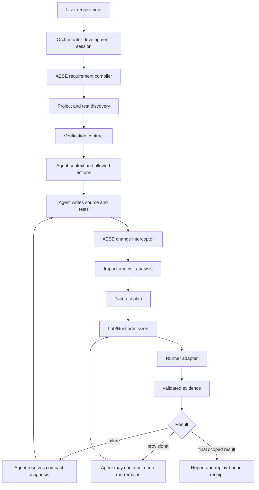

# AESE Integrated Development Capability

**Status:** PROPOSED — implementation handoff plan
**Audience:** agent/engineer implementing AESE integration
**Authority:** this document extends the current Lab architecture; it does not replace the runtime authority ADRs
**Scope:** design and implementation plan only; this document does not claim that the capability is implemented

## 1. Executive decision

AESE will not be implemented as a post-processing test reviewer.

It will be an integrated development capability inside AEGIS Orchestrator. Every agent session that changes source code will pass through AESE from the beginning:

```text
User request
    |
    v
AEGIS Orchestrator creates a development session
    |
    v
AESE compiles the request into a verification contract
    |
    v
AESE discovers the project, existing tests, risks and affected scope
    |
    v
Agent receives code requirements + test obligations + allowed operations
    |
    v
Agent writes code and tests normally in the current workspace
    |
    v
AESE intercepts each meaningful change and selects the smallest safe test scope
    |
    v
Fast feedback -> agent correction -> deeper verification
    |
    v
Provisional result or final scoped verification result
```

The agent remains the implementation worker. AESE owns the quality-control loop. Rust/Lab remains the authority for admission, leases, execution lifecycle, cancellation, replay and resource policy.

The essential distinction is:

```text
Agent proposes code/test changes.
AESE proposes and evaluates verification work.
Lab/Rust authorizes and records execution.
AESE never changes a product requirement merely to make a test pass.
```

## 2. Decisions already locked

| Decision | Required behavior |
|---|---|
| Role of AEGIS | AEGIS is both an agent harness and an orchestrator. External agents operate through AEGIS contracts/API rather than owning runtime authority. |
| AESE entry point | Start at task intake, before implementation code is written. |
| Agent workflow | Agent continues to work normally; it must not manually orchestrate all AESE internals. |
| Code changes | Every source-code change is intercepted and associated with a verification contract. |
| Test authoring | AESE may create, modify, reorganize and optimize tests. |
| Test safety | AESE may never weaken a requirement, remove a critical assertion, add a skip/xfail solely to obtain green status, or update a golden value without evidence and policy. |
| Local-first | Execute on the user's machine by default. Cloud/server execution is disabled unless the user explicitly authorizes it. |
| Fast feedback | Return a structured provisional result while deeper checks continue. |
| Final assurance | Only mandatory and applicable checks with valid evidence can produce a final scoped result. |
| Languages | Use a language-neutral core plus adapters. “Supported” is reported per language, framework, version, platform and feature, not by language name alone. |
| Current workspace | Agent may work in the normal project workspace. AESE must checkpoint and three-way-merge its own test changes; it must not overwrite concurrent user/agent edits. |
| Runtime authority | Do not create a second scheduler, lease registry, execution authority or AESE database. Reuse Lab and Rust authority. |

## 3. Current repository facts and blockers

The implementing agent must recheck these facts at the beginning of every implementation phase because the repository is mutable.

### 3.1. Current baseline observed during planning

- Runtime revision under evaluation during the latest planning pass: `45480ee173be50603929b2461c1a6a0b742b7a9e`.
- The current handoff commit is documentation-only and changed no runtime code. Existing test artifacts remain bound to `45480ee173be50603929b2461c1a6a0b742b7a9e` until a later code-changing commit is verified.
- The latest commit refreshed AESE planning artifacts; it did not change the core AESE runtime implementation compared with the immediately preceding runtime commits.
- Project Python requirement: `>=3.14,<3.16`.
- Verified local interpreter used for the targeted run: Python `3.14.7`.
- Verified pytest version in the project environment: `8.4.2`.
- Targeted baseline run: `145 passed, 1 skipped` in `3.36s` for AESE primitives, code intelligence and GoalContract.
- The skipped test requires Windows symlink privilege. The skip is an environment limitation, not a passing security proof.

These numbers are scoped evidence only. They do not prove AESE product effectiveness, all-language compatibility, hosted compatibility or production readiness.

### 3.2. Existing architecture that must be reused

The implementation must start by reading:

- `docs/architecture/AEGIS_LAB_RUNTIME_MASTER_PLAN.md`
- `docs/adr/ADR-001-runtime-authority.md`
- `aegis_cognition/lab.py`
- `core/rust/src/lab.rs`
- `core/rust/src/execution.rs`
- `core/python/aegis/code_intelligence.py`
- `aegis_cognition/desktop_service.py`
- `core/python/aegis/desktop_protocol.py`
- `desktop/src/protocol.ts`

The current Lab already has mission contracts, execution-cell registration, tool admission, replay, evidence and deterministic goal evaluators. AESE must be an additional capability attached to this system, not another runtime below or beside it.

### 3.3. Blockers that must be fixed before promotion

#### B1 — invalid benchmark baseline can return `PASS`

In the planning checkout, this input was reproduced:

```text
baseline = NaN
observations = [1.0] * 30
warmups = [0.0] * 10
result.status = PASS
result.failure_reasons = ('baseline_invalid',)
```

Required correction:

- An invalid baseline must make the result non-passing.
- The invalid reason must remain visible in the result and evidence.
- The behavior must be covered for NaN, infinity, wrong type and round-trip rehydration.
- A result containing a fatal validation reason must not pass through a later success branch.

#### B2 — invalid legacy outcome can be counted as complete observation

The planning checkout reproduced an outcome such as `ERROR` being classified as `OBSERVED_COMPLETE_ZERO` for a critical-false-negative check.

Required correction:

- `PASS`, `FAIL`, `ERROR`, `TIMEOUT`, `MISSING`, `INVALID` and `UNKNOWN` must be distinct.
- Presence of a result key is not equivalent to valid observation.
- Invalid or incomplete outcomes must never reduce the unobserved count or create “zero false negatives” evidence.
- Confusion-matrix code and completeness code must use the same validated outcome domain.

#### B3 — current AESE selection evidence is shadow-only

The current registry/closure artifacts retain unknown or unmapped surfaces and selection authority is disabled. Existing mapping is not proof that test skipping is safe.

Required correction for integrated AESE:

- Start with recommendation/prioritization and conservative widening.
- Do not use incomplete graph evidence to omit mandatory tests.
- Preserve `UNKNOWN`, `STALE`, `OVERFLOWED`, `SYNTAX_ERROR` and `UNAVAILABLE` states.

#### B4 — native process execution needs an explicit safety gate

The current native process path must be reviewed and tested for:

- resource attachment relative to process start;
- output-pipe draining while the child is still running;
- timeout coverage including output collection;
- descendant cleanup;
- spawn, cancellation and partial-failure cleanup.

The existing process lane must not be described as a complete sandbox unless filesystem, network, memory, CPU and process-tree guarantees are each verified for the target platform.

#### B5 — integration seams are distributed across existing contracts

The current source inspection found that AESE cannot be added safely as an isolated Python module:

- `aegis_cognition/lab.py` already owns the `tool_call` execution-cell binding, sealed registry, admission/settlement fences and trusted runner resolution. Reuse that seam; never register a competing `tool_call` cell or create a second execution ledger.
- `ProcessExecutionCell` is a killable, wall-time-bounded local cell with platform-specific termination behavior, but it does not prove memory/resource isolation or a complete sandbox. Adapter policy must expose the real enforcement level and block when the requested safety level is absent.
- `aegis_cognition/desktop_service.py` already owns workspace opening, `SourceMapper` and bounded source snapshots used to refresh live provider context. AESE session creation and revision invalidation should attach here, while the snapshot remains an input rather than an evidence decision.
- `core/python/aegis/desktop_protocol.py` and `desktop/src/protocol.ts` are not currently symmetric, and neither has the typed `verification.*` contract. Update the Python allowlist/router, TypeScript union/decoders, service handlers, capability discovery and tests as one contract change.
- `aegis_cognition/cli.py` has no verification commands. The CLI must call the same AESE façade as desktop and a future API; it must not introduce an alternate runner or result schema.

The codebase-memory index is a navigation aid only. Its current structural graph is ready, but some line references are stale relative to source. Every implementation decision must be confirmed against the current file and symbol before editing.

### 3.4. Research-derived deployment and evidence constraints

The detailed evidence ledger is in `docs/architecture/empirical-research/AESE_INTEGRATED_CAPABILITY_RESEARCH.md`. The implementing agent must treat the following as hard constraints:

- The current hosted evidence is strong only for its declared scope: at revision `45480ee173be50603929b2461c1a6a0b742b7a9e`, GitHub Actions run `34800284798` recorded the locked Python suite as `821/821` on `ubuntu-latest`, `windows-latest` and `macos-14`. This does not prove test-quality effectiveness, all-language support, or Rust evidence.
- The existing local AESE S1–S6 shadow work is a foundation to extend, not a subsystem to replace: current artifacts report 9 critical mappings and 147 unknown surfaces; S3/S4 remain plan-only; S5 remains synthetic planning validation; S6 is three warm-cache exploratory samples for one Rust change class. Preserve `AESE_MODE=SHADOW`, `SELECTIVE_TEST_AUTHORITY=DISABLED`, `TEST_SKIPPING_AUTHORITY=DISABLED` and `EVIDENCE_PROMOTION=DISABLED` until the integrated held-out gates are complete.
- The hosted artifact explicitly records `independent_verification = NOT VERIFIED`; preserve that distinction instead of upgrading the label in reports.
- GitHub Actions remains an evidence/execution lane, not a second AEGIS runtime authority. Bind each receipt to commit, workflow/run/attempt, runner, toolchain, command, counts, exit semantics and artifact hashes. Keep caches separate from evidence artifacts.
- The repository is currently public, so standard GitHub-hosted runners are a preferred low-cost evidence lane. The implementation must still respect GitHub's real limits: concurrency, six-hour per-job execution, matrix size and artifact/cache retention/storage. “Unlimited standard runner minutes” must not become unbounded fan-out or unbounded artifact retention.
- Untrusted branch/PR/model text must never be interpolated into shell source. Pass it as validated arguments or files, and keep workflow permissions least-privilege.
- Local execution remains the default. Cloud/server execution requires an explicit consent and policy record with provider, source scope, retention, network, cost ceiling, TTL, cancellation and secret policy.
- The inspected GCP project currently has two `e2-standard-2` VMs, `aegis-test-linux-01` and `aegis-test-linux-02`, both `TERMINATED`, with one 30 GiB `pd-standard` boot disk each. Only `aegis-test-linux-02` was used for the bounded environment probe; no source was uploaded and it was stopped and verified `TERMINATED`. Do not use either VM as a persistent generic untrusted-code runner.
- `TERMINATED` does not mean zero cloud cost: the project retains at least 60 GiB of persistent disk capacity, which can continue to incur storage charges while instances are stopped. `autoDelete` applies on instance deletion, not stop. Any future cloud experiment must verify retained disks/snapshots/IPs separately, and an alerts-only budget must not be treated as a hard spend cap. Do not delete the second VM or any disk without explicit ownership/data-preservation confirmation.
- Do not create cloud resources, install persistent agents/toolchains, upload private source, enable autoscaling, or run long experiments on the free-credit VM without a new bounded experiment record and an explicit cost/TTL guard.
- A candidate test patch may be authored or modified freely, but only the candidate layer is free. Application requires oracle, requirement binding, non-weakening, mutation/negative-control, resource, path-boundary and three-way-merge checks. Conflicts stop application.
- Impact selection, predictive selection, sharding and cache reuse remain non-authoritative until held-out paired evaluation reports false passes, critical misses, invalid evidence, flakiness and regressions before speed.

## 4. Product model: AESE as a development control plane

### 4.1. Why post-processing is insufficient

If AESE runs only after an agent has written code and tests, it cannot reliably influence:

- what the agent should test before implementation;
- which requirement each test is supposed to protect;
- which files and dependencies are actually affected;
- whether a new test is meaningful or merely confirms the implementation;
- whether a test was omitted because it was expensive;
- whether the agent changed the test to hide a failure.

Therefore AESE must participate before, during and after code generation.

### 4.2. Integrated control loop



### 4.3. The agent-facing mental model

The agent should experience only these operations:

1. Receive a coding task plus `verification_obligations`.
2. Write code and tests in the current project workspace.
3. Receive compact feedback after meaningful changes.
4. Ask for deeper verification when a change is risky or uncertain.
5. Continue until the orchestrator reports the task state.

The agent should not need to know how to manage leases, runner processes, raw logs, artifact hashes or replay events.

## 5. End-to-end session lifecycle

### 5.1. Session states

Execution state remains Lab-owned. AESE adds a derived assurance state; it must not create a second task ledger.

#### Development execution states

Use existing Lab lifecycle where possible. New state names require a contract review rather than ad-hoc Python strings.

#### AESE assurance states

```text
NOT_STARTED
CONTRACT_BUILDING
READY_FOR_IMPLEMENTATION
FAST_FEEDBACK_RUNNING
PROVISIONAL
DEEP_VERIFICATION_RUNNING
VERIFIED_SCOPE
FAILED
INCONCLUSIVE
BLOCKED
STALE
CANCELLED
```

State rules:

- `PROVISIONAL` means useful evidence exists but one or more required checks remain.
- `VERIFIED_SCOPE` must name the exact requirements, source revision, environment, adapter and checks covered.
- `INCONCLUSIVE` means execution happened but evidence is insufficient.
- `BLOCKED` means a required capability or permission is unavailable; it is not PASS.
- `STALE` means the source/config/environment changed after evidence was produced.
- `CANCELLED` never becomes PASS.

### 5.2. Session sequence

#### Step 1 — Orchestrator accepts a development task

Input:

- user request;
- project/workspace identity;
- current revision and dirty state;
- agent identity and model policy;
- user permissions;
- time/resource budget;
- local/cloud policy;
- requested side-effect scope.

Output:

- `development_session_id`;
- immutable request hash;
- initial workspace snapshot reference;
- AESE preflight event.

No code execution begins before this preflight for a source-changing task.

#### Step 2 — AESE compiles the requirement

The requirement compiler must extract or request:

- behavior to add/change;
- behavior that must remain unchanged;
- explicit acceptance criteria;
- security/privacy/data invariants;
- API/schema/CLI compatibility obligations;
- performance or resource constraints when stated;
- affected component guesses with certainty labels;
- unknowns that require user clarification.

If the requirement is ambiguous in a way that changes expected behavior, pause and ask a simple user question. Do not let the model silently choose a product behavior.

#### Step 3 — AESE creates the initial verification contract

The contract must list:

- mandatory checks;
- recommended checks;
- optional deep checks;
- tests to create or update;
- tests that must not be skipped;
- evidence required for each acceptance criterion;
- provisional completion conditions;
- final completion conditions;
- invalidation conditions.

#### Step 4 — Project discovery

Use `SourceMapper` and adapter discovery, but classify every observation:

- `OBSERVED`
- `INFERRED`
- `UNKNOWN`
- `STALE`
- `TRUNCATED`
- `OVERFLOWED`
- `UNAVAILABLE`

Do not convert a heuristic import/lineage candidate into a guaranteed dependency edge.

#### Step 5 — Agent receives an implementation packet

The packet contains a compact contract, not an unbounded log dump:

```json
{
  "schema": "aegis-development-agent-packet-v1",
  "session_id": "...",
  "source_snapshot": "...",
  "requirements": [
    {
      "id": "REQ-...",
      "statement": "...",
      "must_preserve": ["..."],
      "verification_obligations": ["..."],
      "severity": "critical"
    }
  ],
  "test_obligations": {
    "must_add_or_update": ["..."],
    "must_run_fast": ["..."],
    "must_run_before_final": ["..."],
    "may_defer": ["..."],
    "never_skip": ["..."]
  },
  "allowed_operations": ["write_source", "write_test", "run_local_test"],
  "result_policy": "provisional_then_deep"
}
```

The agent is not allowed to replace the packet with its own assertion that tests are sufficient.

#### Step 6 — Intercept every meaningful change

AESE must observe file changes through a bounded change interceptor. It must identify:

- changed paths;
- added/removed/modified tests;
- changed configuration or lock files;
- generated source changes;
- source/test relationship candidates;
- requirement references claimed by the agent;
- whether the change is code, test, documentation, generated output or unknown.

The interceptor must not run a full suite on every keystroke. Debounce changes and trigger on an agent step, a tool completion, a checkpoint request, or a policy-defined idle interval.

#### Step 7 — AESE updates the plan

The planner must widen the test scope when it sees:

- incomplete or stale dependency information;
- changed public contract/schema/config;
- shared fixture or build graph change;
- security/auth/data path;
- concurrency/async/resource changes;
- generated code or FFI;
- unknown framework behavior;
- test discovery failure.

It may narrow only when the closure is complete enough for the relevant policy and the omitted scope is explicitly recorded.

#### Step 8 — Fast feedback

Fast feedback runs:

- syntax/type/format checks applicable to the changed component;
- directly related tests;
- changed tests;
- mandatory security/contract checks;
- deterministic static checks;
- a focused failure reproduction if one exists.

A fast green result becomes `PROVISIONAL`, never `VERIFIED_SCOPE`, while mandatory deep checks remain.

#### Step 9 — Agent correction loop

The agent receives:

- failure class;
- affected requirement IDs;
- minimal relevant stack/log excerpt;
- artifact references for full details;
- source revision and attempt ID;
- recommended next action;
- whether retry is safe.

It must not receive raw unbounded logs by default. This is a direct token and context saving mechanism.

#### Step 10 — Deep verification

Run the required higher tiers at policy-defined points: before final task completion, before an API/schema change is accepted, before merge/release, and at scheduled full-suite checkpoints.

#### Step 11 — Final report

The report must state:

- exact revision verified;
- environment/toolchain/platform;
- adapter and supported capability level;
- mandatory checks completed;
- checks deferred or unavailable;
- test changes created/applied;
- failures and likely causes;
- evidence references;
- cache/reuse decisions;
- final assurance state;
- residual risk.

## 6. Public module architecture

Create an integrated capability package while preserving current `aegis_cognition.aese` public exports.

```text
aegis_cognition/verification/
├── contracts.py          # versioned immutable domain contracts
├── session.py            # development-session orchestration façade
├── requirement_compiler.py
├── change_interceptor.py # snapshot/diff/checkpoint integration
├── discovery.py          # project and test discovery coordination
├── planning.py           # deterministic scope and tier planning
├── authoring.py          # test candidate generation and patch validation
├── assessment.py         # test-quality and evidence assessment
├── evidence.py           # provenance, freshness and cache eligibility
├── lab_binding.py        # typed adapter to Lab/tool dispatch
├── reporting.py          # compact agent/UI reports
└── adapters/
    ├── protocol.py       # language-neutral runner/discovery protocol
    ├── generic.py        # declared command adapter
    ├── pytest.py
    ├── cargo.py
    ├── javascript.py
    ├── jvm.py
    ├── dotnet.py
    ├── go.py
    ├── cpp.py
    ├── ruby.py
    ├── php.py
    ├── swift.py
    └── dart.py
```

Do not create empty adapter files merely to advertise support. A framework enters the support matrix only after its conformance fixtures and actual runner checks pass.

### 6.1. Dependency direction

```text
desktop / CLI / coding agent
            |
            v
verification.session
            |
    contracts / planning / reporting
       |          |          |
       v          v          v
  discovery   adapters   authoring
       \          |          /
        \         v         /
          lab_binding
                |
                v
       Lab / Rust authority
```

Rules:

- `contracts` is dependency-light and deterministic.
- `planning` does not spawn processes, call the network or call the model.
- `adapters` do not mutate Lab state directly.
- `authoring` produces proposals; it does not apply unverified patches.
- `assessment` cannot claim execution that the receipt does not prove.
- UI and agent protocol call `session`, never a runner directly.
- Existing `scripts/` are development tools only; product package code must not import them.

### 6.2. Core contracts

Implement immutable, schema-versioned contracts. Reuse existing types only where semantics match exactly.

#### `ProjectProfile`

Must contain:

- project/workspace identity;
- checkout/revision identity;
- dirty paths;
- detected languages/frameworks/toolchain versions;
- adapter capability levels;
- discovery completeness and unknowns;
- environment fingerprint excluding secrets.

#### `VerificationRequirement`

Must contain:

- stable requirement ID;
- source/reference of the requirement;
- behavior and must-preserve constraints;
- severity;
- applicable components;
- acceptance oracle;
- mandatory/defer policy;
- clarification status.

#### `TestDescriptor`

Must contain:

- stable test ID within the adapter;
- framework/runner identity;
- component and requirement references;
- parameter/profile identity;
- expected result semantics;
- effect and resource classes;
- discovery certainty;
- whether the test is mandatory, recommended or optional.

#### `VerificationPlan`

Must bind:

- session and source snapshot;
- requirement contract hash;
- project/toolchain/adapter identities;
- execution policy hash;
- selected tests and excluded tests;
- exclusion reasons;
- tier schedule;
- budgets and stopping rules;
- invalidation rules.

#### `TestChangeProposal`

Must bind:

- base snapshot/revision;
- patch hash;
- changed test IDs;
- requirement IDs;
- reason and expected fault detection;
- authoring model/provider policy;
- validation results;
- conflict status;
- apply authorization state.

#### `ExecutionReceipt`

Must bind:

- Lab run/attempt/lease identity;
- plan hash;
- adapter and toolchain identity;
- argv and working directory identity without secrets;
- source and input manifest hashes;
- start/end/deadline;
- exit/collection/result status;
- stdout/stderr artifact references;
- truncation and completeness flags;
- cancellation/timeout/resource facts.

#### `VerificationAssessment`

Must contain:

- assurance state;
- requirement-level result;
- evidence references;
- checks completed/deferred/blocked;
- freshness status;
- limitations;
- residual risks;
- exact scope of any success claim.

Validation rules:

- reject unknown schema versions;
- reject duplicate IDs and duplicate JSON keys;
- reject NaN/infinity and invalid numeric ranges;
- reject malformed status combinations;
- reject a PASS with a fatal validation reason;
- reject a final result without required receipts;
- reject a result whose source snapshot is stale;
- never trust a client/model-supplied `verified: true`.

## 7. Agent integration API

The first implementation should expose one language-neutral service to the CLI, desktop service and coding-agent adapter.

### 7.1. Required operations

```text
verification.inspect_project
verification.create_contract
verification.start_session
verification.observe_change
verification.get_feedback
verification.request_deep_run
verification.propose_test_change
verification.evaluate_test_change
verification.apply_test_change
verification.inspect_run
verification.cancel_run
verification.resume_run
verification.read_report
```

Operation requirements:

- All requests have request ID, session ID where applicable, schema version and source snapshot reference.
- Long operations return a run ID immediately.
- Every operation is idempotent where retries are possible.
- The service uses cursors for events and paginated artifacts.
- Raw output is never required in the control frame.
- Cancellation returns “requested”, “confirmed” or “reconciliation required”; it never assumes immediate termination.
- Agent-facing errors are typed: invalid input, unavailable capability, policy denied, conflict, timeout, failed execution, incomplete evidence and internal failure.

### 7.2. Agent packet and feedback packet

Agent feedback must be small enough to fit normal coding context:

```json
{
  "schema": "aegis-verification-feedback-v1",
  "session_id": "...",
  "source_snapshot": "...",
  "assurance_state": "PROVISIONAL",
  "summary": "2 focused checks passed; 1 mandatory contract check remains.",
  "blocking_failures": [],
  "requirement_results": [
    {
      "requirement_id": "REQ-...",
      "state": "PROVISIONAL",
      "evidence_ids": ["EV-..."]
    }
  ],
  "next_actions": ["Run the database contract tier before finalizing."],
  "deferred_checks": ["full-regression"],
  "raw_artifact_refs": ["artifact://..."]
}
```

The agent must be able to request raw details by reference when needed, but AEGIS must not place all logs in the model context automatically.

## 8. Test planning and scaling model

### 8.1. Verification tiers

| Tier | Purpose | Typical content | Can provide |
|---|---|---|---|
| T0 | Immediate validity | parse, format, type, schema, static policy | fast failure feedback |
| T1 | Direct change | changed tests, changed symbols/components | early provisional result |
| T2 | Impacted closure | reverse dependents, shared fixtures, contracts | stronger provisional result |
| T3 | Boundary/integration | API, DB, queue, browser, generated code, FFI | requirement-level evidence |
| T4 | Full regression | all required project tests | final release/merge evidence |
| T5 | Deep quality | mutation, property/stateful, stress, soak, benchmark | risk-specific confidence |

The tier is not a quality score. A T1 PASS is not equivalent to T4 or T5.

### 8.2. Default scheduling policy

For a normal source change:

1. Run T0 immediately after a coherent agent step.
2. Run T1 after the changed test/code can be collected.
3. Run T2 when the dependency closure is complete enough; otherwise widen.
4. Run T3 for affected boundaries or risk classes.
5. Run T4 at task finalization or the policy-defined checkpoint.
6. Run T5 only when the requirement/risk/profile calls for it or when AESE finds a testing gap.

For critical security, data, concurrency, public API and resource changes, T3/T4 cannot be deferred solely for speed.

### 8.3. Selection rules

The planner may prioritize, shard and schedule. It may omit execution only when:

- the policy explicitly allows omission;
- the closure is complete enough for the omitted test;
- a prior valid evidence record is reusable under the full cache key;
- the omitted item is not mandatory;
- the omission and its reason are recorded.

If any required input is unknown, stale, truncated, overflowed, generated, dynamic or outside the model, widen the scope.

### 8.4. Cache and reuse key

A test result cannot be reused to omit execution unless the key binds all relevant inputs:

- source files and dirty changes;
- tests and fixtures;
- generated files;
- lockfiles/manifests/configuration;
- toolchain, adapter and runner version;
- build features/profile;
- environment and platform where relevant;
- database/schema/container/browser state where relevant;
- policy and requirement contract;
- network/external dependency identity if used.

Build cache, discovery cache and test-result cache must be separate. A build hit is not a test-result hit.

## 9. Test authoring and modification policy

### 9.1. Allowed AESE actions

AESE may:

- generate new unit/integration/contract/property/stateful/negative tests;
- add boundary and malformed-input cases;
- fix a test that is demonstrably inconsistent with the written requirement;
- split slow tests when semantics remain covered;
- remove duplicate setup with behavior-preservation evidence;
- reorganize tests and fixtures;
- add mutation/differential/metamorphic controls;
- propose performance/regression benchmarks.

### 9.2. Prohibited shortcuts

AESE may not:

- change a requirement to match the current implementation;
- delete a critical test because it is slow;
- add skip, xfail, quarantine or retry-only behavior to hide a failure;
- nudge a benchmark threshold after observing the result;
- replace a real dependency with a mock and claim the real boundary is verified;
- update snapshots/goldens without a requirement-linked explanation;
- change auth, ownership, data integrity or security assertions without explicit evidence;
- apply a patch over uncommitted user/agent changes.

### 9.3. Candidate patch workflow

```text
Requirement and invariant
        |
        v
Candidate test patch
        |
        v
Syntax/collection check
        |
        v
Original test suite vs candidate suite
        |
        v
Known-bug/mutation/property/negative control
        |
        v
Critical-test retention and scope comparison
        |
        v
Three-way merge against current workspace
        |
        v
Apply, retain as proposal, or reject
```

For a removed/replaced test, the candidate must show:

- which requirement it covered;
- what replacement covers it;
- which known fault the old test detected;
- whether the replacement detects it;
- why no critical case was lost;
- what evidence supports semantic preservation.

If equivalence is not established, preserve the old test and add the candidate rather than replacing it.

### 9.4. Agent/model trust boundary

Model output is untrusted input. Validate patches, paths, test IDs, commands, dependencies and claimed results. Do not execute arbitrary Python, shell or network instructions from model output outside a configured adapter and Lab policy.

## 10. Multi-language adapter architecture

### 10.1. Support levels

```text
L0 — detected only; cannot execute
L1 — declared command can run with bounded receipt
L2 — structured tests can be discovered and parsed
L3 — impact-aware planning and quality assessment are validated
```

Report support by:

```text
language + framework + version + platform + build profile + feature
```

Never claim that a generic command runner provides L2 or L3.

### 10.2. Adapter protocol

Every adapter must implement the equivalent of:

```text
detect(project) -> ProjectDetection
validate_environment(detection) -> EnvironmentAssessment
discover_tests(request) -> TestDiscoveryResult
build_command(plan) -> BoundedCommand
parse_result(raw_output) -> StructuredTestResult
classify_failure(result) -> FailureClass
capabilities() -> AdapterCapabilities
```

`BoundedCommand` must have executable and argv separately, checked working directory, allowlisted environment, timeout, output policy, resource class and effect class. It must never be a free-form shell string.

### 10.3. Adapter rollout order

The generic core must be language-neutral from the first phase. Implement and validate adapters in this order:

1. pytest and Cargo/nextest for AEGIS validation.
2. JavaScript/TypeScript: Vitest, Jest, Node test and Playwright where applicable.
3. Go and .NET.
4. JVM: JUnit through Maven/Gradle.
5. C/C++ through CTest/build-system-provided executables.
6. Ruby, PHP, Swift, Dart/Flutter.
7. Custom adapter conformance protocol.

An adapter may be added only with fixtures for discovery, pass, fail, skip, timeout, collection error, malformed output, parameterized tests and unsupported features.

### 10.4. Discovery safety

Separate passive discovery from active discovery. Active discovery can load project code/plugins and must pass through execution policy. For example, pytest plugin discovery and `conftest.py` loading occur during pytest startup; AESE must not import arbitrary project test modules in the AEGIS host just to count tests. See the official [pytest plugin documentation](https://docs.pytest.org/en/8.2.x/how-to/writing_plugins.html).

For Cargo/nextest, distinguish machine-readable test listing from binary listing and from execution; the adapter must preserve this distinction. See [nextest machine-readable listings](https://nexte.st/docs/machine-readable/list/).

## 11. Lab and Rust integration

### 11.1. Execution-cell constraint

The current `ExecutionCellRegistry` maps one binding to each action kind. Do not register a second `tool_call` cell for AESE.

Use one trusted dispatcher under the existing action kind with operation-level routing:

```text
tool_call binding
    |
    +-- existing tools
    +-- verification.inspect
    +-- verification.start
    +-- verification.status
    +-- verification.cancel
```

The dispatcher must perform operation-specific capability, effect, trust, resource and policy checks. A high-privilege operation must not inherit permission merely because it shares a dispatcher with a low-privilege operation.

If the current binding contract cannot represent an operation safely, add a versioned typed contract and update all validators/replay tests together. Do not bypass the registry with a hidden Python path.

### 11.2. Goal evaluator

Do not use current generic evaluators such as record existence, observation count or experiment completion as proof that code requirements have been verified.

Add a typed requirement-assessment evaluator, conceptually:

```text
aegis.verification.requirements_satisfied
```

It must confirm:

- requirement contract identity;
- source snapshot identity;
- plan and policy identity;
- every mandatory check has a valid receipt;
- no result is malformed, missing, timed out or stale;
- test-change assessment gates passed;
- required deep checks completed;
- evidence references are retained and replay-bound.

The authoritative final decision must be validated at the Rust boundary or through a Rust-owned Lab evaluator. Python may propose the assessment but cannot force a boolean success.

### 11.3. Replay and recovery

Events must cover at least:

```text
verification_contract_created
verification_plan_created
verification_change_observed
verification_scope_selected
verification_run_admitted
verification_run_started
verification_result_received
verification_test_change_proposed
verification_test_change_assessed
verification_test_change_applied
verification_assurance_updated
verification_invalidated
```

Each event binds session, source revision, plan hash and attempt where applicable. Replay must reproduce the same assurance state or reject tampered/incompatible evidence.

## 12. Execution safety and workspace behavior

### 12.1. Normal workspace model

The user wants the agent to work normally. Therefore v1 does not force every agent to use a separate visible branch or workspace.

AESE must instead:

- record a source snapshot before each meaningful agent step;
- identify the exact files changed by that step;
- retain patch/checkpoint identity;
- apply AESE-generated test patches with three-way merge;
- detect conflict and stop rather than overwrite;
- mark evidence stale if the workspace changes outside the run;
- keep the original test version recoverable;
- distinguish agent-authored changes from AESE-authored changes.

An isolated candidate workspace remains available for risky mutation testing, untrusted generated tests and deep experiments. It is an execution strategy, not the default user workflow.

### 12.2. Runner requirements

The runner path must provide, or explicitly report absence of:

- executable/argv separation;
- checked working directory;
- environment allowlist and secret redaction;
- timeout and cancellation;
- process-tree cleanup;
- stdout/stderr concurrent draining;
- output byte limits and truncation status;
- CPU/memory/process resource observations;
- network/filesystem/effect policy;
- deterministic receipt.

If a platform cannot enforce a requested property, the result must be `BLOCKED`, `INCONCLUSIVE` or trusted-mode with an explicit warning. It must not be labeled isolated.

### 12.3. Local versus optional server execution

Default:

- no source upload;
- no cloud execution;
- local runner and local artifacts;
- user-visible policy and resource limits.

Optional server mode requires a separate explicit consent and policy record containing:

- destination/provider;
- source and artifact scope;
- retention;
- cost limit;
- network permissions;
- cancellation behavior;
- result import and provenance;
- whether secrets are permitted (default: no).

The first server implementation must prefer GitHub-hosted ephemeral runners for authorized repository evidence. It must use least-privilege workflow permissions, job timeouts, commit-bound artifacts and safe argument passing for untrusted branch, issue, test-name and model text. Artifacts are evidence; caches are only performance hints and can never certify a result.

Google Cloud is a separate opt-in adapter, not an implicit fallback. Before it can run project code, it must prove: provider/project/zone identity; explicit maximum wall time and cost budget; automatic stop/cleanup; source upload scope; network policy; service-account least privilege; secret prohibition by default; artifact retention; cancellation; and final `TERMINATED`/cleanup evidence. The currently inspected VM has Secure Boot disabled and uses a project default service account, so it is restricted to bounded diagnostics until a hardened ephemeral profile exists. A failed guard is `BLOCKED`, never `PASS`.

## 13. Desktop, CLI and future API integration

### 13.1. Desktop protocol

Add typed `verification.*` commands to the existing desktop protocol rather than a second transport.

Update together:

- Python command allowlist and router;
- TypeScript command union and result types;
- service handlers;
- protocol tests;
- capability discovery.

Long runs return IDs and cursors. UI receives summaries and artifact references rather than unbounded logs.

Required UI states:

- no project;
- discovering;
- contract clarification needed;
- ready;
- fast check running;
- provisional;
- deep check running;
- passed for scope;
- failed;
- blocked;
- stale;
- cancelled;
- conflict applying test change;
- storage/quota failure.

### 13.2. CLI

Use the same service operations:

```text
aegis verify inspect
aegis verify contract
aegis verify run
aegis verify status
aegis verify cancel
aegis verify report
```

Proposed exit semantics:

```text
0 = required scope verified
1 = verification found a failure
2 = invalid request/configuration
3 = inconclusive, blocked or cancelled
```

Preserve the underlying runner exit status inside the receipt. Do not flatten collection error, no-test-collected, test failure and infrastructure failure into one value. Pytest’s official exit-code contract distinguishes these categories; AESE must preserve that distinction in its adapter result. See [pytest exit codes](https://docs.pytest.org/en/stable/reference/exit-codes.html).

### 13.3. Future public API

Design the service contracts so a future API can expose the same operations without exposing filesystem or subprocess authority:

```text
POST /development-sessions
POST /development-sessions/{id}/verification/contract
POST /development-sessions/{id}/verification/runs
GET  /verification-runs/{id}
POST /verification-runs/{id}/cancel
GET  /verification-runs/{id}/events?cursor=...
GET  /verification-runs/{id}/report
```

The API must use opaque project/session/run identifiers and capability-scoped authorization. It must not accept arbitrary command strings or client-provided ownership/tenant/verification status.

## 14. Test quality assessment

### 14.1. Required techniques

Select techniques based on the invariant and failure mode:

| Technique | Use when |
|---|---|
| Known-bug regression | A previous defect or incident exists |
| Mutation testing | Assertion/fault detection strength is uncertain |
| Property-based testing | Invariants cover broad input spaces |
| Stateful testing | Correctness depends on operation sequences/state transitions |
| Differential testing | Independent implementation/reference exists |
| Metamorphic testing | Output relation is known but exact output is not |
| Negative controls | Valid and invalid cases may be confused |
| Failure injection | Dependencies, timeout, cancellation or retry matters |
| Contract testing | API/event/schema compatibility matters |
| Stress/soak | Concurrency, resource leaks or duration matters |

Stateful testing can generate operation sequences rather than only isolated values; the [Hypothesis stateful testing documentation](https://hypothesis.readthedocs.io/en/latest/stateful.html) is a relevant reference for the concept, not a requirement to add Hypothesis to every project.

### 14.2. Quality gates for generated/modified tests

A candidate test patch is accepted only if:

- it parses and is discoverable;
- it runs in the declared environment;
- it has an observable oracle;
- it is bound to one or more requirements;
- it does not weaken existing critical checks;
- it does not introduce uncontrolled flakiness;
- it does not leak secrets or access outside policy;
- it produces evidence when it claims to catch a fault;
- it survives the relevant known-bug/mutation/negative control;
- its performance/resource effect is recorded if it changes runtime materially.

### 14.3. Independence rule

The same model may author and explain a test, but model explanation is not independent validation. Independence comes from execution, an oracle, known faults, mutation/property controls, contract evidence and a separate authority for final state.

### 14.4. Empirical safeguards for model-authored tests

Recent empirical work indicates that generated tests can pass and achieve high structural coverage on the original implementation while failing to adapt to changed semantics or failing to detect faults because their oracles are weak. Therefore the implementation must enforce the following distinctions:

- execution success is not requirement satisfaction;
- coverage is not fault detection;
- mutation score is not real-bug detection;
- regression evidence from a presumed-correct baseline is not evidence that an already-buggy implementation is correct;
- a model's explanation is not an independent oracle.

For each candidate test, persist separate fields for collection/compilation, execution, requirement oracle, fault-detection control, flakiness, discarded reason and evidence freshness. The candidate evaluator must reject or mark `INCONCLUSIVE` when the oracle is missing, when the candidate only reproduces the implementation, or when the relevant fault/negative-control check was not run. The baseline suite remains protected and is never replaced by a larger generated suite without explicit requirement-linked evidence.

The evaluator must include held-out semantic changes or real/seeded faults in the quality experiment. It must report scenario, corpus, oracle type, mutation/coverage method and cost, rather than publishing a single “test quality” number. Coverage/mutation may guide prioritization, but they cannot authorize omission or promotion by themselves. See the research ledger's “Recent empirical evidence changes the acceptance design” section and its cited studies.

## 15. Performance and token-efficiency plan

### 15.1. What AESE must optimize

Measure separately:

- time to first useful failure;
- time to provisional result;
- time to final scoped result;
- total wall time;
- total CPU time;
- discovery/setup/build/execution/assessment time;
- model prompt and completion tokens;
- raw artifact volume;
- rerun and cache-hit rates;
- failure diagnosis time.

The agent context should contain structured summaries and references, not complete test logs. This reduces token consumption without reducing the retained evidence.

### 15.2. Safe optimization order

1. Instrument every phase.
2. Fail early on deterministic invalidity.
3. Run direct/high-signal tests first.
4. Avoid repeated discovery and setup.
5. Parallelize independent tests with resource-aware scheduling.
6. Reuse valid builds and discovery results.
7. Reuse test evidence only with complete cache keys.
8. Generate targeted tests for uncovered risk.
9. Introduce conservative selection/sharding in shadow mode.
10. Consider predictive selection only after held-out evaluation.

Do not claim a speedup from a single warm run or from reducing model tokens while increasing total execution cost.

### 15.3. Performance experiment design

Compare on the same revision, toolchain, platform class and workload:

- A: existing full workflow;
- B: AESE integrated scheduling without test authoring;
- C: AESE scheduling plus targeted test authoring and assessment.

Report correctness metrics before efficiency metrics:

- real/seeded faults detected;
- false passes;
- critical misses;
- invalid/incomplete evidence misclassified;
- test weakening;
- flakiness and reproducibility.

Only if correctness does not regress report time, CPU, memory, tokens and cost.

Predictive test selection research demonstrates that historical production data can reduce infrastructure cost while retaining high failure detection in a particular workload, but this is evidence for an experimental option, not a universal guarantee for new repositories. See [Predictive Test Selection](https://arxiv.org/abs/1810.05286).

## 16. Implementation phases for the other agent

The implementing agent must complete phases in order. It may parallelize independent tests, but must not skip gates.

### Phase 0 — repository and evidence correction

Tasks:

- recheck HEAD, toolchain, worktree and current public exports;
- add regression tests for B1 and B2;
- fix fail-closed behavior;
- verify current AESE artifacts are not treated as current proof when their source HEAD differs;
- preserve shadow-only selection authority.

Exit gate:

- invalid baseline cannot PASS;
- invalid legacy outcome cannot count as complete valid observation;
- targeted and affected tests pass;
- no public import regression.

### Phase 1 — contracts and integrated session skeleton

Tasks:

- add versioned contracts;
- add `DevelopmentVerificationSession` façade;
- add event/cursor model;
- add requirement compiler interface with deterministic fallback;
- add change observation/checkpoint interface;
- bind to existing Lab without a second ledger.

Exit gate:

- a fixture task can create a session, contract and plan without running code;
- plan hash is deterministic;
- malformed contracts fail closed;
- no adapter subprocess runs during planning.

### Phase 2 — agent packet and feedback loop

Tasks:

- generate implementation packet before code execution;
- intercept coherent agent changes;
- calculate delta and risk;
- emit compact feedback;
- support provisional state and deep-run continuation;
- mark evidence stale after source/config changes.

Exit gate:

- an agent session cannot start source implementation without a contract unless an explicit policy exception is recorded;
- changed code receives targeted feedback;
- logs are artifact references, not unbounded context;
- revision A evidence cannot certify revision B.

### Phase 3 — generic adapter and execution boundary

Tasks:

- implement generic bounded command adapter;
- define discovery/result/failure conformance;
- integrate with existing `tool_call` dispatcher;
- harden native runner or document the exact trusted-mode limitation;
- implement cancellation and output draining tests.

Exit gate:

- success, failure, no-tests, collection error, timeout, cancellation and malformed result remain distinct;
- process output cannot deadlock the runner;
- no arbitrary model command reaches the runner;
- receipts are replay-bound.

### Phase 4 — AEGIS adapters

Tasks:

- pytest;
- Cargo/nextest;
- JavaScript/TypeScript;
- Go and .NET;
- JVM;
- C/C++;
- remaining adapters only after previous conformance gates.

Exit gate per adapter:

- declared version/platform matrix;
- pass/fail/skip/timeout/collection-error fixtures;
- parameterized and malformed-output fixtures;
- actual toolchain detection;
- honest L0–L3 capability level.

### Phase 5 — AESE test authoring

Tasks:

- candidate test patch generation;
- patch validation and path boundary checks;
- original-versus-candidate comparison;
- known-bug/mutation/property/negative controls;
- three-way merge and conflict reporting;
- apply/retain/reject states.

Exit gate:

- harmful test weakening is rejected;
- useful new tests can be applied safely;
- existing user edits are preserved;
- candidate failure is not hidden by retry or skip.

### Phase 6 — impact-aware scaling

Tasks:

- complete dependency/change model;
- classify unknown and overflow states;
- tiered scheduler;
- resource-aware concurrency;
- separate build/discovery/result caches;
- shadow selection evidence;
- conservative widening.

Exit gate:

- no mandatory test is omitted under incomplete closure;
- cache invalidation adversarial tests pass;
- paired benchmark reports quality before speed;
- cold and warm paths are separate.

### Phase 7 — Desktop, CLI and API contract

Tasks:

- add typed desktop commands and UI states;
- add CLI commands using the same service;
- add future API-compatible opaque IDs/cursors;
- package/sidecar smoke tests outside the source checkout.

Exit gate:

- open project → contract → code change → feedback → deep run → report works end to end;
- long run does not freeze UI;
- cancellation/recovery works;
- installed package does not import repository-only scripts.

### Phase 8 — held-out evaluation and controlled promotion

Tasks:

- build a held-out corpus by project and change type;
- compare A/B/C workflows;
- measure false passes and critical misses;
- document support matrix and residual risks;
- enable features by flag/capability only after evidence;
- keep cloud disabled by default.

Exit gate:

- no unsupported quality or speed claim;
- experimental selection stays non-authoritative until separately promoted;
- rollback disables integrated optimization without losing baseline testing;
- release evidence is reproducible.

## 17. Mandatory test matrix

### Contract and evidence

- unknown schema/version;
- duplicate IDs/keys;
- NaN/infinity/wrong numeric types;
- invalid baseline;
- invalid legacy outcome;
- hash mismatch;
- forged receipt;
- stale source revision;
- missing artifact;
- malformed status combination;
- final verification without mandatory receipt.

### Change and discovery

- source add/modify/delete/rename/copy;
- dirty workspace;
- generated source;
- lockfile/config/fixture changes;
- shared dependency;
- FFI and cross-language boundary;
- dynamic import/plugin;
- watcher overflow;
- parser syntax error;
- case-sensitive path;
- symlink outside workspace;
- monorepo multiple frameworks;
- no Git repository.

### Runner

- pass;
- test failure;
- zero tests;
- collection/build failure;
- malformed report;
- large stdout/stderr;
- child process holding output pipe;
- timeout;
- cancellation;
- descendant process;
- resource exhaustion;
- missing toolchain;
- network/filesystem policy denial;
- crash and resume.

### Test authoring

- new useful test;
- test with no oracle;
- test that weakens assertion;
- added skip/xfail;
- snapshot/golden mutation;
- critical assertion deletion;
- known bug detected before and after candidate;
- equivalent/non-runnable mutant;
- flaky/order-dependent candidate;
- conflict with concurrent agent edit;
- prompt injection in source/log;
- patch outside allowed path.

### Integration

- existing tool calls and AESE dispatcher coexist;
- replay old run;
- replay new run;
- wrong lease/attempt/generation;
- duplicate request;
- cancel during each lifecycle phase;
- UI pagination/cursor;
- CLI exit status;
- installed package/sidecar;
- local-only policy;
- explicit server-consent flow.

## 18. Acceptance criteria for the complete capability

The capability may be called integrated only when all criteria below have evidence:

1. A source-changing agent task receives an AESE contract before implementation.
2. The agent can continue normal coding without manually managing runtime internals.
3. Every coherent code change produces a bounded impact-aware verification update.
4. The system distinguishes provisional from final scoped assurance.
5. A small change does not automatically rerun unrelated full project tests when the closure is complete.
6. An incomplete/unknown closure widens scope instead of silently skipping.
7. AESE can create and safely assess a new test.
8. AESE rejects a test patch that weakens a critical requirement.
9. Tests and code are never overwritten across a concurrent edit.
10. Runner failures, no-test results, timeouts, cancellations and malformed output are not PASS.
11. Rust/Lab remains the only execution authority.
12. Replay and restart preserve or reject evidence deterministically.
13. Local execution is the default and no source is uploaded without consent.
14. At least the declared adapter matrix has conformance evidence.
15. Paired evaluation reports quality metrics before speed metrics.
16. Documentation reports unsupported areas and residual risks.

## 19. Required handoff report from the implementing agent

The implementing agent must return:

- changed files and why each is required;
- public contract/schema changes;
- execution authority and trust-boundary changes;
- migration/replay compatibility impact;
- tests run and exact results;
- skipped/blocked checks with reasons;
- benchmark workload, environment and raw artifacts;
- adapter support matrix;
- security/privacy limitations;
- rollback procedure;
- remaining unknowns.

The agent must not report “100% compatible”, “fully secure”, “production-ready”, “all languages supported” or “equivalent to exhaustive testing” without a specific evidence scope that justifies the statement.

## 20. Final implementation rule

Implement the smallest vertical slice that proves the integrated lifecycle first:

```text
one coding task
→ one requirement contract
→ one changed file
→ one changed test
→ one bounded adapter
→ one Lab receipt
→ one provisional feedback
→ one deep verification
→ one replayable report
```

Only after that slice is correct should the other agent add language adapters, mutation/property strategies, UI features, caching and predictive selection.

The central quality rule is:

> AESE must make the agent test the right things at the right time, preserve the evidence of what was actually tested, and refuse to turn missing knowledge into a green result.
