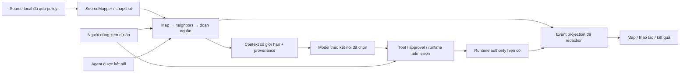

# AEGIS Personal Code Map — Product Design & Implementation Plan

Ngày lập: 2026-09-29. Phạm vi: người dùng cá nhân, workspace local, các agent được người dùng kết nối. Trạng thái tại ngày lập: proposal/prototype để review; trạng thái runtime sau ngày đó chưa được xác minh trong tài liệu này.

Điều chỉnh thiết kế ngày 2026-09-30: [Personal Diagram Workspace](personal-diagram-workspace-design-plan.md) là **chức năng sản phẩm AEGIS cho workspace của người dùng**, tích hợp code/memory graph và bounded retrieval. Bản đồ toàn dự án là màn hình chính, avatar agent trên vùng có hoạt động và inspector khi bấm; luồng công việc là phần chi tiết bổ sung. Hợp đồng backend/authority/retrieval/verification ở đây vẫn áp dụng; prototype và bằng chứng UI cũ chỉ mô tả bản phác trước, không xác nhận thiết kế mới.

Cách đọc: A chốt mục tiêu và quyết định; B có 12 use case, UI/keyboard/giải thích và ownership frontend; C có DTO, retrieval, transport/control, usage và bounds; D có nguồn nghiên cứu, trình tự bàn giao, benchmark và checklist nghiệm thu. Agent triển khai bắt đầu theo D2, lấy A6 làm hợp đồng chung.

## A. Định hướng, quyết định và cách dùng tài liệu

### A1. Mục tiêu sản phẩm

AEGIS giúp người dùng hiểu dự án, giao việc cho agent và kiểm tra công việc trên cùng một workspace. Agent tra bản đồ cấu trúc trước, mở phần liên quan sau; người dùng nhìn thấy thao tác được ghi nhận, nguồn code và những quyết định cần duyệt. Bản đồ là một projection của dữ liệu có nguồn gốc, không phải một hình ảnh mà model phải đọc lại trong mọi lượt.

Ba kết quả cần chứng minh:

1. Agent tìm được đúng phần code với ít ngữ cảnh không cần thiết hơn, giữ chất lượng giải quyết công việc.
2. Người dùng hiểu agent đã đọc/sửa/kiểm tra gì và có thể kiểm soát những bước runtime thực sự hỗ trợ.
3. Workspace hoạt động local, giữ dữ liệu riêng và không cần server AEGIS lưu dự án cá nhân.

**Giảm token là giả thuyết cần benchmark.** Repo hiện đã có `build_repository_map` và context budgeting. Baseline phải là workflow hiện có; không tạo baseline giả rằng mọi agent luôn đọc toàn bộ repo. Bản đồ có thể làm tăng overhead với việc rất nhỏ. Tách chi phí token model khỏi CPU/I/O của indexing và độ hữu ích của giao diện.

Đây là quyết định hướng sản phẩm cá nhân cho phần code map, retrieval và live observability. Giữ memory lifecycle, quyền truy cập, local persistence, runtime authority và evidence đã có. Các thiết kế cộng tác nhiều người trước đây chưa phải yêu cầu triển khai trong kế hoạch này. Nhiều worker do **cùng một người** quản lý vẫn thuộc phạm vi.

### A2. Phạm vi giao hàng

| Trong phạm vi | Điều kiện hoàn tất |
|---|---|
| Mở workspace local và lập bản đồ | Root được host xác nhận; trạng thái index/coverage rõ; nguồn nhạy cảm bị loại trước đọc |
| Tìm file, symbol và neighborhood | Tìm được phần bị ẩn bởi viewport; phân biệt quan hệ quan sát được và candidate |
| Đọc nguồn theo đoạn | Range/hash/revision kiểm tra bởi host; không có đường đọc file tùy ý từ renderer/model |
| Chọn context cho agent | Cùng dispatcher/policy với UI; giới hạn response và provenance kiểm tra được |
| Xem hoạt động trực tiếp | Event từ thao tác/transition được ghi nhận; replay không mất sự kiện; không suy đoán reasoning |
| Quyền đọc, duyệt thao tác và dừng | Backend enforce; approval gắn đúng action; dừng yêu cầu khác dừng xác nhận |
| Memory liên quan | Hiển thị scope, lifecycle, nguồn và độ mới; kết quả tìm kiếm không giả thành liên kết chắc chắn |
| Kết quả và thông số | Có evidence references, nullable usage, paired benchmark; không có phần trăm dựng sẵn |
| Theme, responsive, keyboard | Màn hình rộng/hẹp và các trạng thái có hành vi đầy đủ, không phụ thuộc màu/mouse |
| Khôi phục/chuyển workspace | State host là nguồn thật; không replay write mơ hồ, không trộn dữ liệu giữa checkout |

Không dựng multiuser transport, relay, CRDT, cloud workspace storage, marketplace mới, scheduler thứ hai hoặc pipeline vector database cho lát cắt này. Không thay thế toàn bộ shell desktop. Không yêu cầu tất cả agent bên ngoài phải cho AEGIS quan sát hoặc điều khiển những kênh nằm ngoài tích hợp.

### A3. Hiện trạng đã kiểm tra

Nguồn và số dòng của kế hoạch được chụp ngày 2026-09-29; checkout hiện tại đã thay đổi. Agent phải kiểm tra git status, định nghĩa, callers và tests hiện tại trước khi triển khai; không dựa vào hash/số dòng cũ hoặc ghi đè thay đổi đang có.

| Phần hiện có | Nguồn sở hữu | Kết luận từ source |
|---|---|---|
| Bản đồ/revision/source snapshot | `core/python/aegis/code_intelligence.py` | Có map metadata có giới hạn; Python dùng AST, Rust/JS/TS có lexical candidate; snapshot vẫn có thể scan lại cây |
| Source range có provenance | `aegis_cognition/code_reuse.py` | Có kiểm tra root/range/file hash/snippet hash; cần general read tool và policy trước admission |
| Context/memory hydration | `core/python/aegis/context_compiler.py`, `learning.py` | Có source refs, stale/mandatory checks; không ép code thành transcript ID |
| Map UI | `desktop/src/workspace_graph.ts`, `WorkspaceGraphView.tsx` | Có file grid/inspector; map ở dock hẹp, chưa là workspace surface tương tác đầy đủ |
| Runtime/native | `desktop/src-tauri/src/main.rs`, `aegis_cognition/desktop_service.py` | Roundtrip đồng bộ giữ lock có thể chặn control; cần start ACK ngắn và transport demux |
| Worker events | `aegis_cognition/subagents.py`, `desktop/src/App.tsx` | Có cursor journal; UI đang có nguy cơ nhảy qua event chưa giao và kết thúc quá sớm khi CANCELLING |
| Token reports | `desktop_service.py`, `cache_economics.py` | Estimate khác usage thật; live result chưa aggregate đúng mọi request; missing counter có thể thành 0 |
| AESE | `aegis_cognition/verification/facade.py` | SHADOW; map candidate không cấp quyền skip test hoặc promote bằng chứng |

Kiểm tra có chạy trong audit: Python **3.14.7**, `pytest -q tests/test_code_intelligence.py tests/test_code_reuse.py tests/test_context_compiler.py tests/test_cache_economics.py`: **32 passed, 1 skipped**, 3.64 s. Test symlink skip vì Windows `WinError 1314`; đường bảo vệ symlink đó **NOT VERIFIED** trên máy này. Đây là bằng chứng cho primitives hiện có, không phải test cho sản phẩm mới hay chứng minh tiết kiệm token.

### A4. Lựa chọn kỹ thuật

| Quyết định | Cách làm ban đầu | Điều kiện đổi hướng |
|---|---|---|
| Canonical code index | Reuse `SourceMapper`/`SourceSnapshot`; cache theo checkout/policy/file hash | Chỉ đổi khi workload chứng minh primitive không đáp ứng correctness/cost |
| Agent retrieval | Map → bounded neighbors/search → exact source | Fallback có giới hạn khi language/edge chưa rõ; không dump repo |
| Graph rendering | Mở rộng DOM/SVG hiện có; aggregate folder, query và neighborhood nhỏ | React Flow chỉ sau comparator về interaction/accessibility/frame time và dependency rent |
| Semantic extraction | Giữ AST/lexical backend, ghi provenance thật | Tree-sitter/LSP chỉ cho ngôn ngữ/use case đòi hỏi; syntax tree không tự chứng minh call target |
| UI state | React hiện có + pure typed reducer | Không thêm state framework hoặc frontend scheduler khi local reducer đủ |
| Desktop transport | Một reader, write frame serialize, pending waiters ngắn | Không thêm websocket/cloud server chỉ để đi vòng qua sidecar local |
| Runtime control | Host orchestration, authority theo RuntimeFacade/Rust hiện có | Capability phải có evidence; không bật nút chỉ vì protocol có tên cancel |
| Persistence | Store/setting primitives hiện có; migration additive nếu cần | Không tạo database index/event riêng nếu owner hiện tại dùng được |
| Retrieval/ranking | Exact matching + ranking hiện có + bounded traversal | Embedding/search service chỉ sau failure cases đã đo |

Không cài React Flow, Tree-sitter, Radix, Tailwind hay font package trong task lập kế hoạch này. Nếu cần dependency ở triển khai, khóa version tương thích manifest thực tế, kiểm tra license/transitives và đo comparator trước.

### A5. Luồng dữ liệu và trust boundary



UI không giữ execution authority. Graph không phải nguồn cấp quyền. Chọn node không tự gửi toàn bộ file cho model. Source text/tool metadata là dữ liệu không đáng tin qua trust boundary; không tự nâng comment/code/README thành control instructions. Agent chỉ được đọc/ghi theo context/capability được host cấp. Memory riêng và provider keys không nằm trong graph telemetry.

### A6. Hợp đồng chung bắt buộc cho các chương

Các hợp đồng trong chương C là **đề xuất mới**, không phải API đã tồn tại. Chương B dùng đúng tên đó; không tạo một event schema khác để UI tự diễn giải.

1. `workspace_generation`: binding của root/policy/checkout do host cấp, không phải bộ đếm render của React.
2. `root_generation`: fence của execution/runtime hiện có; chỉ có khi request/run có execution context. Không dùng nó làm generation của source index hoặc human browsing.
3. `view_generation`: guard local trong UI để bỏ late reply sau navigation; không phát thành quyền hoặc canonical runtime fence.
4. `HUMAN_WORKSPACE_READ` được browse trước khi có run; `AGENT_EXECUTION_READ` còn phải xác nhận execution active. Cả hai dùng cùng SourcePolicy, bounds và checked loader.
5. Event chuẩn là `aegis-workspace-event-v1`, dedupe bằng `(process_epoch, stream_id, sequence)`. Một root execution stream có một sequencer projection; task/worker events mang task IDs trong cùng stream. Runtime authority vẫn ở owner hiện có.
6. Snapshot và `snapshot_at_sequence` phải được capture ở cùng serialization boundary; replay những event lớn hơn watermark. `next_cursor` là event cuối đã giao, không phải journal tail.
7. `operation_key` tạo run phải bền vững qua restart, độc lập transport epoch. Receipt/binding được ghi atomically trước dispatch; lookup sau mất ACK không được tạo run thứ hai.
8. Cancel trước dispatch ngăn dispatch mới dù approval đã được chấp nhận. Approval không vô hiệu cancel tới sau. External write đã dispatch có thể còn outcome unknown; không tự retry.
9. Hard caps áp dụng cho **toàn response serialized** và bounded source reads, không chỉ phần text trong từng item. Heuristic token budget không phải giới hạn token thật của mọi model.

### A7. Trạng thái thiết kế và giới hạn bằng chứng

Các hình phác, prototype, ảnh chụp và tệp xuất từ công cụ thiết kế được giữ trong kho lưu trữ riêng để truy xuất lịch sử; chúng không thuộc source tree công khai. Chúng chỉ minh họa ý tưởng, không phải bằng chứng rằng UI, runtime, đa nền tảng hay tiết kiệm token đã hoạt động.

Tài liệu này giữ yêu cầu sản phẩm, hợp đồng và tiêu chí nghiệm thu. Agent phải đối chiếu trực tiếp implementation hiện tại với các tiêu chí đó và lưu evidence runtime mới; không suy ra trạng thái hoàn tất từ prototype hoặc ảnh.

### A8. Thứ tự thực hiện

1. Chốt contracts/policy/provenance và characterize các lỗi event/control đã nêu.
2. Source read tools + aggregate caps + cache/invalidation + tests về secret/path/stale.
3. Async start/receipt/transport và event replay + cancel/approval races.
4. Promoted map surface + shared selection + tree/source/context inspector.
5. Activity/controls thực nối cùng schema; preview chỉ để kiểm tra trạng thái.
6. Correct token normalization/aggregate + paired benchmark trước công bố phần trăm.
7. Cross-platform contract/build, rồi native critical journeys và recovery; giữ bằng chứng có revision.

Mỗi bước phải có contract/tests/diff có thể review trước khi bước phụ thuộc bắt đầu. Không gọi MVP xong vì có screenshot đẹp; không gọi control xong vì nút đổi nhãn. Các milestone và gate cụ thể ở chương B/C.

## B. Trải nghiệm cá nhân, frontend và nghiệm thu

### B1. Phạm vi và điều kiện thiết kế

1. Workspace phục vụ một chủ sở hữu cá nhân trên một máy tại một thời điểm.
2. Một người có thể chạy nhiều agent và worker cho nhiệm vụ của mình.
3. Không đưa cộng tác nhiều người, presence, cursor của người khác, RBAC nhóm hoặc đồng bộ realtime nhiều người vào phạm vi này.
4. Bản đồ hỗ trợ hiểu code, chọn phạm vi công việc, xem bằng chứng và điều khiển agent.
5. Host Python/Rust tiếp tục sở hữu quyền truy cập workspace, phiên chạy, approval và dữ liệu bền vững.
6. React chỉ giữ trạng thái trình bày và bản chiếu đã kiểm tra của dữ liệu host.
7. Giữ React, TypeScript, CSS và Tauri hiện có; renderer đầu tiên dùng DOM/SVG có giới hạn.
8. React Flow chỉ là phương án xem xét sau khi benchmark chỉ ra giới hạn cụ thể của renderer hiện tại.
9. Không lấy độ dài prompt, số node hay màu xanh làm bằng chứng rằng hiểu code là đầy đủ.
10. Mọi quan hệ phải có loại, hướng, nguồn và mức chắc chắn có thể đọc được.
11. Mọi kết quả phải gắn với project, checkout và source revision đã dùng.
12. Không mô tả bản đồ lexical hiện tại là call graph đã được xác minh.
13. Không hiển thị hidden reasoning; activity dùng sự kiện, hành động, tóm tắt và bằng chứng được host cho phép.
14. Figma là đặc tả giao diện đề xuất; không phải bằng chứng rằng chức năng đã triển khai.
15. Noto Sans trong Figma là lựa chọn có chủ ý cho đặc tả mới; app hiện dùng font hệ thống của OS.
16. Chưa có benchmark cho thay đổi này; không đưa tỷ lệ tiết kiệm token hoặc tăng tốc vào cam kết.

### B2. Bố cục workspace và thứ tự thông tin

1. Thanh điều hướng trái: project hiện tại, các chat cá nhân, đường vào Settings và Utilities.
2. Thanh trên: tên project, nhánh/checkout, trạng thái index, menu project và tìm kiếm.
3. `TaskStrip`: nhiệm vụ đang chọn, trạng thái run, model, phạm vi, approval cần xử lý và nút Stop khi có hỗ trợ.
4. Vùng giữa: bản đồ chính, có toggle `Graph` / `Tree` / `List` và thanh công cụ riêng.
5. `WorkspaceInspector`: chi tiết entity, quan hệ, source location, memory liên quan và bằng chứng.
6. `ActivityDrawer`: sự kiện theo thời gian, worker, lỗi, chi phí được báo cáo và artifact kết quả.
7. `ContextManifestPanel`: những gì được chọn cho run, source revision, token budget và mục bị loại.
8. Composer: yêu cầu mới, entity đính kèm, model và reasoning effort hợp lệ.
9. Composer dùng chung cho workspace; không đặt composer riêng trên từng node.
10. Activity và context mở theo nhu cầu; bản đồ vẫn là bề mặt làm việc chính.
11. Không giấu approval hoặc Stop trong drawer đóng khi run cần sự chú ý.
12. Inspector thay đổi theo selection; task strip thay đổi theo run đang được quan sát.
13. Selection của code và selection của run là hai khái niệm khác nhau, liên kết khi có bằng chứng.
14. Khi chưa chọn entity, inspector giải thích cách chọn và cung cấp thông tin index của project.
15. Khi chưa có run, task strip gọn và composer đưa ra bước bắt đầu có ích.
16. Không để thống kê index, trạng thái transport hoặc thông tin model lấn át nhiệm vụ chính.
17. Breadcrumb, tên đầy đủ và tooltip giúp phân biệt các file cùng basename.
18. Mọi thao tác kéo có cách làm tương đương bằng nút hoặc bàn phím.

### B3. Các use case phải triển khai

#### UC01 — Mở project cá nhân lần đầu

1. Người dùng chọn `Open project`; Tauri mở native folder picker.
2. Host xác nhận canonical root và khởi tạo hoặc mở state hiện có.
3. UI hiển thị đường dẫn đã chọn, checkout identity và trạng thái `Indexing`.
4. Có thể xem chat cũ nếu đã tải; các hành động phụ thuộc index chưa sẵn sàng bị vô hiệu với lý do.
5. Khi index có dữ liệu, overview hiện folder/file và thông báo coverage.
6. Nếu bị từ chối quyền, giữ project trước đó và cho mở lại picker.
7. Nếu index lỗi một số file, hiển thị partial coverage cùng danh sách lỗi có giới hạn.
8. Không tự thêm quyền cho parent, sibling hoặc đường dẫn do renderer tự gửi.
9. Nghiệm thu: picker cancel, path Unicode, project không có Git và lỗi quyền không làm mất trạng thái trước đó.

#### UC02 — Hiểu cấu trúc project ở overview

1. Mặc định nhóm theo directory hoặc module; mức phóng đủ để thấy cấu trúc chính.
2. Badge phân biệt `Observed containment`, `Candidate import` và quan hệ khác thực sự có dữ liệu.
3. Toolbar cho tìm entity, filter loại, loại quan hệ và mức certainty.
4. Hiển thị số mục đang thấy, số nằm trong kết quả và số bị giới hạn ở tầng dữ liệu.
5. `Fit view` chỉ fit tập đang hiển thị; không ngụ ý fit toàn bộ repository.
6. Toggle `Tree` giữ selection, filter và project; không làm một lần index mới.
7. Khi search không có kết quả, cung cấp Clear search và mô tả phạm vi đã tìm.
8. Các cạnh không có source/target hợp lệ bị loại khỏi render và được ghi nhận trong lỗi contract.
9. Nghiệm thu: người dùng hiểu được trạng thái partial mà không phải suy luận từ màu hoặc số liệu.

#### UC03 — Tìm file hoặc symbol

1. Ô tìm kiếm cho tên, relative path và symbol khi backend cung cấp symbol search.
2. Kết quả hiện tên, loại entity, path, language và source location nếu có.
3. Search local trong tập đang tải phải được ghi rõ; không giả làm search toàn index.
4. Mở một kết quả đặt shared selection và đưa entity vào vùng nhìn thấy.
5. Nếu entity nằm ngoài graph bound, host tải neighborhood có giới hạn cho entity đó.
6. Search reply đến muộn của project cũ bị bỏ theo `workspace_generation`.
7. Không mở file chỉ vì có chuỗi giống path trong nội dung model hoặc memory.
8. Nghiệm thu: hai symbol/file trùng tên vẫn phân biệt được; keyboard chọn kết quả tương đương mouse.

#### UC04 — Xem neighborhood và nguồn của entity

1. Chọn node/file/symbol cập nhật shared selection, inspector và breadcrumb.
2. Inspector có inbound/outbound relations, loại cạnh, certainty và evidence reference.
3. `Focus neighborhood` hiển thị phạm vi một hoặc hai bước theo bound do host công bố.
4. Tăng phạm vi là thao tác rõ ràng; không tự tăng vô hạn vì node có nhiều hàng xóm.
5. `Open source` dùng host command kiểm tra root, relative path, content hash và vị trí.
6. Source preview là read-only trong giai đoạn đầu nếu chưa có contract chỉnh sửa.
7. File đã bị xóa hoặc thay đổi hiện `Stale source`; không nhảy đến dòng cũ như thể vẫn chính xác.
8. Có Back/Forward trong lịch sử focus của workspace hiện tại.
9. Nghiệm thu: relation candidate không được trình bày thành dependency đã chứng minh.

#### UC05 — Chuẩn bị phạm vi cho agent

1. Người dùng chọn entity rồi chọn `Add to context` hoặc thao tác tương đương trong inspector.
2. Composer hiện chip entity có tên và path, cho Remove bằng keyboard hoặc mouse.
3. Context manifest cho biết explicit selection, nguồn host bổ sung và phần bị loại.
4. Selection là ý định phạm vi, không phải quyền đọc/ghi hoặc sự đảm bảo mọi dependency đã được chọn.
5. Host kiểm tra revision và authority trước khi biên dịch context.
6. Khi nguồn thay đổi trước Send, host rebuild hoặc trả conflict yêu cầu refresh có nội dung cụ thể.
7. Token count/budget chỉ hiện khi có dữ liệu backend; chưa biết dùng dấu “—” và nhãn giải thích.
8. Không gửi toàn repository tự động khi neighborhood thiếu dữ liệu.
9. Nghiệm thu: bỏ chip làm thay đổi đúng manifest; source revision của run có thể truy ngược.

#### UC06 — Chạy nhiệm vụ cá nhân

1. Send kiểm tra text/attachment, model, connection, reasoning effort và approval đang chặn.
2. Host start trả `run_id` hoặc `execution_id` trước khi model/tool work hoàn tất.
3. Task strip chuyển theo trạng thái host; composer giữ draft cho tới khi start được chấp nhận.
4. Activity cập nhật bằng push sự kiện có sequence, không dùng vòng status mỗi 250 ms.
5. Nếu provider hỗ trợ delta thực sự, hiển thị delta đã kiểm tra và giới hạn; nếu không, hiện hoạt động chờ đúng sự thật.
6. Không dùng elapsed time để suy ra rằng model vẫn chạy khi transport đã mất.
7. Khi mất kết nối, giữ run trong trạng thái `Recovering` của observer và ngừng lệnh phụ thuộc quyền chưa rõ.
8. Start retry phải đối chiếu idempotency hoặc canonical state, tránh tạo hai run vì ACK bị mất.
9. Nghiệm thu: UI và Stop vẫn phản hồi khi provider request đang chờ; user draft không mất vì start bị từ chối.

#### UC07 — Theo dõi nhiều worker của mình

1. Task strip có số worker và trạng thái tổng hợp do host cung cấp.
2. Activity drawer có danh sách worker gồm role, nhiệm vụ ngắn, status, blockers và artifacts.
3. Worker DAG dùng dependency thực từ runtime; không lấy tọa độ code graph làm dependency chạy.
4. Chọn worker mở phần chi tiết đã redacted, không tự thay code selection nếu thiếu source reference.
5. Worker result có evidence refs, uncertainty, bounded summary và packet/hash khi backend cung cấp.
6. Worker bị blocked hoặc failed vẫn xuất hiện; không tính thành successful chỉ vì root có output.
7. Giới hạn concurrency hiển thị theo capability host; renderer không tự bỏ qua quota.
8. Không đưa presence, teammate hay tính năng chat nhóm vào giao diện worker cá nhân.
9. Nghiệm thu: completion một worker không khiến UI đóng toàn run; dependency/cancel state khớp canonical runtime.

#### UC08 — Xử lý approval một lần

1. Khi host yêu cầu approval, task strip hiện nhãn cần hành động và control mở approval.
2. Panel trình bày tool, effect class, safe argument preview, target và lý do yêu cầu.
3. Nút `Run once` và `Decline` có nhãn rõ; không chọn mặc định một quyết định bằng Enter khi panel vừa mở.
4. Quyết định gửi `approval_id`, conversation/run identity và `expected_revision`.
5. Trong lúc đang resolve, vô hiệu hai nút của quyết định đó và giữ mô tả hành động.
6. Conflict hoặc approval hết hạn làm refresh projection; không tự approve lại bằng revision mới.
7. Approval sau restart có outcome chưa rõ hiển thị `Needs inspection`; không replay side effect.
8. Không biến `Accept edits` hoặc server metadata thành quyền auto-run rộng hơn contract host.
9. Nghiệm thu: double click, stale revision, thay catalog, deny và crash-before-ACK đều không chạy tool hai lần.

#### UC09 — Dừng run

1. Stop chỉ khả dụng khi host công bố `cancel_supported` và run đang active.
2. Click gửi yêu cầu cooperative cancellation tới run đang hiển thị.
3. UI hiện `Stopping…`; disable lặp request khi phù hợp nhưng vẫn cho đọc activity.
4. `CANCELLING` không phải trạng thái terminal và không giải phóng workspace cho switch.
5. Khi host xác nhận terminal, hiển thị phần output/artifact đã tồn tại cùng trạng thái cuối.
6. Nếu cancellation không được hỗ trợ, giải thích trong task strip; không hiển thị Stop giả.
7. Khi ACK bị mất, inspect canonical run trước khi gửi lại; không kill thread từ renderer.
8. Không hứa rollback những side effect đã hoàn tất trước khi Stop.
9. Nghiệm thu: Stop trong provider, tool và worker paths; race giữa completion và Stop; repeated Stop có kết quả nhất quán.

#### UC10 — Xem kết quả và bằng chứng

1. Run terminal có status, summary, artifacts, blockers và giới hạn kiểm chứng.
2. Source references mở đúng revision hoặc báo nguồn đã thay đổi.
3. File đã chỉnh sửa, test evidence và memory capture chỉ hiện khi có event/record thật.
4. Người dùng mở artifact bằng host action có kiểm tra path và loại.
5. `Add result to memory` là thao tác rõ ràng với provenance, lifecycle và validation.
6. Có cách quay lại manifest và activity đã dùng cho run, tránh chỉ giữ output văn bản.
7. Lỗi một gate không bị che bởi badge completed của model turn.
8. Nghiệm thu: artifact path độc hại, artifact mất, test không chạy và kết quả partial đều có trình bày trung thực.

#### UC11 — Làm việc khi nguồn thay đổi

1. Watcher gửi invalidation/revision signal; host tạo snapshot có giới hạn.
2. UI giữ cảnh báo thay đổi trong lúc vẫn xem kết quả của revision trước.
3. Không âm thầm đổi evidence của run cũ sang source revision mới.
4. Refresh map cập nhật entity còn tồn tại và xóa selection không hợp lệ theo quy tắc rõ ràng.
5. Khi file renamed, chỉ giữ focus nếu có identity/lineage đủ bằng chứng; không đoán qua basename.
6. Index overflow, parser error và partial extraction có nhãn khác nhau.
7. Có `Refresh` thủ công để phục hồi và kiểm chứng khi watcher bị gián đoạn.
8. Nghiệm thu: delete/rename/change ngoài app, branch switch và watcher overflow không tạo cạnh nguồn cũ như thể mới.

#### UC12 — Rời, mở lại và chuyển project

1. Đổi project được host từ chối hoặc yêu cầu xử lý run/approval active theo contract hiện tại.
2. Renderer tăng generation của request/view ngay khi chuyển binding được xác nhận.
3. View preference của project trước được lưu có version; execution state lấy lại từ host.
4. Mở lại project khôi phục filter/layout hợp lệ; entity đã xóa không được restore thành selection giả.
5. Không tự resume ngoại tác hoặc approval chỉ vì localStorage còn `run_id`.
6. Khi state không đọc được, cung cấp lỗi, đường phục hồi và giữ file dữ liệu để điều tra.
7. Nghiệm thu: late search/memory/source response từ project A không ghi đè project B.

### B4. Trạng thái thiết kế và contract của từng màn hình

| Trạng thái | Nội dung bắt buộc | Chuyển trạng thái cần minh họa |
|---|---|---|
| Onboarding | Open project, trạng thái quyền, giải thích dữ liệu local, chưa có graph | Picker success/cancel/denied → Indexing hoặc giữ màn hình |
| Overview | Navigation, task strip idle, graph/tree toggle, coverage, inspector rỗng, composer | Search/select → Focus; Send → Running |
| Focus | Entity selected, breadcrumb, directed relations, safe source preview, Add to context | Back, neighborhood expansion, context chip, source stale |
| Approval | Run waiting, tool/effect/preview, Run once/Decline, status worker liên quan | Approve/deny/conflict/restart ambiguity |
| Result | Terminal status, artifacts, evidence, context manifest, limitations | Open artifact, follow-up draft, inspect source revision |
| Errors | Offline, denied, stale/partial index, failed run, corrupt preference được phân biệt | Retry có scope, Refresh, Reopen picker, Inspect outcome |
| Narrow | 640 px, surface đơn, inspector/activity dạng panel thay thế, Stop và Close rõ | Toggle surface, restore focus, keyboard không mắc kẹt |
| Light | Màu semantic sáng, đầy đủ selected/focus/status/disabled state | Cùng behavior với dark, không dựa màu để truyền nghĩa |

1. Đây là các trạng thái cần nghiệm thu; ví dụ minh họa chỉ để tham khảo và không thay thế kiểm tra trực tiếp trên implementation hiện tại.
2. Dữ liệu minh họa phải đánh dấu fixture/preview; không dùng badge “verified” cho giả lập.
3. Mỗi frame cần mô tả trạng thái run, project, revision, theme, viewport và panel đang mở.
4. Figma cần state hover/focus/disabled/error cho control dùng trong use case, không chỉ frame đẹp ở trạng thái mặc định.
5. Prototype được dùng để review flow; nghiệm thu runtime vẫn cần browser/native evidence.

### B5. Control, keyboard và khả năng khám phá

| Control | Hành vi | Điều kiện disable hoặc giới hạn |
|---|---|---|
| Project picker | Chọn root bằng native dialog | Không tự đổi binding khi dialog cancel |
| Graph/Tree/List | Cùng data/selection, đổi cách trình bày | Không biến đổi authority hoặc certainty |
| Search | Kết quả có scope và path | Query length/bounded result; late reply bị bỏ |
| Relation filter | Chọn loại/hướng/certainty | Loại chưa hỗ trợ không xuất hiện như khả dụng |
| Fit view | Fit tập đang render | Empty state có lời giải thích |
| Zoom in/out/reset | Có nút và shortcut khi graph hỗ trợ | Clamp scale; không zoom browser ngoài ý định |
| Focus neighborhood | Fetch có node/edge/depth bound | Không expansion vô hạn |
| Add to context | Thêm explicit entity selection | Entity stale hoặc ngoài quyền phải resolve trước |
| Open source | Host read/open bounded location | Hash/path/revision mismatch có thông báo |
| Activity | Xem run/worker events | Không tự clear failure hoặc pending approval |
| Context manifest | Xem inclusion/provenance/budget | Không cho giả lập token count khi thiếu dữ liệu |
| Send | Start host-owned run | Model/connection/attachment/approval gate hợp lệ |
| Stop | Cooperative cancellation | Capability host quyết định; CANCELLING giữ active |
| Run once/Decline | Một quyết định cho một tool call | Stale revision và double submit phải bị chặn |

1. Giữ `Ctrl/Cmd+K` cho search, `Ctrl/Cmd+B` cho navigation và `Ctrl/Cmd+J` cho work surface hiện có.
2. Shortcut mới phải được đăng ký một nơi và xuất hiện trong Settings → Shortcuts.
3. Không đánh cắp shortcut nhập liệu hoặc browser/native shortcut phổ biến khi focus ở input.
4. Enter kích hoạt selection có focus; Space kích hoạt button; Shift+Enter xuống dòng composer.
5. Escape đóng surface tạm theo thứ tự ưu tiên và trả focus về control mở surface.
6. Arrow keys/Home/End cho tree và result list theo widget contract; không chỉ đặt ARIA role rồi bỏ keyboard behavior.
7. Mỗi group control có label; icon-only buttons có accessible name và tooltip không phải tên duy nhất.
8. Bản đồ có cách đọc cùng quan hệ qua List/Inspector; screen reader không phải đọc từng đường SVG.
9. Không dùng global keyboard listener để duyệt hàng nghìn node ngoài viewport.
10. Splitter dùng semantic separator, value bounds, arrow keys và restore focus như control hiện có.

### B6. Responsive, scale, accessibility và motion

| Chiều rộng đề xuất | Bố cục | Nội dung luôn có đường tiếp cận |
|---|---|---|
| 1440 px | Navigation + map trung tâm + inspector; drawer dưới/overlay theo chiều cao | Task/approval/Stop, search, context và composer |
| 1024 px | Navigation thu gọn; map + inspector tùy chọn, drawer overlay | Toggle rõ ràng; không thu map thành cột quá nhỏ |
| 640 px | Một surface chính; inspector/activity/context thay thế hoặc overlay | Close/Back, task state, approval và Stop trong vùng nhìn thấy |

1. Ba breakpoints là đặc tả đề xuất; kiểm tra thêm minimum native 640×480, 1280×800 và 1920×1080.
2. Giữ UI-size preset hiện có: Tall 92%, Grande 100%, Venti 108%, Trenta 116%.
3. Độ rộng logic, device scale và UI preset phải được ghi riêng trong bằng chứng.
4. Không dùng tỷ lệ Figma px làm cam kết kích thước physical px trên mọi OS.
5. Text dài, path sâu, tiếng Việt, tên model và tên task nhiều dòng không che action cuối hàng.
6. Hạn chế scroll lồng nhau; map pan/scroll, inspector scroll và page scroll có mục đích rõ ràng.
7. Tab order đi qua navigation → task strip → toolbar → content → inspector/drawer → composer theo bố cục thực.
8. Surface modal phải quản lý focus; surface không modal không được khai báo `aria-modal=true`.
9. Approval attention dùng label/icon cùng màu; graph certainty dùng chữ và kiểu nét cùng legend.
10. Mục selected có `aria-selected`/`aria-pressed` đúng loại widget, không chỉ đổi class.
11. `aria-live` thông báo chuyển phase/approval/terminal; không đọc mọi token hoặc mọi event burst.
12. Tránh animation tự chạy; transition ngắn gắn với thay đổi state.
13. `prefers-reduced-motion` bỏ chuyển động không cần thiết và giữ hoàn toàn khả năng hiểu trạng thái.
14. Contrast cần đo ở token thực, không kết luận đạt chỉ vì dùng màu của hệ thống.
15. Automated accessibility scan bổ sung cho keyboard/screen-reader review, không thay thế.

### B7. Component và file ownership

| Trách nhiệm | File hiện có cần chạm | Tách mới chỉ khi cần |
|---|---|---|
| Shell/destination, project/chat binding | `desktop/src/App.tsx` | `desktop/src/WorkspaceView.tsx` cho center workspace mới |
| Toolbar, task strip và context action | `desktop/src/App.tsx` | `WorkspaceToolbar.tsx`, `TaskStrip.tsx` theo trách nhiệm thực |
| Graph view và node selection | `desktop/src/WorkspaceGraphView.tsx` | Không thay toàn renderer nếu mở rộng hiện tại đủ |
| Model graph, node IDs, bounds | `desktop/src/workspace_graph.ts` | Hàm pure query/coverage cùng module trước |
| Inspector/source/evidence | `desktop/src/WorkspaceGraphView.tsx` | `WorkspaceInspector.tsx` khi dùng chung graph/tree |
| Activity/context projections | `desktop/src/App.tsx`, `desktop/src/protocol.ts` | `ActivityDrawer.tsx`, `ContextManifestPanel.tsx` |
| Event reducer/selection contract | `desktop/src/protocol.ts` | Một module `workspace_state` có test trực tiếp |
| Native request/event routing | `desktop/src-tauri/src/main.rs` | Tách transport module khi code thực cần, không dựng framework |
| Host start/cancel/source/approval | `aegis_cognition/desktop_service.py` | Giữ runtime owner, không tạo scheduler UI thứ hai |
| Redacted DTO projection | `core/python/aegis/desktop_projection.py` | Union/version mới được test contract |
| Command allowlist | `core/python/aegis/desktop_protocol.py` | Thêm đúng commands thật, giữ deny-by-default |
| Preview adapter | `desktop/src/preview_backend.ts` | Fixture cùng schema; live approval không giả lập thành thật |
| Theme, geometry, states | `desktop/src/styles.css`, `desktop/src/desktop-theme.css` | Dùng semantic tokens; tránh thêm lớp override trùng trách nhiệm |
| Icons | `desktop/src/capability-icons.tsx` | Reuse Lucide và icon registry hiện có |
| Persistence schema | `core/python/aegis/desktop_settings.py` | Migration riêng nếu thêm typed persisted fields |
| QA/docs | `docs/design/desktop-workbench.md`, `desktop/README.md` | Ghi route/theme/viewport/OS và NOT VERIFIED |

1. Không tách component chỉ để giảm LOC của App; tách để sở hữu một state/behavior có thể kiểm chứng.
2. Không thêm UI library để giải quyết một custom dropdown hoặc menu khi primitive hiện có đủ và sửa được accessibility.
3. Thay contract phải đồng bộ TS decoder, Python allowlist/handler/projection, Rust routing, preview và tests.
4. File/source mở từ inspector phải đi qua authority hiện có; không thêm shell passthrough hoặc renderer filesystem API.

### B8. Phân biệt memory state, preference và dữ liệu bền vững

1. Trong memory React: selection, hover/focus, panel đang mở, camera, search draft, request generation và observer status.
2. Selection dùng `project_id`, `checkout_id`, `entity_id` và revision tham chiếu; không chỉ basename.
3. Preference: theme, UI preset, panel sizes và filter/layout được người dùng muốn giữ.
4. Preference lưu có schema version, bounds và key theo project/checkout khi có tính chất project.
5. Không lưu approval grant, API key, raw tool payload hay trạng thái run authoritative vào localStorage.
6. localStorage lỗi/corrupt/blocked phải fallback về layout hợp lệ và cho reset preference.
7. Host canonical store: conversation turns, executions, checkpoints, tool ledger và artifacts có provenance.
8. `.aegis/state.db` hiện là workspace state; `settings.json` và registry là profile-owned documents.
9. Không mở hoặc đọc secret-bearing state thật để dựng preview, screenshot hoặc test.
10. Settings hiện kiểm tra exact fields và expected revision; thêm field cần migration/compatibility rõ ràng.
11. App restart lấy snapshot từ host; preference không được biến `RUNNING` cũ thành run đang chạy thật.
12. Không đổi data directory theo OS chỉ cho đẹp; nếu sau này đổi phải có migration và recovery riêng.

### B9. Event contract và reducer

1. Thiết kế envelope mới có version rõ; tên schema dự kiến `aegis-workspace-event-v1` là proposal, chưa tồn tại.
2. Trường theo C10: `process_epoch`, `stream_id`, `sequence`, `execution_id`, `project_id`, `checkout_id`, `workspace_generation`, `root_generation`, `task_id`, `attempt_id`, `emitted_at_ms`, `kind`, `state`, `payload`. Execution/fence/task fields nullable với human workspace stream; payload đã redaction.
3. Run-related event có `run_id`, `execution_id` hoặc `conversation_id` đúng loại; source event có `source_revision`.
4. `emitted_at_ms` chỉ để hiển thị; sequence quyết định thứ tự áp dụng trong một stream.
5. Payload là discriminated union được validate ở trust boundary; không dùng object tùy ý để quyết định permission/state.
6. Reducer bỏ event sai epoch, sai workspace generation, sai project/checkout hoặc run identity.
7. Dedupe bằng `(process_epoch, stream_id, sequence)`; event cũ không lùi state; gap yêu cầu snapshot/resync. Projection owner có một sequencer cho mỗi root execution stream; worker không tự cấp sequence.
8. Snapshot và `snapshot_at_sequence` được capture tại cùng serialization boundary. Replay chỉ sequence lớn hơn watermark, không lấy global tail thay watermark.
9. Page/replay dùng `next_cursor` của event cuối được giao, `has_more`, `oldest_cursor` và `latest_cursor` riêng.
10. Không advance replay cursor tới global tail khi chỉ nhận một phần page.
11. Event journal là observation; execution authority vẫn ở canonical runtime/store.
12. Coalesce progress/delta khi cần nhưng không bỏ approval, failure hoặc terminal transitions.
13. Queue, event bytes, delta bytes và số row có giới hạn; khi vượt bound dùng resync thay vì tăng vô hạn.
14. Backend commit canonical terminal state trước khi phát terminal event dùng để mở khóa UI.
15. Native host có một stdout reader; route response bằng request ID, route event bằng validated envelope.
16. Mutex write không được giữ suốt provider execution hoặc blocking response read.
17. Startup/read/write deadlines có lỗi rõ; timeout write là outcome unknown và phải reconcile trước retry.
18. Thay model, switch project và approval resolve kiểm tra revision tại host, không chỉ disable button phía React.

| Domain state | Trạng thái | Ý nghĩa và transition |
|---|---|---|
| Run | `QUEUED`, `RUNNING` | Active; host start/admission quyết định |
| Run | `WAITING_APPROVAL` | Active và đang cần user action; không tự tiếp tục |
| Run | `CANCELLING` | Active; đã nhận cancel request nhưng chưa có outcome cuối |
| Run | Terminal allowlist | `COMPLETED`, `FAILED`, `CANCELLED` và terminal khác chỉ khi contract định nghĩa |
| Transport observer | `CONNECTED`, `RECOVERING`, `DISCONNECTED` | Không đồng nhất với run thành công/thất bại |
| Index | `INDEXING`, `READY`, `PARTIAL`, `STALE`, `FAILED` | Coverage/freshness tách khỏi execution state |
| Approval | Actionable/resolving/expired/ambiguous | Trạng thái projection, không cấp quyền mới trong reducer |

1. `CANCELLING != terminal` là regression invariant trực tiếp vì UI hiện kết thúc theo `status !== RUNNING`.
2. `delivered cursor != journal tail` là regression invariant vì API hiện giới hạn page nhưng renderer nhảy tới tail.
3. Reducer không tự đoán terminal từ `thread_alive=false`, elapsed time hoặc mất connection.
4. Host restart tạo epoch mới; bỏ event cũ và reconcile checkpoints/tool ledger trước resume.
5. Cancel phải lan đến provider/tool/worker paths có hỗ trợ; capability không hỗ trợ được hiển thị thật.

### B10. Native và preview phải được trình bày trung thực

1. Browser preview dùng in-memory adapter và fixture schema; native Tauri dùng sidecar thực.
2. Preview luôn có chỉ dấu dễ tìm, không gắn native/runtime-ready badge cho dữ liệu giả.
3. Approval live trong preview không được resolve như hành động đã chạy thật.
4. Preview phải có fixture `CANCELLING` kéo dài đủ để kiểm tra UI; không chỉ chuyển CANCELLED ngay.
5. Native picker, canonical path, sidecar start/shutdown, display scale và OS chrome chỉ được nghiệm thu native.
6. Browser screenshot không chứng minh Windows WebView2, Linux WebKitGTK hay macOS WKWebView render giống nhau.
7. API key dùng profile/test secret scope phù hợp; screenshot và evidence không chứa key/raw request.
8. Native test dùng workspace temp/fixture, không để runner sửa repository cá nhân thật.
9. Tauri WebDriver/WebdriverIO chỉ dùng nơi driver thực sự hỗ trợ và cần repeatable CI; nền tảng khác cần native evidence riêng.

### B11. Milestone và dependency triển khai

| Milestone | Phụ thuộc | Deliverable và acceptance gate |
|---|---|---|
| M0 — Contract + fixture | Backend code-map ownership và Figma spec | Chốt entity/coverage/event/control DTO; ghi distinction existing/proposed |
| M1 — Workspace surface | M0 | Map center + Graph/Tree/List + shared selection + inspector; mock states có label |
| M2 — Host source/context | M0, backend bounded query | Source opening đúng authority/revision; context manifest liên kết explicit selection |
| M3 — Async run/control | M0, canonical runtime cancellation | Start return sớm, Stop reachable, event push, epoch/replay/resync; không block request channel |
| M4 — Approval/result | M2, M3 | Run once/Decline theo revision, ambiguity recovery, artifacts/evidence truthful |
| M5 — Responsive/a11y | M1–M4 | 640/1024/1440 và native minimum, UI presets, keyboard, reduced motion, both themes |
| M6 — Cross-platform evidence | M2–M5 | Targeted contract tests, full CI3 OS, browser/native review và packaged smoke |
| M7 — Scale decision | M6, benchmark fixtures | Đo DOM/SVG; chỉ đề xuất React Flow nếu thiếu requirement và comparator được ghi |

1. Không đợi graph engine hoàn hảo để review layout; fixtures có thể chạy M1 nhưng phải là preview.
2. Không phát hành Stop/approval UI trước khi M3/M4 có behavior authoritative.
3. Không lấy green build của M1 làm bằng chứng toàn workspace đã hoàn tất.
4. Mỗi milestone kiểm tra final diff, stale references và generated/preview contract coherence.
5. Rollback giữ synchronous commands cũ khi cần compatibility; không drop durable records hoặc migrate phá hủy.

### B12. Lệnh kiểm tra hiện có và test bổ sung

Các lệnh dưới đây có nguồn từ package/CI hiện có; chương này không tuyên bố đã chạy chúng.

```text
# Run from `desktop/`
npm ci --ignore-scripts
npm test
npm run build
cargo test --locked --manifest-path src-tauri/Cargo.toml
cargo check --manifest-path src-tauri/Cargo.toml

# Run from the repository root
uv run --locked --extra all --extra dev python -m pytest tests/test_desktop_protocol.py tests/test_desktop_projection.py tests/test_desktop_settings.py tests/test_conversations.py tests/test_subagents.py tests/test_application_subagents.py -q -W error::DeprecationWarning
uv run --locked --extra all --extra dev python -m pytest tests core/python/tests.py -v -W error::DeprecationWarning
```

1. `npm test` hiện chỉ chạy `desktop/test/model-selection.test.mjs`; không đủ cho graph/control mới.
2. Thêm tests cho pure graph bounds/selection/reducer theo test pattern của package, cập nhật test script để thực sự chạy chúng.
3. Test start/cancel/event/approval ở `tests/test_desktop_protocol.py`; test projection/redaction ở `tests/test_desktop_projection.py`.
4. Test durable transition/restart ở `tests/test_conversations.py`; cancellation/runtime propagation ở tests của agent/application.
5. Rust host tests dùng fake sidecar để kiểm tra handshake, interleaving event-response, frame bound, timeout và request correlation.
6. Không dùng real network, wall-clock sleep vòng lặp hoặc polling job để chờ test; dùng fake clock, barriers và bounded event signaling.
7. Test pagination burst >64, bounded history trim, duplicate/reorder/gap và consistent snapshot watermark.
8. Test CANCELLING vẫn active; terminal arriving sau cancel ACK; completion thắng race và cancellation unsupported.
9. Test stale epoch/generation, project A reply sau project B, mất entity, renamed path và source hash mismatch.
10. Test approval double submit, stale revision, catalog change, deny và process loss trước outcome confirmation.
11. Test safe source/artifact paths: traversal, symlink escape, sibling root, Unicode, casing và file bị xóa.
12. Browser journey dùng Playwright fixture; thêm harness rõ ràng nếu chưa có, không giả định npm đã có Playwright runner.
13. CI hiện có desktop-build matrix `ubuntu-latest`, `windows-latest`, `macos-14` với Node `22.14.0`.
14. Giữ các lane npm test/build + cargo check/test và cross-platform full-suite evidence gate hiện có.
15. Linux lane đã cài Tauri system dependencies trong CI; không bỏ bước này khi bổ sung native smoke.

### B13. Ma trận acceptance và bằng chứng cần giữ

| Gate | Fixture/journey | Bằng chứng | Điều kiện không được claim PASS |
|---|---|---|---|
| Graph correctness | Empty, bounded, dense, unresolved, duplicate names | Unit/contract assertions, relation provenance | Chỉ xem hình đẹp hoặc đếm node |
| Source freshness | External edit/delete/rename, checkout switch | Revision/hash assertions, stale UI capture | Chỉ có watcher event nhưng chưa validate snapshot |
| Run responsiveness | Provider/tool/worker đang chờ | Start/Stop test, event trace, native interaction | Stop chỉ thay text hoặc disable UI |
| Approval | Approve/deny/conflict/restart | Tool ledger + one-call assertion + UI state | Preview adapter hoặc ACK chưa có canonical outcome |
| Replay/recovery | Lost ACK, gap, trim, host restart | Deterministic reducer/transport tests | Không biết outcome nhưng tự retry side effect |
| Context | Explicit entity inclusion, bound/exclusion | Manifest hash/revision/inclusion assertions | Token counter giả hoặc toàn repo tự chèn |
| Accessibility | Keyboard, focus return, labels, tree/list parity | Accessibility tree + keyboard review + scan | Scan xanh nhưng không kiểm tra custom widget |
| Responsive | 640/1024/1440; 640×480/1280×800/1920×1080 | Screenshot và geometry theo theme/preset | Chỉ một viewport hoặc browser đại diện native |
| Windows native | Picker, WebView, shortcuts, scale, sidecar | OS/window/scale/preset/route/theme + screenshot/tree | Chỉ browser preview |
| Linux native | Picker, WebKitGTK, paths, sidecar, shutdown | Native smoke và rendered evidence trên Linux | Chỉ Windows hoặc build lane |
| macOS native | Picker, WKWebView, Cmd labels, scale, sidecar | Native smoke và rendered evidence trên macOS | Chỉ Chromium hoặc build lane |
| Performance | 50/180 visible nodes, dense edges; larger bounded result sets | Timings/frame/memory theo machine và workload | Chưa đo hoặc chỉ self-reported library benchmark |

1. Performance fixture cần ghi số source entities, visible nodes/edges, bound, renderer, hardware, OS, viewport và theme.
2. Đặt performance budget trước benchmark và được review theo workflow thực; ngân sách là mục tiêu, không là kết quả đã đo.
3. Đo interaction selection/search/fit, frame responsiveness, retained memory và native control responsiveness.
4. So sánh DOM/SVG với phương án thay thế cùng workload, semantics, machine và build mode nếu M7 cần quyết định.
5. Không khẳng định token savings, faster hoặc scalable chỉ từ việc bounded graph có ít node hơn.
6. Screenshot baseline dùng Figma frame đã review; chưa có baseline thì mô tả concrete observations, không claim pixel parity.
7. Ghi failure, skip, unsupported driver và partial coverage; không rerun flaky test tới xanh rồi xóa lần fail.
8. `docs/design/desktop-workbench.md` lưu evidence ngắn gồm route, browser/native, viewport/window size, OS scale, theme, preset và giới hạn.
9. `NOT VERIFIED — lý do` dùng cho nền tảng, provider path hoặc state chưa thể kiểm tra.
10. Done khi behavior yêu cầu, contract closure, mandatory gates, final diff và bounded adversarial review đều có bằng chứng.

### B14. Mốc nguồn repository để đối chiếu

- [Stack và scripts](../../desktop/package.json): package React/TypeScript/Vite/Tauri và test hiện có.
- [Native window contract](../../desktop/src-tauri/tauri.conf.json): decorated/resizable, 1280×800, minimum 640×480.
- [Graph schema/bound hiện có](../../desktop/src/workspace_graph.ts): file/directory/project và relation candidate.
- [Map grid/selection hiện có](../../desktop/src/WorkspaceGraphView.tsx): 180 visible files, inspector và memory request guard.
- [Worker observer hiện có](../../desktop/src/App.tsx): polling/cursor/terminal logic cần thay có regression tests.
- [Journal pagination](../../aegis_cognition/subagents.py): global latest cursor và delivered page là khác nhau.
- [Host cancellation](../../aegis_cognition/desktop_service.py): CANCELLING là trạng thái active của host.
- [Blocking native transport](../../desktop/src-tauri/src/main.rs): mutex/request hiện giữ tới synchronous response.
- [Theme cuối file](../../desktop/src/desktop-theme.css): token light/dark có hiệu lực cho đặc tả mới.
- [CI ba OS](../../.github/workflows/ci.yml): desktop npm/cargo matrix hiện có.
- [Evidence đã ghi và giới hạn](../design/desktop-workbench.md): Windows debug/browser là evidence cũ; native Linux/macOS và packaged pass chưa được chứng minh.

### B15. Giải thích ngắn gọn mà không phát sinh inference mặc định

`ActivitySummary` là projection của operation/event đã ghi nhận, không phải đọc suy nghĩ model. Ưu tiên template local có version và tiếng Việt dễ hiểu; reuse hệ thống localization hiện có nếu có. Không gọi thêm model cho mỗi node, animation hoặc event burst. Cách này tránh tạo token overhead cho tính năng nhằm giảm context không cần thiết.

| Sự kiện có evidence | Nội dung ngắn | Mở chi tiết |
|---|---|---|
| Map query thành công | “Đang tìm phần code liên quan đến yêu cầu của bạn.” | Query đã redaction, phạm vi index, coverage và revision |
| Checked source read thành công | “Đã đọc đoạn kiểm tra quyền trong file này.” | Path/range/hash, thời điểm đọc; không giả định vẫn đang đọc sau khi operation kết thúc |
| Candidate neighborhood | “Có thể liên quan đến các phần này; cần kiểm tra nguồn.” | Loại cạnh, extraction backend, candidate label và omission reasons |
| Tool waiting approval | “Agent muốn sửa một file; cần bạn xác nhận.” | Đúng tool/action/effect, diff an toàn nếu có, target/revision và quyền một lần |
| Cancel accepted | “Đã yêu cầu dừng; đang chờ xác nhận.” | Owned work đang chờ, fence/state, external outcome unknown nếu có |
| Test process có result | “Đã chạy kiểm tra cho phần thay đổi.” | Command/test scope, exit/outcome, revision, skip và output reference an toàn |
| Usage thiếu | “Chưa đủ dữ liệu để đo tiết kiệm token.” | Known/unknown requests và accounting source; không biến thiếu thành 0 |

Template chỉ khẳng định loại thao tác có evidence. Nếu chưa biết chức năng của symbol, dùng “Đã đọc đoạn code trong file này”, không tự gán ý nghĩa “kiểm tra quyền” từ tên hoặc graph. Description do agent công khai cung cấp phải có label “Agent mô tả”, được redaction và không trở thành quyền hoặc bằng chứng. Một explanation model bổ sung chỉ chạy khi user chủ động hỏi, qua provider/policy hiện có; usage của nó vẫn tính vào run đã xác định.

Summary một dòng mục tiêu ≤120 ký tự, phần giải thích mở rộng ≤300 ký tự; là presentation target, không cắt evidence source thật. Path/source reference có field riêng và có thể mở chi tiết. Dùng text node, không render HTML/Markdown/link có quyền từ tool metadata. Redact trước projection; tránh lộ query hoặc command argument chứa secrets. Pending, succeeded, failed, cancelled và ambiguous có template khác nhau. Timestamp/state đến từ host; UI không tự tạo một hoạt động “đang làm” vì vừa animate node.

## C. Backend, retrieval và runtime contracts

### C1. Mục tiêu, phạm vi và mức chứng cứ

- Mục tiêu: agent tìm đúng phần mã theo thứ tự map → neighbors → exact source, với dữ liệu nguồn có thể kiểm tra lại.
- Người dùng cá nhân, một local profile; không xây tenant, tổ chức, RBAC hay máy chủ cộng tác.
- Tái sử dụng DesktopService, SourceMapper, ExtensionRegistry, conversation manager, RuntimeFacade và Lab.
- Không thêm index mã thứ hai, dịch vụ embedding, cơ sở dữ liệu graph hoặc runtime agent khác.
- Các tên DTO và command mới trong chương này là ĐỀ XUẤT; không mô tả chúng như tính năng đã chạy.
- Mọi ngưỡng mới là MỤC TIÊU KỸ THUẬT ban đầu; chưa phải số đo hay bảo đảm hiệu năng.
- Không suy ra mức tiết kiệm token, độ chính xác graph hoặc production readiness từ việc test cục bộ đã qua.
- Bằng chứng audit: Python 3.14.7; package Python và Rust 0.1.0.
- Bốn module test_code_intelligence, test_code_reuse, test_context_compiler, test_cache_economics: 32 passed, 1 skipped trong 3.64s.
- Test symlink bị skip vì WinError 1314; đường bảo vệ đó NOT VERIFIED trên máy Windows này.
- Không chạy cloud job, benchmark provider hoặc đo mức tiết kiệm end-to-end trong audit.

### C2. Những phần đã có và điểm còn thiếu

| Phần hiện có | Ownership và chứng cứ | Giới hạn thực tế |
| --- | --- | --- |
| SourceMapper, SourceSnapshot, ProjectIdentity | core/python/aegis/code_intelligence.py:243 | Snapshot đọc cây file; watcher chưa làm scan thành incremental |
| RepositoryMap, build_repository_map | core/python/aegis/code_intelligence.py:696 | Metadata lexical có budget; không có body nguồn |
| Map trong prompt desktop | aegis_cognition/desktop_service.py:5847 | Budget estimate 2,048; chưa có tool đọc neighbors/source tổng quát |
| Snapshot/hash-bound range | aegis_cognition/code_reuse.py:208 | Caller phải biết path và dòng; gắn với code reuse |
| ContextCompiler | core/python/aegis/context_compiler.py:54 | Hydrate session/memory; không phải loader file nguồn |
| Scoped session recall | core/python/aegis/learning.py:156; core/rust/src/memory/session_search.rs | Candidate reference tách khỏi payload được hydrate |
| Tool registry | aegis_cognition/extensions.py:577, :2452 | Schema, effect class, descriptor hash, timeout và result cap đã có |
| VerificationFacade | aegis_cognition/verification/facade.py:102 | SHADOW; selective testing, skipping, promotion đang DISABLED |
| RuntimeTelemetry | aegis_cognition/observability.py:57 | Observation-only; schema v1 chưa có token counters |
| Provider cache usage | core/python/aegis/cache_economics.py:413 | Missing counter bị đổi thành zero; cần provenance |
| Subagent journal | aegis_cognition/subagents.py:775 | Global tail khác cursor của trang đã giao |
| Live sidecar transport | desktop/src-tauri/src/main.rs:196, :274 | Mutex bao cả roundtrip; response read đồng bộ |

- Python dùng ast để lấy function/class/import; Rust, JavaScript, TypeScript dùng lexical extraction.
- SourceFileRecord giữ content_hash, extraction_status, symbols, imports và lỗi extraction.
- SymbolRecord hiện giữ name, kind, line, signature_hash; chưa có qualified name hoặc end_line.
- LineageCandidate là import-path/name/signature match; không được đổi nhãn thành compiler-proven CALLS.
- SourceMapper có cap 10,000 files, 2 MiB/file, 128 MiB tổng và cap symbols/imports.
- SourceMapper._walk_files dùng danh sách directory cố định; chưa tôn trọng .gitignore hay chặn .env/.local.
- build_repository_map có map_hash, source_revision, complete, omitted_files và estimated-byte-heuristic-v1.
- _render_provider_prompt đã dùng map; mở rộng hành vi từ seam này thay vì thay toàn bộ prompt builder.
- build_local_reuse_candidate kiểm tra root, relative path, dòng, file hash và snippet hash.
- Không gọi materialize_exact để phục vụ source retrieval: đọc nguồn và ghi lại mã có effect khác nhau.
- Public Agent RunResult hiện chưa có usage ledger; mọi bổ sung phải giữ tương thích cho caller hiện tại.

### C3. Identity và binding giữa các revision

- Host quyết định profile_id, workspace root và workspace_generation; agent không được tự khai authority bằng payload.
- workspace_generation đổi khi open/switch hoặc binding root/policy/checkout đổi; source edit đơn thuần đổi snapshot_revision, không tự đổi execution fence. root_generation giữ tên/ngữ nghĩa fence của Rust execution hiện có, không đổi tên toàn runtime.
- project_id/checkout_id giữ thuật toán ProjectIdentity; canonical_workspace_id là persistent workspace record ID độc lập revision/generation/epoch.
- execution_id là ID canonical do conversation/runtime boundary tạo; không tạo run ID song song để điều khiển.
- task_id, attempt_id và lease_id dùng CorrelationContext khi có; thiếu thì ghi null, không bịa ID.
- process_epoch thay đổi khi sidecar restart; request ID chỉ duy nhất trong epoch tương ứng.
- snapshot_revision giữ nguyên hash aegis-source-snapshot-v1.
- verification_revision giữ nguyên Git HEAD, HEAD+WORKTREE hoặc WORKSPACE fingerprint của AESE.
- Hai revision có thuật toán và vùng phủ khác nhau; không so sánh equality để chứng minh cùng nguồn.
- RevisionBinding là bản ghi host tạo lúc capture, không phải phép chuyển đổi hash có thể suy ra.
- Capture kiểm tra workspace_generation và trạng thái trước/sau; execution_context giữ execution_id và existing root_generation riêng.
- Bảo đảm đọc nguồn nằm ở expected_file_hash và byte hash thực tế, không ở timestamp riêng lẻ.
- Nếu AESE revision UNKNOWN, map vẫn có thể đọc file hash-bound; không được nâng thành verification evidence.
- symbol_id đề xuất = SHA-256(namespace, snapshot_revision, relative_path, kind, qualified_name-or-name, line, file_hash).
- ID symbol gắn revision, có thể đổi sau edit; UI không dùng nó như ID ổn định xuyên mọi revision.
- locator candidate dài hạn có thể là relative_path + qualified_name + kind; phải resolve và kiểm tra lại.
- Khi chưa có qualified name, trả null cùng tên/start line; không gán độ chắc chắn giả cho nested/overloaded symbol.
- source_ref là object có path/range/hash; không nhét path tùy ý vào chuỗi rồi parse bằng split.

~~~json
{
  "schema": "aegis-revision-binding-v1",
  "project_id": "project-id",
  "checkout_id": "checkout-id",
  "workspace_generation": 7,
  "snapshot_revision": "sha256-snapshot",
  "verification_revision": null,
  "verification_revision_status": "UNKNOWN",
  "git_head": "commit-sha-or-null",
  "capture_status": "SAME_CAPTURE",
  "observed_at_ms": 0
}
~~~

- capture_status: SAME_CAPTURE | CHANGED_DURING_CAPTURE | UNKNOWN; SAME_CAPTURE chỉ là cùng lượt capture, không chứng minh atomic toàn cây.
- Chỉ chấp nhận revision do host đang giữ; không nạp SourceSnapshot do model hoặc plugin gửi.

### C4. DTO map và neighbors đề xuất

- Giữ object/schema aegis-repository-map-v1 hiện có trong builder; DTO mới là projection riêng, không đổi v1.
- map_metadata lấy metadata v1; symbol_refs chứa identity/range mới, không thay SymbolRecord.line âm thầm.
- API trả dữ liệu có cấu trúc và rendered metadata tùy chọn; agent không mặc định nhận toàn SourceSnapshot.
- Thêm policy_hash vào envelope để map không được tái dùng sau thay đổi chính sách nguồn.
- Không phát danh sách file nhạy cảm đã loại; chỉ phát aggregate counts.

~~~json
{
  "schema": "aegis-code-map-v1",
  "request_id": "request-id",
  "binding": {
    "project_id": "project-id", "checkout_id": "checkout-id",
    "workspace_generation": 7, "snapshot_revision": "sha256-snapshot"
  },
  "read_context_id": "host-created-read-id", "representation": "structured",
  "policy_hash": "sha256-policy",
  "status": "READY",
  "map_metadata": {
    "source_schema": "aegis-repository-map-v1",
    "source_revision": "sha256-snapshot", "query": "memory recall",
    "token_budget": 2048, "token_count": 700,
    "accounting": "estimated-byte-heuristic-v1",
    "complete": false, "omitted_files": 80, "map_hash": "sha256-map",
    "entries": [{
      "relative_path": "core/python/aegis/learning.py",
      "language": "python", "content_hash": "sha256-file",
      "size_bytes": 10000, "score": 5, "token_cost": 200,
      "extraction_status": "EXTRACTED",
      "symbols": [{"name": "LearningManager", "kind": "class", "line": 156,
        "signature_hash": "sha256-signature"}],
      "imports": ["json"]
    }]
  },
  "symbol_refs": [{"symbol_id": "sha256-symbol", "relative_path": "core/python/aegis/learning.py",
    "name": "LearningManager", "qualified_name": null, "kind": "class",
    "start_line": 156, "end_line": null, "file_hash": "sha256-file"}],
  "excluded_sensitive_count": 2,
  "excluded_generated_count": 12,
  "overflowed": false
}
~~~

- DTO minh họa dùng hash/ID placeholder; validator yêu cầu format thật, số hữu hạn và bounded strings.
- status: READY | EMPTY | PARTIAL | STALE | ERROR; partial luôn có lý do và omission counters.
- Request neighbors nhận seed_paths hoặc symbol_ids, direction, depth, max_nodes, token_budget và expected revision.
- Ban đầu edge types chỉ phản ánh dữ liệu có thật: IMPORT_PATH_MATCH, DUPLICATE_SIGNATURE, NAME_MATCH.
- direction inbound/outbound/both phải nói rõ traversal của edge candidate; không gọi đó là caller proof.
- Hard caps ban đầu: depth là integer 0–2, max_nodes là integer 1–40 (tính cả seeds), max_edges là integer 0–160. Validator reject ngoài cap; khi dữ liệu lớn hơn, truncate deterministic optional candidates và đánh dấu partial. Những số này là design bounds, chưa phải capacity/performance đo được.
- Mỗi edge có evidence_class=CANDIDATE, extraction_backend và source file hash.
- Truncation của nodes, edges hoặc source snapshot đều làm complete=false.
- Unknown dynamic dependencies là lý do fallback, không phải danh sách rỗng đã được chứng minh.

~~~json
{
  "schema": "aegis-code-neighbors-v1",
  "request_id": "request-id", "read_context_id": "host-created-read-id",
  "workspace_generation": 7, "snapshot_revision": "sha256-snapshot",
  "policy_hash": "sha256-policy", "status": "PARTIAL",
  "seeds": ["core/python/aegis/learning.py"],
  "direction": "both", "depth": 1,
  "nodes": [{"node_id": "sha256-node-a", "relative_path": "core/python/aegis/learning.py",
    "content_hash": "sha256-file-a", "extraction_status": "EXTRACTED"},
    {"node_id": "sha256-node-b", "relative_path": "aegis_cognition/rag.py",
    "content_hash": "sha256-file-b", "extraction_status": "EXTRACTED"}],
  "edges": [{"from": "sha256-node-a", "to": "sha256-node-b",
    "kind": "IMPORT_PATH_MATCH", "evidence_class": "CANDIDATE",
    "reason": "import-path-match", "extraction_backend": "python-ast",
    "source_file_hash": "sha256-file-a"}],
  "complete": false, "omitted_nodes": 3, "omitted_edges": 1,
  "unknown_reasons": ["DYNAMIC_DEPENDENCIES_NOT_RESOLVED"],
  "estimated_tokens": 320, "accounting": "estimated-byte-heuristic-v1"
}
~~~

### C5. DTO exact source đề xuất

- Source đọc theo range rõ ràng; hash toàn file được kiểm tra từ chính handle đã đọc.
- Response không silently cắt giữa function hoặc UTF-8 sequence.
- Range vượt cap trả SOURCE_RANGE_TOO_LARGE để agent thu hẹp; chỉ partial khi caller cho phép rõ ràng.
- start/end là dòng một-based inclusive; giữ newlines của nguồn để hash và citation lặp lại được.
- Với file invalid UTF-8, trả SOURCE_ENCODING_UNSUPPORTED; không replace byte để giả vờ exact text.

~~~json
{
  "schema": "aegis-source-range-v1",
  "request_id": "request-id", "execution_id": null, "execution_context": null,
  "read_context": {"kind": "HUMAN_WORKSPACE_READ", "read_context_id": "host-created-read-id", "workspace_generation": 7},
  "snapshot_revision": "sha256-snapshot", "policy_hash": "sha256-policy",
  "status": "READY",
  "source_ref": {
    "relative_path": "core/python/aegis/learning.py",
    "start_line": 267, "end_line": 286,
    "file_hash": "sha256-file", "snippet_hash": "sha256-snippet"
  },
  "content": "exact source text",
  "bytes": 900, "estimated_tokens": 233,
  "accounting": "estimated-byte-heuristic-v1",
  "truncated": false, "citation_uri": "aegis-source:opaque-reference-id"
}
~~~

- Citation URI chỉ là opaque local reference; UI resolve qua host, không biến nó thành quyền mở path tùy ý.
- Error envelope chuẩn: schema, request_id, error_code, retryable, current_revision?, safe_message.
- Các lỗi tối thiểu: STALE_REVISION, SOURCE_HASH_MISMATCH, SOURCE_NOT_FOUND, PATH_POLICY_REJECTED.
- Thêm SOURCE_RANGE_TOO_LARGE, SOURCE_ENCODING_UNSUPPORTED, SNAPSHOT_PARTIAL, CANCELLED và INTERNAL_ERROR.
- Không đưa absolute secret path, exception internals hay nội dung file vào safe_message.


### C6. SourcePolicy: file nguồn, secrets và path

- Định nghĩa SourcePolicy cùng mapper; mọi map, neighbors, source read dùng cùng policy_hash.
- Host tạo HUMAN_WORKSPACE_READ không cần run hoặc AGENT_EXECUTION_READ gắn execution hợp lệ; cùng policy/loader, source execution_id nullable, execution_context giữ root_generation riêng.
- Chỉ indexing/hydration từ workspace root do host đã mở; không nhận root tùy ý từ tool arguments.
- Kiểm tra policy trước read_bytes, không chỉ che nội dung sau khi đã đọc.
- Default deny source bodies cho .env*, credentials, .netrc, .npmrc, .pypirc và private-key/keystore formats.
- Chặn .git, .aegis, .local, .venv, node_modules, target, build, dist, coverage, caches và artifacts mặc định.
- Không ngoại lệ tự động cho .env.example; opt-in file mẫu cần là lựa chọn cụ thể có thể kiểm tra.
- Dùng source/document/manifest extension allowlist có giới hạn; unknown file chỉ có metadata an toàn nếu cần.
- Với Git, có thể lấy file list bằng git ls-files -z --cached --others --exclude-standard, timeout và output cap.
- Git ignore giảm rác; không thay thế secret policy. File tracked vẫn có thể nhạy cảm.
- Với non-Git root, dùng allowlist và hard exclusions; không cần thêm dependency để parse mọi gitignore dialect.
- Không scan filesystem bên ngoài để tìm credentials hay project khác.
- Chuẩn hóa separator một lần; từ chối absolute, UNC, drive path, NUL, parent traversal và Windows ADS colon.
- relative_path là lexical normalized path; sau resolve vẫn phải ở trong root được mở.
- Kiểm tra mọi intermediate directory cho symlink/junction/reparse point theo nền tảng.
- Không khẳng định chống race chỉ từ is_symlink trước open; link có thể đổi giữa check và read.
- Đọc từ một handle, kiểm tra identity/final resolved path và file hash từ cùng handle trước khi trả content.
- Read theo chunks, payload ≤2 MiB và bounded EOF probe; đếm byte thực, reject growth/range vượt indexed size/cap trước allocation không giới hạn.
- Trên Windows, chọn native handle helper nhỏ nếu cần; kiểm tra API thực tế trước dùng, không đoán flag.
- Nếu không kiểm tra được path confinement của handle, fail closed bằng PATH_POLICY_REJECTED.
- Reuse nguyên tắc _inside/_relative_target/_read_lines; không import private helper như public contract.
- Nếu cần dùng chung loader, tách một helper có ownership rõ và chuyển code_reuse sang dùng cùng helper.
- Secret detection theo nội dung chỉ là lớp bổ sung; không tuyên bố sạch secrets từ regex không tìm thấy.
- Nếu nội dung có secret rõ ràng, từ chối/redact theo policy; exact=true không được đi cùng byte đã redact.
- DTO source đã redact phải có schema/status riêng và không dùng snippet_hash để khẳng định exact source.
- Cache key gồm workspace_generation, snapshot_revision, policy_hash và range; execution admission dùng execution_context/root_generation riêng.
- Cache nguồn chỉ giữ bounded working set; initial version không cần lưu source bodies xuống database.
- Log source_ref/hash/range và counts; không log content, prompts, tokens truy cập hay chain of thought.
- Agent nhìn source/memory như dữ liệu không tin cậy; comment trong file không cấp quyền gọi tool hoặc đổi policy.

### C7. Pipeline bounded retrieval

- Bước 0: validate host-created read context/workspace_generation; chỉ AGENT_EXECUTION_READ kiểm tra execution/root_generation đang hợp lệ.
- Bước 1: dùng SourceSnapshot hiện có hoặc refresh bounded; ghi capture status và overflow.
- Bước 2: build_repository_map cho query; giữ map budget riêng với budget inference.
- Bước 3: agent chọn tối đa vài seed từ map, không hydrate mọi file được liệt kê.
- Bước 4: neighbors chỉ mở neighborhood có giới hạn; edge CANDIDATE không phải sự thật về dependency.
- Bước 5: exact source chỉ đọc range có mục đích; hash mismatch buộc refresh/reselect.
- Bước 6: giữ source references và evidence cache; lần sau chỉ lấy delta khi hash/revision đổi.
- Bước 7: AESE nhận references/unknowns và plan độc lập; candidate retrieval không tự xác nhận verification.
- Bước 8: thu token usage cuối mỗi model request, kể cả request phát sinh do tool result hoặc subagent.
- Khi map/neighbor thiếu, fallback bounded text/symbol search trong admitted source set.
- Khi chưa đủ để giải quyết task, mở rộng budget/neighborhood trong hard cap và ghi lý do.
- Không fallback sang dump repo/full logs. Không lặp refresh vô hạn khi workspace đang thay đổi.
- Retry stale tối đa mục tiêu 2 lần mỗi retrieval action; hết mức trả blocker có thể kiểm tra.
- Policy cap và admission cap là hard constraints; model không tự tăng chúng bằng prompt.
- Estimated targets: map 2,048, neighbors 1,024, source 4,096; byte heuristic không là hard limit token của model.
- Hard serialized whole-pack cap 64 KiB: source total ≤48 KiB, map ≤8 KiB, neighbors ≤8 KiB; envelope/citations vẫn nằm trong whole cap.
- Hard cap 6 ranges/pack và 200 dòng/range; đo UTF-8 serialized JSON thật, gồm mọi duplicated structured/rendered nếu caller yêu cầu.
- Mặc định chỉ gửi structured hoặc rendered, không cả hai; drop optional ranges theo thứ tự deterministic hoặc trả PACK_CAP_EXCEEDED, không truncate mandatory.
- Source section cap đếm content cùng provenance; nếu JSON escaping/envelope làm whole pack quá cap thì cap toàn pack có ưu tiên.

~~~python
async def retrieve(request, read_context):
    read_context.assert_host_binding(request.workspace_generation)
    read_context.assert_execution_fence_if_agent()
    policy = source_policy_for(read_context.workspace)
    snapshot = snapshot_for(read_context.workspace, policy)
    require_expected_revision(request, snapshot)
    repository_map = build_repository_map(snapshot, query=request.query,
                                           token_budget=request.map_budget)
    seeds = bounded_seed_selection(repository_map, request.seeds)
    neighborhood = candidate_neighbors(snapshot, seeds, caps=request.neighbor_caps)
    ranges = bounded_range_selection(repository_map, neighborhood, request.ranges)
    hydrated = []
    for source_range in ranges:
        read_context.assert_execution_fence_if_agent()
        source = bounded_read_checked_handle(snapshot, policy, source_range, max_file_bytes=2 * 1024 * 1024)
        require_hash_match(source, source_range.expected_file_hash)
        hydrated.append(source)
    pack = source_pack(repository_map, neighborhood, hydrated, representation=request.representation)
    return fit_serialized_pack(pack, whole_cap=65536, source_cap=49152, map_cap=8192, neighbors_cap=8192)
~~~

- Agent quyết định range bằng tool calls; host luôn quyết định admission, bounds, hashes và authority.
- ContextCompiler vẫn sở hữu session/memory hydration; source pack có adapter riêng cùng kiểu budget/provenance.
- Chỉ dùng Rust ContextGovernor selector nếu reuse có lợi và không phải ép source thành session ID giả.
- Nếu mở rộng selector, node_id/source_kind/source_id phải giữ namespace riêng và collision checks.

### C8. Tool registration: một dispatcher, một source owner

- Thêm workspace.repository_map, workspace.neighbors, workspace.read_source vào DesktopService._handlers.
- Đăng ký ToolSpec tương ứng trong _register_core_agent_tools với local read effect, input schema và result cap.
- Không tạo MCP server nội bộ chỉ để gọi lại cùng hàm trong process.
- Không dùng codebase-memory plugin làm dependency runtime của sản phẩm; đó là công cụ audit hiện tại.
- UI command/model tool cùng handler/checked loader; human dùng HUMAN_WORKSPACE_READ, agent dùng AGENT_EXECUTION_READ, renderer không đọc file riêng.
- Kiểm tra expected_catalog_revision, expected_descriptor_hash và expected_effect_class như ExtensionRegistry.invoke.
- Đặt timeout cho retrieval, không kéo dài toàn inference timeout vì source scan.
- Chuỗi tool result giữ schema, source references, completeness và accounting label.
- Không nạp mọi tool schema vào prompt; tái dùng tool discovery metadata đã có trong core.tools.
- Công cụ write code_reuse.materialize vẫn có admission/effect riêng; read_source không cấp quyền ghi.
- Tách test handler domain khỏi test transport; tránh test chỉ mirror implementation.

### C9. Native transport và authority control

- Hiện tại desktop_request tại desktop/src-tauri/src/main.rs:274 giữ một SidecarClient mutex qua cả roundtrip.
- main.rs:196 đọc response line đồng bộ; provider call dài có thể chặn command điều khiển kế tiếp.
- Vòng Python desktop_service.py:6094 dispatch/write response trước khi đọc command mới.
- conversations.send đang đồng bộ ở desktop/src/App.tsx:2176.
- Đề xuất giữ conversations.send cho compatibility và thêm conversations.start/cancel/events.
- Một stdout reader native đọc frame và demux response/event; không để mỗi request tự đọc stdout.
- Pending map lock chỉ giữ khi insert/remove waiter; writer lock chỉ giữ khi ghi một frame hoàn chỉnh.
- Không giữ SidecarClient state mutex khi chờ response, provider, approval hoặc journal page.
- Process supervision cấp process_epoch; EOF giải phóng pending requests với SIDECAR_LOST.
- Python stdin reader tiếp nhận command nhanh; long run thành task có handle trên host-owned event loop.
- Các mutation conversation/runtime vẫn serialize theo ownership hiện có; không rải state vào nhiều thread.
- start tạo canonical execution, admission và durable start boundary trước khi trả ID.
- Worker gắn execution_id/existing root_generation cùng workspace_generation riêng; callback cũ bị từ chối sau switch/restart.
- Dùng RuntimeFacade/Rust runtime làm authority cho transition, lease, admission và terminal state.
- Python event chỉ là projection của transition/observation đã được chấp nhận; UI không tự quyết state thật.
- Không thêm supervisor khác cạnh Lab hoặc Python-only ledger có quyền cao hơn Rust.
- Durable operation_key = hash(profile_id, canonical_workspace_id, conversation_id, client_operation_id); không phụ thuộc process_epoch/request_id.
- Owner atomically lưu operation binding + canonical start receipt trong store hiện có TRƯỚC dispatch; duplicate lookup trả receipt, payload khác cùng key trả OPERATION_CONFLICT.
- Mất ACK/restart thì lookup operation_key trước mọi start; outcome UNKNOWN không tự replay/provider dispatch lần nữa.

~~~json
{
  "schema": "aegis-desktop-frame-v2",
  "frame": "response", "process_epoch": "epoch-id", "request_id": "request-id",
  "result": {"execution_id": "execution-id", "state": "RUNNING"},
  "error": null
}
~~~

- Frame event dùng cùng stream, frame=event, có execution_id và event DTO bên dưới.
- Negotiation xác nhận v2 trước push event; client cũ tiếp tục nhận request/response v1 không unsolicited frames.
- Serialized writes phải giữ framing UTF-8/newline và max frame bytes; stderr không đi vào parser stdout.
- Native IPC chỉ nhận command allowlist; renderer không được nhận quyền mở process/filesystem tổng quát.

### C10. Event cursor và DTO event

- subagents.py:775-781 trả first max_messages nhưng latest_cursor là global journal tail.
- App.tsx:942 đang dùng page.latest_cursor để tiến cursor; có thể bỏ sót trang chưa giao.
- Thêm next_cursor = cursor cuối đã giao; has_more cho biết còn dữ liệu; latest_cursor chỉ mô tả tail.
- Nếu page rỗng và không gap, next_cursor giữ cursor đã yêu cầu; không tự nhảy lên tail.
- oldest_cursor/gap/resync_required buộc lấy state snapshot trước khi tiếp tục.
- Chỉ schema aegis-workspace-event-v1 bên dưới là normative event DTO; frame v2 chỉ là transport envelope. `payload` luôn là discriminated union đã redaction, không phải arbitrary object hoặc raw provider/tool output.
- Một root execution stream sequencer tại projection owner hợp worker observations; Rust vẫn là state authority.
- Worker không tự cấp sequence; human workspace stream có execution_id/root_generation=null và cùng sequencer ownership.
- Push/page dedupe bằng process_epoch + stream_id + sequence; sequence chỉ so sánh trong cùng stream/epoch.
- Bounded buffer overflow phải có signal; không im lặng mất terminal event.
- CANCELLING là nonterminal. App.tsx:954 không được coi mọi state khác RUNNING là terminal.
- Chỉ COMPLETED, FAILED, CANCELLED và trạng thái terminal canonical khác đã được contract cho phép mới kết thúc.

~~~json
{
  "schema": "aegis-workspace-event-v1",
  "process_epoch": "epoch-id", "stream_id": "root-execution-stream-id", "sequence": 21,
  "execution_id": "execution-id", "project_id": "project-id", "checkout_id": "checkout-id",
  "workspace_generation": 7, "root_generation": 3, "emitted_at_ms": 0,
  "task_id": 8, "attempt_id": 1,
  "kind": "RETRIEVAL_COMPLETED", "state": "RUNNING",
  "payload": {"source_ref_count": 3, "complete": false, "observation_status": "OBSERVED"}
}
~~~

- Event kinds: EXECUTION_STARTED, TASK_STATE_CHANGED, RETRIEVAL_COMPLETED, TOOL_STATE_CHANGED, APPROVAL_REQUIRED/RESOLVED, USAGE_UPDATED, CANCEL_REQUESTED, EXECUTION_TERMINAL.
- Không phát reasoning/chain of thought, source body/secrets trong payload; field root_generation chỉ có giá trị khi existing execution fence thật đã được bind.
- Page DTO: stream_id, process_epoch, events, oldest_cursor, latest_cursor, next_cursor, has_more, resync_required; cursor là sequence.
- Resync trả state nhất quán cùng snapshot_at_sequence từ projection owner; replay strictly sequence > snapshot_at_sequence, không snapshot rồi nhảy lên tail.


### C11. Approval và cancellation races

- Cancel là request transition; UI phải hiện CANCELLING cho tới canonical terminal receipt.
- Kiểm tra lại cancellation sau retrieval, trước provider dispatch, trước tool admission và trước apply result.
- Approval binding gồm execution_id, existing root_generation, workspace_generation, attempt_id, descriptor/catalog revision và arguments_hash.
- Approval chỉ giải quyết đúng pending action một lần; duplicate resolution trả receipt đã có.
- Approval không override cancel tới sau: cancellation trước dispatch ngăn dispatch dù action đã approved; recheck atomically tại admission/dispatch guard.
- Approval đến sau cancel/restart không mở lại action; trả APPROVAL_STALE và giữ audit reference.
- Tool descriptor/schema/arguments thay đổi sau approval làm admission thất bại; không tự thay binding.
- MCP ungranted call tại extensions.py:2674 được shield sau dispatch và giữ serial lock đến khi settle.
- Do đó timeout/cancel waiter không chứng minh remote operation đã dừng.
- Already-dispatched external effects không có reliable acknowledgement giữ IN_FLIGHT_UNKNOWN riêng; đó không phải safeRetry.
- Không retry external write tự động sau timeout; reconcile bằng operation receipt/idempotency contract nếu có.
- Read-only retrieval có thể cancel cục bộ; synchronous thread vẫn có thể chạy tới khi read kết thúc.
- Không release serialization lock chỉ vì UI đã đóng; preserve ownership cho work chưa settle.
- CANCELLED owned run chỉ khi owned admitted work settle hoặc bị fenced không còn authority; external unknown có thể còn và phải hiện riêng.
- Test deterministic barriers cho cancel-before-dispatch, cancel-after-dispatch, approval-after-cancel và late response.
- Không dùng sleep-based timing để chứng minh race; inject event/barrier/clock và ghi transition order.

### C12. Memory và evidence provenance

- Source retrieval chỉ tạo references; không tự tạo ACTIVE memory. Giữ session/memory pipeline trong LearningManager và ContextCompiler.
- application.py dùng _aegis_memory_proposals; proposal không tự thành memory đã được chấp nhận.
- ContextCompiler chỉ hydrate ACTIVE accepted memory thuộc scope/owner yêu cầu.
- Mọi source-derived proposal có source_ref, snapshot_revision, file_hash, snippet_hash và observation time.
- Khi source đổi, memory phải hiển thị stale/revalidation-needed; không xóa lịch sử provenance âm thầm.
- Không để retrieved comment/memory thay system instructions, authz hoặc approval policy.
- Retrieval candidates không được nâng thành PhysicalWitness, PolicyApproval hay MemoryCommit.
- AESE facade dùng source references làm input; execution receipt và verification assessment vẫn có authority riêng.
- scripts/aese_affected_closure.py:358 giữ shadow selection và unknown → all retained fallback.
- Không dùng neighbors complete=false để skip test, promote evidence hoặc công bố closure hoàn chỉnh.

### C13. Token usage DTO và aggregate đúng phạm vi

- Existing estimate: ContextCompiler._estimate_tokens và map dùng ceil(UTF-8 bytes/4)+8.
- Existing provider usage: desktop_service.py:4859 chỉ đọc provider_usage_reports[0], chưa phải tổng run.
- Existing missing usage: cache_economics._first_counter và subagents._usage trả zero khi không có counter.
- Bổ sung normalizer có nullable counters; giữ API cũ cho compatibility nhưng UI mới dùng provenance status.
- Một observation gắn một provider request/attempt; bao gồm root, planner, child, synthesizer và tool-loop calls.
- Retry là request mới có parent_request_id; request bị cancel vẫn giữ usage nếu provider trả.
- Streaming cumulative updates thay observation trước; không cộng mọi update vào tổng.
- Usage final có quyền thay pending estimate của cùng request, không cộng cả hai.
- Missing usage là UNKNOWN; genuine reported zero là OBSERVED với giá trị 0.
- Cached tokens có thể là subset input hoặc counter riêng tùy provider; không áp invariant chung sai.
- Giữ input_semantics và counter_semantics để cost calculator biết cách tính theo provider thật.
- Reasoning tokens có thể nằm trong output total; không cộng lại nếu semantics nói đã bao gồm.
- Retrieval estimates mô tả working set; actual model input đã bao gồm nguồn nên không cộng hai lần.

~~~json
{
  "schema": "aegis-token-usage-v1",
  "usage_id": "usage-id", "execution_id": "execution-id",
  "task_id": 8, "attempt_id": 1, "provider_request_id": "provider-id-or-null",
  "host_request_id": "host-request-id", "parent_request_id": null,
  "provider": "configured-provider", "model": "resolved-model",
  "source": "provider_reported", "status": "OBSERVED",
  "counter_semantics": "final_total",
  "input_semantics": "total_including_cached",
  "input_tokens": 1000, "output_tokens": 200,
  "cached_read_tokens": 640, "cache_write_tokens": null,
  "reasoning_tokens": null, "output_includes_reasoning": null,
  "observed_at_ms": 0, "final": true
}
~~~

- source enum: provider_reported | tokenizer_measured | estimated | unknown.
- status enum: PENDING | OBSERVED | PARTIAL | UNKNOWN | INVALID.
- Provider/tokenizer/model version gắn observation khi available; không giả một tokenizer cho mọi model.
- INVALID counter không được coerce thành zero; ghi safe error và giữ run usage incomplete.
- Aggregate đề xuất: known_input_tokens, known_output_tokens, observed_requests, unknown_requests và complete.
- Nếu một request UNKNOWN, tổng hiển thị “đã biết ít nhất …” hoặc “chưa đủ dữ liệu”, không hiển thị total exact.
- Giá tiền chỉ tính bằng price table có provider/model/version/date/currency; thiếu bảng thì cost UNKNOWN.
- Không suy ra dollar savings từ estimated context bytes hoặc cached token ratio riêng lẻ.
- Event USAGE_UPDATED chỉ mang normalized counters, status và IDs; không phát raw provider response.
- Ledger usage là observation-only; nó không cấp quyền cho agent hoặc chứng minh provider billing.
- Dedupe bằng host_request_id + attempt scope; provider_request_id bổ sung correlation, không là khóa duy nhất.
- Kiểm tra total all calls ở _provider tool loop, usage_observer và subagent handler trước aggregation.
- Attach usage summary vào new DTO; bổ sung RunResult optional field chỉ khi compatibility tests cho phép.
- File triển khai có thể dùng module nhỏ usage_accounting nếu ownership xuyên provider/subagent cần tách rõ.
- Không thêm monitoring SDK, billing service hay token database độc lập chỉ để hiển thị counters.

### C14. Benchmark paired và quality gates

- Baseline A đã có repo map; B thêm bounded neighbors/exact source. Cùng revision/model/caps/task; không dùng full-repo baseline giả để phóng đại savings.
- Mỗi variant có isolated task state; không để đáp án/edit của A lọt vào B.
- Phân nhóm cache cold/warm; ghi actual cache usage và không trộn hai điều kiện.
- Held-out tasks gồm bug một symbol, contract hai file, rename, dynamic import, syntax error và oversized file.
- Thêm stale read, secret-file rejection, path traversal, restart, approval race và usage missing cases.
- Mục tiêu thiết kế ban đầu ≥20 tasks; lặp stochastic tasks khi cần. Đây chưa phải benchmark đã chạy.
- Chất lượng trước efficiency: acceptance success, regression, security/path leaks và invariant violations.
- Bug/contract task dùng tests hoặc expected behavior độc lập; không dùng self-score của agent làm oracle.
- Một data leak, invalid authority transition hoặc skipped mandatory verification chặn rollout.
- So sánh input/output tokens cho tất cả request khi observed; báo tỷ lệ UNKNOWN cùng denominator.
- Đo elapsed time, retrieval latency, tool calls, duplicate reads, cache behavior và changed diff scope.
- Ghi trung vị/dispersion/outliers, raw result refs, model/version/date và sample size.
- Mẫu nhỏ chỉ exploratory; không tuyên bố “best”, “x% saved” hay “faster” trước kết quả reproducible.
- Target latency chưa đặt thành guarantee; đo full scan/cached map/range read riêng rồi chọn gate phù hợp.
- Dừng tối ưu khi lợi ích không rõ hoặc chất lượng giảm; giữ fallback và rollback path hiện có.
- React Flow không là dependency backend; initial UI dùng DOM/SVG hiện có theo plan frontend.
- Tree-sitter chỉ xem xét khi lexical misses trên workload đã đo làm hỏng acceptance cần thiết.
- Trước thêm parser/UI dependency phải ghi comparator, license, bundle/runtime rent và khả năng rollback.

### C15. Migration, restart và recovery

- Source snapshot/cache ban đầu giữ trong RAM và rebuild; không cần migration database cho map.
- Persist usage/control journal qua persistence boundary hiện có; schema migration thuộc owner của store.
- Nếu thêm usage part/event kind, cập nhật Rust validator, FFI, Python và wire consumer cùng một thay đổi contract.
- Dùng expand → write new optional records → migrate/backfill có giới hạn nếu cần → contract sau compatibility window.
- Không đổi meaning của existing v1 schemas, session IDs hay counters trong packet cũ âm thầm.
- Reader cũ cần optional-field contract hoặc route v2; newer unsupported schema fail closed, không drop authorization/revision fields.
- Restart đổi process_epoch; lookup durable operation_key/start receipt rồi resync consistent snapshot_at_sequence trước replay strictly after.
- Recovery không tự replay provider call hoặc external write đang ambiguous.
- Dedupe start bằng durable operation_key, events bằng epoch/stream/sequence, usage theo request attempt; late response không áp vào attempt mới.
- Buffer gap phục hồi consistent snapshot_at_sequence; không nhảy cursor lên global tail hay tự replay operation UNKNOWN.
- Terminal event được render từ canonical state nếu push bị mất; cursor không là authority về thành công.
- Workspace switch cancel/reconcile old run trước khi source cache root mới được dùng.
- Rollback tắt new tools/async mode qua existing capability configuration; sync command vẫn hoạt động.
- Giữ data mới có version; rollback không xóa receipts, source refs hoặc usage đã quan sát.
- Test backup/restore/migration chỉ khi thay persistent schema; không gọi cache RAM là durable memory.

### C16. Task chunks và acceptance evidence

| Chunk | File/symbol chịu trách nhiệm | Check bắt buộc trước tích hợp |
| --- | --- | --- |
| B1 DTO/SourcePolicy | core/python/aegis/code_intelligence.py; desktop/src/protocol.ts | Human browse khi idle, execution fence riêng, schema/caps/secrets |
| B2 neighbors/source loader | code_intelligence.py; aegis_cognition/code_reuse.py | Whole pack cap, growing file 2 MiB, mandatory preserved, path/range/hash |
| B3 shared tools | DesktopService._handlers/_register_core_agent_tools; ExtensionRegistry.invoke | Same dispatcher, descriptor revision, read effect, result cap |
| B4 async sidecar | desktop/src-tauri/src/main.rs; desktop_service.py main loop | One stdout reader, serialized writes, no held roundtrip mutex |
| B5 execution control | conversations.start/cancel/events; canonical RuntimeFacade seam | Durable operation_key lost ACK/restart, approved-then-cancel-before-dispatch |
| B6 events/cursors | subagents.py journal; App.tsx consumer; protocol.ts | Root sequencer, snapshot_at_sequence replay, gap/dedupe, CANCELLING |
| B7 usage ledger | cache_economics.py; subagents.py:_usage; desktop_service.py usage observer | All calls/attempts, UNKNOWN≠0, cumulative stream dedupe |
| B8 memory/AESE binding | ContextCompiler; verification/facade.py; source references | Memory not auto-active, revisions distinct, shadow stays shadow |
| B9 rollout/evaluation | Existing capability gates and benchmark harness | Paired acceptance first, observed efficiency only, recovery/rollback |

- B1/B2 trước B3; B4/B5 trước push events; B7 có thể làm song song sau DTO chuẩn.
- Tests hiện có cần giữ: tests/test_code_intelligence.py, test_code_reuse.py và test_context_compiler.py.
- Token compatibility dùng tests/test_cache_economics.py; thêm multi-request/unknown assertions có oracle thật.
- Transport/control dùng tests/test_desktop_protocol.py và tests/test_extensions.py.
- MCP race regression hiện có: test_mcp_interrupted_call_keeps_ungranted_provider_serialized_until_it_finishes.
- AESE giữ tests/test_aese_affected_closure.py và tests/test_aese_claim_graph.py; không đổi shadow selection gate.
- Bổ sung focused tests mới vào module gần ownership; tránh một test suite chỉ snapshot DTO implementation.
- Trước B5, xác định exact RuntimeFacade/conversation ownership ở revision implementation; không invent writer API.
- Definition of done: contracts coherent, source boundaries verified, native control usable, all-request usage honest.
- NOT VERIFIED còn lại phải ghi cụ thể; symlink skip không được thay thế bằng lời tuyên bố path “secure”.

### C17. Bounds vận hành và capability negotiation

Các giá trị dưới đây là **default thiết kế cho protocol mới**, không phải benchmark/SLO đã đạt. Chúng giúp agent triển khai có một hợp đồng hữu hạn để test. Điều chỉnh sau workload đo được phải version/configure rõ, không giảm secret/authority guarantees. Không áp chúng âm thầm lên legacy synchronous v1 response.

| Boundary | Default/hard limit ban đầu | Khi vượt hoặc hết hạn |
|---|---|---|
| Source snapshot | Giữ caps hiện có: 10.000 files, 2 MiB/file, 128 MiB total admitted bytes | Partial + lý do; không tự đọc thêm |
| Neighbors | Depth 0–2, tối đa 40 nodes gồm seeds, 160 edges | Reject request ngoài caps; omitted candidates có counter |
| Source pack | 64 KiB toàn serialized response; source 48 KiB, map 8 KiB, neighbors 8 KiB; 6 ranges, 200 lines/range | Whole cap có ưu tiên; mandatory không bị cắt im lặng |
| V2 frame | 256 KiB serialized UTF-8/frame, framed boundary rõ | FRAME_TOO_LARGE; output lớn giữ private artifact/reference, không một stdout line vô hạn |
| Event | 8 KiB/event; source bodies/secret/raw tool output bị cấm | Projection giữ summary/reference; không bỏ terminal/approval transition |
| Event page | ≤64 events và ≤192 KiB serialized payload | Paginate theo cursor cuối đã giao; không advance tới tail |
| Replay journal đang active | ≤4.096 events hoặc 4 MiB, đạt limit nào trước | Evict observation cũ + oldest/gap metadata; consistent snapshot/resync |
| Subscriber buffer | ≤1 MiB/subscriber; host aggregate budget hữu hạn | Overflow signal và resync, không tăng RAM vô hạn |
| Source-range cache | ≤64 entries hoặc 8 MiB serialized source working set | LRU eviction; không xóa canonical source references/receipts |
| UI activity rows | Render tối đa 200 rows, tải lịch sử qua paging | Count/window label; DOM không giữ toàn nhật ký |
| Source/query timeout | Source range 3 s, map/neighbors 10 s, có cancellation checks | Lỗi có scope; stale retry tối đa 2, không layered retries |
| Start/control ACK deadline | 5 s từ transport request; không chờ toàn provider run | Lookup/reconcile receipt theo operation_key; không tự start lại |
| Sidecar startup | 15 s | SIDECAR_START_TIMEOUT, reconnect có user-visible scope |

Max event/page bytes tính cả strings/JSON metadata. Durable operation/tool receipts không bị evict theo replay buffer; snapshot state tham chiếu canonical store, không lấy observation journal làm store quyền. Khi event terminal payload cần artifact lớn, event mang reference và state, artifact được đọc qua command có policy riêng. History retention dùng policy hiện có của canonical store; không tự purge unresolved external operations hoặc receipts của conversation còn có thể retry/recover. Nếu owner chưa có retention đúng, ghi migration/retention requirement vào chunk B5 thay vì thêm kho song song.

V2 decoder đọc theo bounded chunks và enforce maximum trước allocation/parse; một request frame không được làm sidecar treo hoặc consume bộ nhớ không giới hạn. Timeout response/write giữ outcome unknown như C9/C11. Cancel waiter không giải phóng authority của operation đã dispatch. ACK deadlines là safety bounds; chưa tuyên bố action đạt latency p95/p99 nào. Đo indexing, control ACK và event-render latency riêng trước khi chốt performance regression gate.

Capability record do host adapter sở hữu, có adapter ID/version/catalog revision và probe evidence. Tối thiểu phân biệt `source_map`, `source_read`, `start`, `observe`, `cancel`, `approval`, `context_transfer`; mỗi capability có SUPPORTED/UNSUPPORTED/UNKNOWN và limitations. Protocol có method cùng tên không đủ thành SUPPORTED. Probe read-only/handshake trước; không tự dispatch external write để thử capability. Timeout, stale catalog hoặc schema không nhận diện trả UNKNOWN và vô hiệu action cần capability đó.

Runtime AEGIS được nối đầy đủ dùng canonical execution/control; adapter ngoài chỉ observe/read/context transfer được thì UI giới hạn tương ứng. “Chuyển gói thủ công” giữ manifest/source policy và user action rõ; không tuyên bố đang theo dõi realtime agent ngoài. Không tạo cloud connector, auto-login, API key hoặc transport mới để lấp một capability chưa có trong phạm vi này.

## D. Nghiên cứu đối chiếu, hướng dẫn bàn giao và đóng nghiệm thu

### D1. Nguồn nghiên cứu và điều gì được áp dụng

Các nguồn dưới đây là tài liệu chính thức hoặc source upstream, được xem xét cho thiết kế này. Chúng chứng minh khả năng/giới hạn của công cụ tương ứng; không chứng minh AEGIS đã triển khai hoặc tiết kiệm token. Không sao chép nguyên giao diện, thương hiệu hoặc code upstream chỉ vì có thể xem trên GitHub. Dependency hoặc code tái sử dụng phải có review license/attribution riêng.

| Nguồn | Nhận định có căn cứ | Quyết định trong AEGIS |
|---|---|---|
| [Aider repository map](https://aider.chat/docs/repomap.html), [upstream implementation](https://github.com/Aider-AI/aider/blob/main/aider/repomap.py) | Map ưu tiên metadata/symbol liên quan trong ngân sách ngữ cảnh; giới hạn đó có thể điều chỉnh theo workflow | Giữ map có giới hạn, bổ sung exact source có provenance; không mặc định đưa toàn map/file cho mọi lượt |
| [Tree-sitter](https://tree-sitter.github.io/tree-sitter/), [query syntax](https://tree-sitter.github.io/tree-sitter/using-parsers/queries/1-syntax.html), [repository](https://github.com/tree-sitter/tree-sitter) | Incremental syntax tree và syntax query; không tự resolve semantic target của dynamic call/import | Parser là candidate cải thiện extraction sau khi đo misses; không gọi lexical edge là call graph đã xác minh |
| [React Flow accessibility](https://reactflow.dev/learn/advanced-use/accessibility), [performance](https://reactflow.dev/learn/advanced-use/performance), [repository](https://github.com/xyflow/xyflow) | Có primitives cho graph interaction, focus/keyboard và hướng dẫn giảm render | Comparator nếu DOM/SVG hiện tại thiếu requirement; graph engine không thay source policy, index hoặc runtime |
| [MCP tools](https://modelcontextprotocol.io/specification/2026-07-28/server/tools), [cancellation](https://modelcontextprotocol.io/specification/2026-07-28/basic/patterns/cancellation), [repository](https://github.com/modelcontextprotocol/modelcontextprotocol) | Tool metadata/cancellation là protocol behavior có phạm vi; không chứng minh mọi server/agent có thể bị dừng hoặc rollback | Probe capability thật, approval tại host, giữ outcome unknown của external side effects; pin protocol version tương thích adapter |
| [mini-SWE-agent output files](https://mini-swe-agent.com/latest/usage/output_files/), [model implementation](https://github.com/SWE-agent/mini-swe-agent/blob/main/src/minisweagent/models/litellm_model.py) | Trajectory và model usage có thể được lưu theo run/request | Lưu request-attempt ledger và raw references đã redaction; không dùng tự đánh giá của agent làm oracle chất lượng |

Lựa chọn **DOM/SVG trước, parser hiện có trước, source owner hiện có trước** là suy luận từ scope, primitives và chi phí dependency hiện tại. Đây chưa phải kết quả benchmark thắng React Flow/Tree-sitter. Nếu comparator cho thấy lựa chọn khác đáp ứng requirement mà primitive hiện có không đáp ứng, ghi ADR ngắn và thay lựa chọn có thể rollback.

### D2. Cách agent triển khai bắt đầu

1. Đọc A1/A2/A6 rồi B3, C3/C6/C7/C9–C11. Xác định phần mình được giao và dependencies; không đọc toàn bộ repo theo thói quen.
2. Kiểm tra working tree, revision và manifest trước edit. File/symbol được nêu là điểm xuất phát tại ngày audit; đọc definition/callers/tests hiện hành để xác nhận ownership. Không áp dụng số dòng cũ như một patch cố định.
3. Phân loại source policy, transport, approval, cancel và migration là T3; component/reducer/graph contract là T2. Thêm characterization test cho lỗi hiện có trước sửa khi test đó có oracle độc lập.
4. Viết acceptance của chunk đang làm: input, output, invariant, failure, caller, test và rollback. Chọn primitive gần causal ownership nhất. Không tạo service/module mới nếu owner hiện tại đủ rõ.
5. DTO ở C là **proposal**, phải được khai báo/validate ở Python–Rust–TypeScript và adapter liên quan trong cùng change. Không gọi phương thức dự kiến trước khi register/implement. Unsupported version fail closed với lỗi có nghĩa.
6. Fixtures có version, generation/revision rõ, không chứa API key hoặc source riêng. Preview và native dùng cùng typed contract; không tạo DTO khác chỉ để UI mock tiện hơn.
7. Sau edit: chạy focused checks của chunk, tìm stale names/keys/partial renames, inspect diff và bounded adversarial cases. Chỉ broaden tests khi contract closure hoặc lỗi mới yêu cầu.
8. Ghi evidence ngắn vào registry/report hiện có: revision, dirty/source hashes nếu cần, command, environment, result, skip, limitations. Không tạo một Markdown báo cáo rời cho mỗi lần chạy.
9. Khi đạt gate, bàn giao output và unresolved dependencies cho chunk kế tiếp. Không báo “xong” từ source inspection, screenshot hoặc green compile đơn lẻ.

### D3. Đồng bộ milestone frontend và backend

| Thứ tự tích hợp | Chunks C16 | Milestone B11 | Deliverable có thể review |
|---|---|---|---|
| 0. Contract/policy | B1 + phần contract B5/B6/B7 | M0 | DTO, threat/failure notes, fixtures, regression characterization; chưa bật control thật |
| 1. Source retrieval | B2 → B3 | M2; M1 có thể review bằng fixtures | Human idle browse, bounded neighbors/ranges, safe loader, verified source references |
| 2. Async/control | B4 → B5 → B6 | M3 | ACK ngắn, durable receipt, event replay/resync, usable cancellation; không held roundtrip lock |
| 3. Workspace UX | Graph/selection/reducer và B8 | M1 → M4 → M5 | Map/tree/list/source/context, approval/result, truthful memory scope, keyboard/narrow/light |
| 4. Đo lường | B7 → B9 | M6 + quality evaluation | All-request usage ledger, quality-first paired benchmark, native/cross-platform evidence |
| 5. Quyết định tối ưu | Kết quả đo | M7 | Giữ DOM/SVG hoặc ADR comparator có căn cứ; không thêm graph engine tự động |

IDs B1–B9 trong C16 là backend chunk IDs; M0–M7 là frontend milestone IDs. Chúng không phải số thứ tự chương B. A8 là thứ tự tích hợp có authority; việc review layout bằng mock được phép sớm nhưng không làm runtime gate hoàn tất.

### D4. Quy tắc đo token và báo cáo cho người dùng

Đo task **hoàn chỉnh**, không chỉ một context packet. Giữ request/attempt/model/counter provenance như C13; bao gồm lời giải, tool loop, retries và workers trong phạm vi đã định. Báo cache cold và warm riêng. Request thiếu usage vẫn là `UNKNOWN`; không ghép một tổng có phần thiếu thành tổng chính xác.

Với từng pair đủ coverage, `input_reduction_percent = 100 × (A_input − B_input) / A_input`, điều kiện `A_input > 0`. Với cohort đủ coverage, phần trăm theo tổng là `100 × (ΣA_input − ΣB_input) / ΣA_input`; không dùng trung bình các phần trăm như tỷ lệ tổng. Báo median per-task riêng để người đọc thấy phân bố. Giá trị âm là tăng token và phải giữ. Output reduction, tổng token và monetary cost là các metric khác, không suy ra từ input reduction. Không so `ceil(bytes/4)` với provider token count như cùng đơn vị.

Protocol nhỏ ban đầu: ít nhất 20 task held-out đại diện, có Python/Rust/TS nếu sản phẩm hỗ trợ các ngôn ngữ đó; chia nhóm local symbol, cross-file contract, source không trích xuất được/dynamic và failure/recovery. Khóa task manifest trước chạy. Mỗi stochastic case có ít nhất 3 paired repeats nếu quota và thời gian cho phép; nếu không, ghi exploratory và giới hạn lặp. Không chạy thêm hàng trăm case trùng lặp chỉ để tăng số lượng.

Acceptance/test oracle nằm ngoài prompt và không lấy từ đáp án của variant trước. A là workflow hiện có với map hiện có; B là proposed retrieval. Isolated checkout/state cho mỗi run, cùng revision/model/tool/caps/time budget. Randomize/counterbalance thứ tự A/B khi provider/network drift có thể ảnh hưởng. Tắt hoặc tách personal memory làm rò đáp án giữa các pair. Giữ task failures/timeouts/outliers, không bỏ run tốn token khỏi báo cáo.

Quality gate trước efficiency: không có secret/path leak, duplicate write, authority violation, mất event quyết định hoặc skipped mandatory check. Báo acceptance success/regression trên cùng denominator. Với mẫu nhỏ, kết quả không kém trong sample chỉ là quan sát trong sample, không phải chứng minh không suy giảm trên mọi task. Nếu quality giảm, sửa hoặc giữ fallback trước rollout; không quảng cáo phần trăm tốt từ subset thành tích chung.

Giao diện sản phẩm có thể trình bày phần trăm ngắn gọn sau khi đủ evidence, ví dụ “Giảm ngữ cảnh đầu vào X% trong benchmark này”, kèm link report chứa scope/model/date/n và limitations. Chưa có measured result thì hiện “Chưa đo”. Không đưa con số minh họa vào badge/README như kết quả thật. Prototype hiện không chứa metric tiết kiệm được đo.

### D5. Bằng chứng theo môi trường và tránh lãng phí

| Nơi chạy | Giá trị cần lấy | Không được suy ra |
|---|---|---|
| Local Windows | Focused unit/contract, rendered UI, native startup/source/approval/stop | Không thay test Linux/macOS hoặc external-provider stop |
| GitHub Actions 3 OS | Same revision, contract/replay/race tests, frontend build, Rust checks, packaged smoke khi có lane | Green compile không chứng minh user journey native/OS filesystem boundaries |
| GCP Linux VM | Linux file permissions/symlink, process/pipe failure, bounded load/cached-vs-full indexing, recovery | Không giả lập macOS Cocoa/Tauri/WebView hoặc Windows Job Object behavior |
| Browser prototype | Layout, label, selection, keyboard và local simulated flows | Không chứng minh source admission, provider usage, memory/runtime authority hoặc app 3 OS |
| Design sketches | Layout, labels and states can guide review | Do not prove runnable behavior, accessibility or live events |

Không coi GitHub Actions “không giới hạn” là giả định: kiểm tra account/repository quota và runner limits khi cần; bounded job matrix, cancellation của superseded runs và artifact retention đủ dùng. Không tạo VM/provider calls trong task thiết kế này. Khi benchmark triển khai, dùng VM có sẵn với workload hữu hạn; stop/reconcile work do mình tạo, giữ dữ liệu cần phục hồi; không xóa hạ tầng của task khác.

Chạy nhanh/deep gates theo loại thay đổi và affected closure, nhưng security/control/source invariant luôn có direct regression. AESE vẫn SHADOW trong kế hoạch này. Proposed map không đủ bằng chứng để skip test; không giảm gate nhằm làm dashboard đẹp. Native journeys cần máy/runner thật tương ứng và record OS/WebView/runtime version, locale/path, package revision, command hoặc bước thao tác, outcome/skip rõ.

### D6. Checklist giao sản phẩm sau khi triển khai

- Personal scope đúng A2; multiworker của mình không biến thành multiuser hosting.
- SourcePolicy enforced trước đọc/hash; human idle browse và agent execution reads cùng checked loader; symlink/junction/growth/stale/Unicode cases có evidence theo OS.
- DTO/projection có provenance, coverage và đúng generation; candidate không hiển thị như semantic proof; snapshot revision không bị thay bằng verification revision.
- Whole serialized caps, range caps, event/queue/UI bounds có direct tests; cache invalidation không reuse nhầm checkout/root/policy.
- Start idempotency qua lost ACK/restart; `operation_key` receipt durable trước dispatch; lookup/reconcile không duplicate execution.
- Cursor pagination không bỏ event; snapshot watermark nhất quán; overflow có resync; reducer không tự cấp quyền hoặc đoán terminal.
- Stop reachable khi run active, kể cả chờ approval; approved action bị cancel trước dispatch vẫn bị chặn. Owned run terminal và external unknown được phân biệt.
- UI/source/context/activity/results truthful, focus/keyboard/narrow/light có rendered và native review. Không công bố toàn UI đạt WCAG từ một phép tính contrast.
- Usage cho mọi request/attempt có coverage; thiếu counter không thành zero. Paired benchmark có independent quality oracle trước công bố savings.
- Docs/fixtures/schemas/callers cùng contract; existing v1 meaning được giữ; rollback/capability fallback không xóa durable receipts/evidence.
- Final diff không chứa secret, generated scratch, dependency không cần thiết hoặc thay đổi của task khác. Unverified lanes/failures được nêu rõ.

### D7. Artifact ownership và các điểm còn mở

Tài liệu trong docs/architecture là authority của proposal. Hình, prototype, screenshot và manifest nghiên cứu đã được lưu riêng ngoài repo; không tham chiếu chúng như source hoặc acceptance evidence. README architecture chỉ giữ liên kết khám phá đến kế hoạch.

Các quyết định về typography, graph engine và adapter/provider chỉ cần người dùng chọn khi test triển khai khiến chúng trở thành lựa chọn có ảnh hưởng. Không coi chúng là blocker của proposal. Thiết kế không cam kết tiết kiệm token, hỗ trợ mọi agent hoặc production readiness trước khi có evidence.
