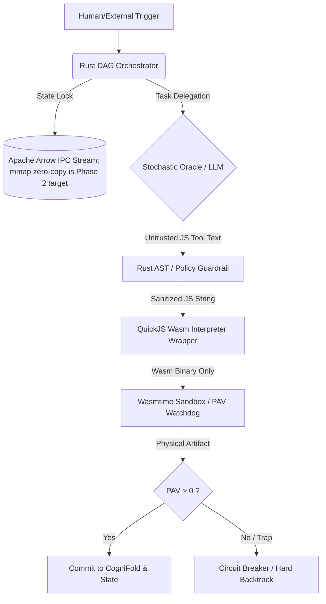
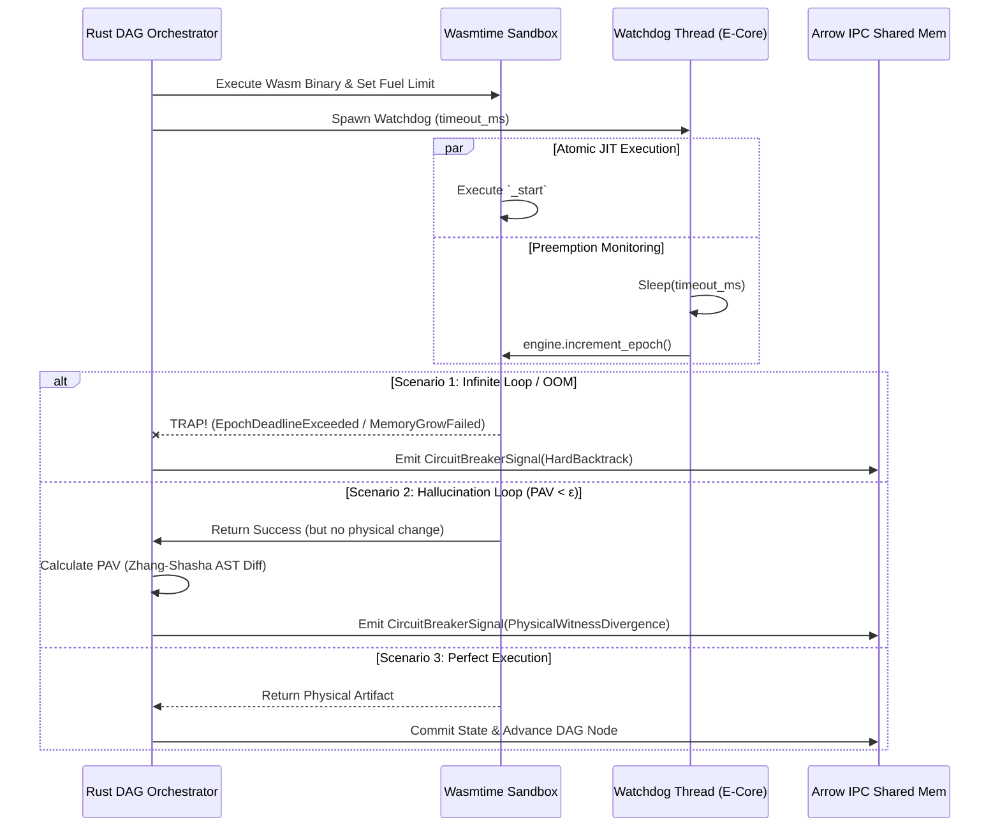
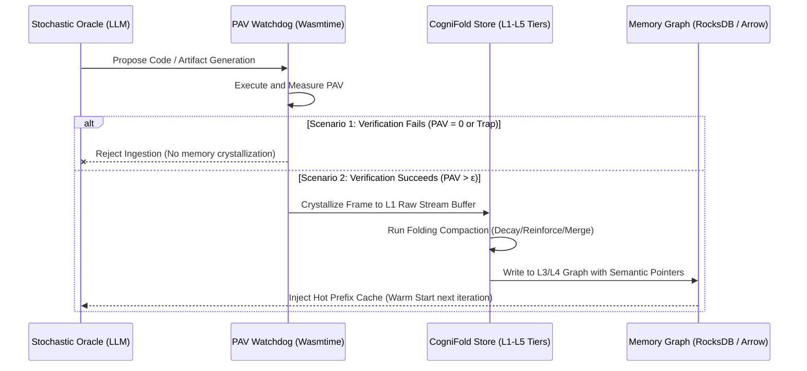
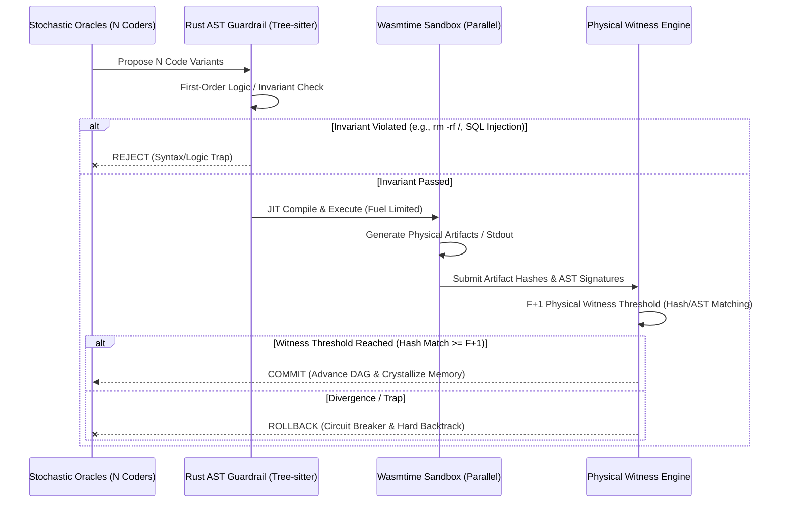
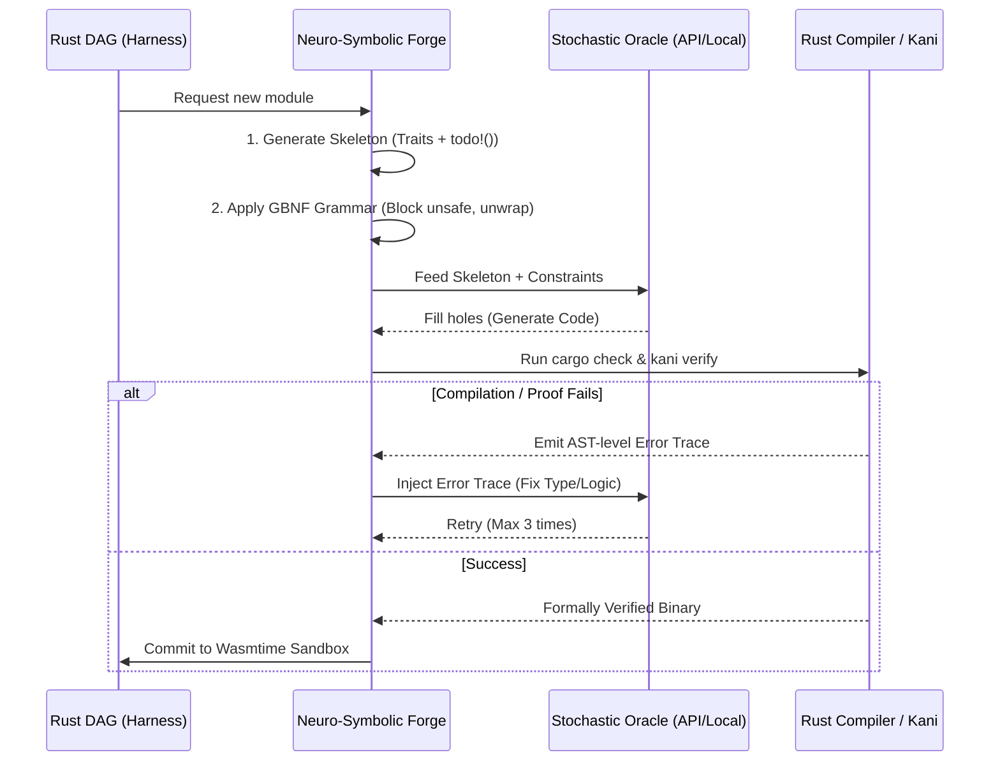

# AEGIS-COGNITION: UNIFIED CORE ARCHITECTURE & SYSTEM CONSTITUTION

This document compiles the core architectural paradigms, system constitutions, and operational models for AEGIS-COGNITION. It consolidates all 4 turns of the "Compression & Refactoring" campaign:
1. **Turn 1**: `SYSTEM_CONSTITUTION.md` - Core constitution, metrics, and banned concepts.
2. **Turn 2**: `DETERMINISTIC_ORCHESTRATOR.md` - Rust DAG and Wasmtime Watchdog.q
3. **Turn 3**: `COGNITIVE_MEMORY.md` - PAV-Gated Memory and Semantic Pointers.
4. **Turn 4**: `SECURITY_WITNESS.md` - Zero-Trust Guardrails and Physical Witness.

## Current Implementation Reality Check
- This file is a constitution/target architecture. The current implementation source of truth is `core/rust`, `docs/archive/reports/project-overview.md`, and `planning pdf/AEGIS-COGNITION_ Agent Harness Continuation Plan.md`.
- Arrow today is standard append-only Arrow IPC stream plus sealed/mmap-readable replay segments. Mutable mmap writer and benchmark-proven zero-copy observability remain Phase 2 targets.
- QuickJS/Wasm ABI remains a target until wrapper ABI and cold-start benchmarks exist. Do not claim `<1ms` or binary-size numbers without HarnessBench evidence.
- Task priority is deterministic Rust DAG math: critical path, blocked descendants, evidence unblock count, and explicit deadline timestamp. LLM output may contain only `suggested_priority` metadata.
- Subagent output is only `CandidateEvidence`. It becomes `PhysicalWitness` only after Wasmtime/browser/command/artifact hash gates.
- R4 dry-run means staging sandbox/testnet/snapshot/browser-session execution with a physical `StagingEvidenceKind`, or a scoped HITL signed approval. Untyped hashes, LLM-generated dry-run text, and mock logs are not evidence.

---

# 🛡️ FILE 1: SYSTEM_CONSTITUTION.md (Hiến Pháp Lõi)

# AEGIS-COGNITION: SYSTEM CONSTITUTION & EPISTEMIC AXIOMS
**ROLE**: Principal AI Systems Architect & HPC Engineer.
**PARADIGM**: "Systems-First, AI-Second. LLMs are stochastic oracles; Rust is the deterministic truth."

## 1. NORTH STAR METRICS (BẤT KHẢ XÂM PHẠM)
Mọi thiết kế code phải tối ưu hóa đồng thời 3 chỉ số sau (Phá vỡ đường cong Pareto):
- **SFoT (State-Fidelity over Time)**: > 99.9% tại giờ thứ 100 (Đo bằng Vật lý/AST, không đo bằng Semantic Similarity).
- **MTC (Marginal Token Cost)**: < 1.5% overhead cho metadata (Target; chỉ được claim khi có benchmark Arrow IPC/zero-copy observability thực tế).
- **Long-Horizon Completion**: > 90% cho tác vụ 50+ bước (Nhờ Rust DAG Hard Backtracking).

## 2. THE 3 IRON LAWS (ĐỊNH LUẬT SẮT - RUST TRAITS)
Mọi AI Agent khi đọc context này BẮT BUỘC phải tuân thủ 3 Traits sau. Cấm đề xuất bất kỳ giải pháp nào vi phạm.

```rust
/// # LAW 1: DETERMINISTIC OVERRIDE (No LLM-as-a-Judge)
/// LLM is a Stochastic Oracle. It proposes, Rust disposes.
/// Banned: LLM Debate, LLM Skeptic, Nash Equilibrium via Hessian.
pub trait ExecutiveAuthority {
    fn evaluate_action(&self, llm_proposal: &UntrustedText) -> Result<PhysicalArtifact, Trap>;
}

/// # LAW 2: MEASURED IPC PHYSICS (No JSON/Pickle Bloat)
/// Banned: LangGraph JsonPlusSerializer, Pydantic dumpd(), unbenchmarked zero-copy claims.
pub trait InterProcessCommunication {
    fn transmit_state(&self, buffer: pyo3_arrow::ArrowBuffer) -> Result<(), FFIError>;
}

/// # LAW 3: PAV-GATED COGNITION (No Entropy-based Memory)
/// Memory is ONLY forged through physical execution (Wasmtime AST diff).
/// Banned: Shannon Entropy triggers, Confident Hallucination Crystallization.
pub trait MemoryCrystallization {
    fn commit_to_cognifold(&self, artifact: &PhysicalArtifact) -> Result<SemanticNode, PAVFailure>;
}
```

## 3. THE "BANNED CONCEPTS" LIST (DANH SÁCH CẤM)
Nếu AI Agent đề xuất bất kỳ điều gì dưới đây, hãy tự động **REJECT** và áp dụng **Pareto Penalty**:
1. ❌ **LLM-as-a-Judge / Adversarial Court**: LLM không có khả năng phản biện logic bậc nhất. -> ✅ *Replace with: Rust Tree-sitter AST Parser & Wasmtime Unit Tests.*
2. ❌ **Shannon Entropy for Memory**: Entropy thấp = Ảo giác tự tin. -> ✅ *Replace with: PAV > 0 (Wasmtime Execution Success).*
3. ❌ **KV-Cache Portability / Hâm nóng**: API Providers không cho phép Export/Import raw KV-Cache tensors. -> ✅ *Replace with: Semantic Pointers & Prefix Caching Injection.*
4. ❌ **Fractal MCTS with LLM Rollouts**: Đốt cháy MTC theo hàm mũ. -> ✅ *Replace with: Deterministic DAG + Wasmtime Sandbox Simulation.*
5. ❌ **Semantic Consensus (SAC via Cosine)**: Dễ bị Poisoning RAG. -> ✅ *Replace with: Physical Witness (Wasmtime Artifact Matching).*

## 4. ARCHITECTURAL BOUNDARIES (RANH GIỚI HỆ THỐNG)

**EXECUTION DIRECTIVE**: Khi được yêu cầu viết code hoặc thiết kế module, hãy luôn bắt đầu bằng việc khai báo `impl ExecutiveAuthority` hoặc `impl MemoryCrystallization` tương ứng.

---

# ⚙️ FILE 2: DETERMINISTIC_ORCHESTRATOR.md (Khung sườn Tất định)

# AEGIS-COGNITION: DETERMINISTIC ORCHESTRATOR & PAV WATCHDOG
**ROLE**: Rust HPC Engineer & Sandbox Architect.
**PARADIGM**: "Measure reality, not promises. The LLM is a stochastic proposer; Rust is the deterministic verifier."

## 1. ARCHITECTURAL SHIFT: FROM MCTS TO RUST DAG
- **BANNED**: Fractal MCTS, LLM-based Rollouts, UCB Utility Estimation via LLM. (Lý do: Đốt cháy MTC, tạo ra Cascade of Hallucinations).
- **ENFORCED**: **Directed Acyclic Graph (DAG) State Machine** được biên dịch cứng trong Rust. 
- **Cơ chế Hard Backtracking**: Khi Wasmtime Sandbox báo lỗi (Trap) hoặc PAV < \epsilon, Rust DAG tự động `Rollback` trạng thái về `Arrow IPC Snapshot` của node trước đó mà **KHÔNG** gọi LLM để "tự suy luận lỗi".

## 2. MERMAID SEQUENCE: THE WASMTIME TRAP & PAV WATCHDOG


## 3. RUST CORE INTERFACES (BẮT BUỘC IMPLEMENT)
Mọi AI Agent khi viết code cho phân hệ này PHẢI tuân thủ tuyệt đối các `Traits` sau. Cấm thêm bất kỳ logic "gọi LLM" nào vào các hàm này.

```rust
use wasmtime::{Store, Engine, Module, Instance};

/// # INVARIANT 1: Deterministic DAG State Machine
/// Thay thế MCTS. Không có LLM Rollouts. Không có UCB Stochastic.
/// Luồng điều khiển chỉ rẽ nhánh dựa trên Kết quả Vật lý (Physical Artifacts).
pub trait DeterministicOrchestrator {
    ///Advance the DAG based STRICTLY on Wasmtime execution results.
    fn advance_state(
        &self, 
        current_node: DAGNode, 
        execution_result: Result<PhysicalArtifact, Trap>
    ) -> Result<DAGNode, BacktrackSignal>;
}

/// # INVARIANT 2: Physical Artifact Velocity (PAV) Watchdog
/// Đo lường "công cơ học" để phát hiện Vòng lặp Hoang tưởng (Hallucination Loops).
/// PAV = (Zhang-Shasha AST Distance) / (Wasmtime Fuel Consumed).
/// Nếu PAV < EPSILON (ví dụ: 0.0367) -> LLM đang viết code lặp lại vô nghĩa -> KÍCH HOẠT NGẮT MẠCH.
pub trait PAVWatchdog {
    fn measure_pav(
        &self, 
        old_ast: &SyntaxTree, 
        new_ast: &SyntaxTree, 
        fuel_consumed: u64
    ) -> f64;
    
    fn trigger_circuit_breaker(&self, reason: TrapReason) -> BacktrackSignal;
}

/// # INVARIANT 3: Wasmtime Sandbox Execution
/// Wasmtime chỉ nhận Wasm bytes. Text từ LLM phải được bọc bằng QuickJS Wasm ở tầng Orchestrator.
pub trait WasmExecutionSandbox {
    fn execute_wasm_binary(
        &self, 
        wasm_bytes: &[u8], 
        fuel_limit: u64
    ) -> Result<SandboxResult, TrapReason>;
}
```

## 4. WASMTIME IMPLEMENTATION SCAFFOLD (THAM CHIẾU CHUẨN)
```rust
impl WasmExecutionSandbox for AegisSandbox {
    fn execute_wasm_binary(&self, wasm_bytes: &[u8], fuel_limit: u64) -> Result<SandboxResult, TrapReason> {
        if !wasm_bytes.starts_with(b"\0asm") {
            return Err(TrapReason::InvariantViolation);
        }
        let engine = Engine::new(&self.config).unwrap();
        let mut store = Store::new(&engine, UserData::default());
        
        // 1. Giới hạn tài nguyên cứng (Hard Limits)
        store.set_fuel(fuel_limit).unwrap();
        store.limiter(|_| &mut self.resource_limiter); // Chặn OOM
        
        // 2. Spawn Watchdog Thread (Ghim vào E-Core để tiết kiệm P-Core cho JIT)
        let engine_clone = engine.clone();
        let timeout = self.timeout_ms;
        std::thread::spawn(move || {
            std::thread::sleep(std::time::Duration::from_millis(timeout));
            engine_clone.increment_epoch(); // Ép buộc TRAP nếu quá giờ
        });

        let module = Module::new(&engine, wasm_bytes)?;
        let instance = Instance::new(&mut store, &module, &[])?;
        let run_func = instance.get_typed_func::<(), ()>(&mut store, "_start")?;

        // 3. Thực thi & Đo lường Fuel
        let fuel_before = store.fuel_consumed().unwrap_or(0);
        let exec_result = run_func.call(&mut store, ());
        let fuel_after = store.fuel_consumed().unwrap_or(0);
        
        // 4. Trả về kết quả vật lý (Không tin vào text output của LLM)
        match exec_result {
            Ok(_) => Ok(SandboxResult::Success(fuel_after - fuel_before)),
            Err(trap) => Err(trap), // Rust DAG sẽ bắt lỗi này và Backtrack
        }
    }
}
```

## 5. STRICT RULES FOR AI AGENTS
1. **NO LLM RETRY LOGIC**: Khi `exec_result` trả về `Err(trap)`, Rust DAG tự động `Pop()` node hiện tại khỏi Stack và nạp lại `Arrow Snapshot` của node cha. **CẤM** viết code gọi LLM để "hỏi xem tại sao lỗi".
2. **AST DIFFING IS LAW**: Sử dụng `tree-sitter` hoặc `Zhang-Shasha` thuật toán để tính khoảng cách cây cú pháp. Nếu LLM sinh ra 1000 dòng code nhưng AST Distance = 0 (chỉ thay đổi comment/whitespace) -> `PAV = 0.0` -> `CircuitBreaker`.
3. **EPOCH INTERRUPTIBILITY**: Luôn luôn bật `Config::epoch_interruption(true)` trong Wasmtime. Đây là cách duy nhất để giết một vòng lặp `while(true)` ở cấp độ chỉ thị CPU mà không cần dựa vào OS Signals.

---

# 🧠 FILE 3: COGNITIVE_MEMORY.md (Bộ nhớ Nhận thức)

# AEGIS-COGNITION: PAV-GATED COGNIFOLD & SEMANTIC POINTERS
**ROLE**: Cognitive Memory Architect & Storage Engineer.
**PARADIGM**: "Memory is physical, not thermodynamic. Shannon entropy is a statistical ghost; physical execution is the only true anchor."

## 1. ARCHITECTURAL SHIFT: FROM SHANNON ENTROPY TO PAV-GATED COGNIFOLD
- **BANNED**: 
  - ❌ **Shannon Entropy Triggers**: Cấm dùng biến thiên Entropy Shannon để phát hiện ranh giới ngữ nghĩa (chỉ tạo ra ảo giác tự tin).
  - ❌ **KV-Cache Porting**: Cấm di chuyển/migrating raw KV-Cache tensors giữa các tiến trình hoặc API Providers.
- **ENFORCED**:
  - ✅ **PAV-Gated Memory Ingestion**: Tri thức chỉ được "khắc cốt ghi tâm" vào CogniFold (Memory Layer) khi có bằng chứng vật lý qua quá trình sandbox compile thành công (PAV > 0).
  - ✅ **Semantic Pointers & Context Injection**: Sử dụng các Semantic Pointer (dense embeddings ánh xạ trực tiếp đến các node AST hash trong DB) để tham chiếu tri thức cũ và dùng kỹ thuật Prefix Caching Injection để "hâm nóng" context LLM mà không tốn MTC.

## 2. MERMAID SEQUENCE: THE COGNIFOLD MEMORY SYSTEM


## 3. RUST CORE INTERFACES (BẮT BUỘC IMPLEMENT)
Mọi AI Agent khi thiết kế tầng bộ nhớ CogniFold PHẢI kế thừa và cài đặt các `Traits` này.

```rust
/// # INVARIANT 1: PAV-Gated Memory Ingestion
/// Bộ nhớ chỉ được đúc kết từ kết quả thực thi thực tế (Physical execution success).
pub trait MemoryCrystallization {
    fn commit_to_cognifold(&self, artifact: &PhysicalArtifact) -> Result<SemanticNode, PAVFailure>;
}

/// # INVARIANT 2: Semantic Pointer Resolution
/// Thay vì truyền KV-Cache tensor, dùng Semantic Pointer ánh xạ trực tiếp vào Graph DB.
pub trait SemanticPointerResolver {
    fn resolve_pointer(&self, pointer: &SemanticPointer) -> Result<ASTNode, ResolutionError>;
    fn inject_context_prefix(&self, node: &ASTNode) -> Result<ContextPrefix, InjectionError>;
}

/// # INVARIANT 3: CogniFold Cognitive Folding (L3 & L4 Graph Compaction)
/// Tự động nén đồ thị tri thức thông qua cơ chế Folding (Merge/Decay/Reinforce/Ground)
pub trait CognitiveFolding {
    fn fold_memory(&self, graph: &mut MemoryGraph) -> Result<(), FoldingError>;
    fn decay_links(&self, graph: &mut MemoryGraph) -> Result<(), DecayError>;
}
```

## 4. COGNIFOLD FOLDING ALGORITHM SCAFFOLD (THAM CHIẾU CHUẨN)
```rust
impl CognitiveFolding for AegisMemoryEngine {
    fn fold_memory(&self, graph: &mut MemoryGraph) -> Result<(), FoldingError> {
        // 1. Quét đồ thị tìm các node có độ tương đồng ngữ nghĩa cao (> 0.95)
        let duplicates = self.find_semantic_duplicates(graph)?;
        for (node_a, node_b) in duplicates {
            // Hợp nhất node trùng lặp (Compression) để giải phóng RAM
            graph.merge_nodes(node_a, node_b)?;
        }

        // 2. Củng cố liên kết (Accumulation) cho các node được kích hoạt nhiều lần
        let active_paths = self.get_frequent_activation_paths(graph)?;
        for path in active_paths {
            graph.strengthen_edges(&path, self.config.reinforce_factor)?;
        }

        // 3. Áp dụng suy hao Ebbinghaus (Decay) cho các liên kết không dùng
        self.decay_links(graph)?;

        Ok(())
    }

    fn decay_links(&self, graph: &mut MemoryGraph) -> Result<(), DecayError> {
        let decay_rate = self.config.decay_rate;
        for edge in graph.all_edges_mut() {
            edge.weight *= f64::exp(-decay_rate * edge.time_since_last_access);
            if edge.weight < self.config.pruning_threshold {
                graph.remove_edge(edge.id)?;
            }
        }
        Ok(())
    }
}
```

## 5. STRICT RULES FOR AI AGENTS
1. **NO STOCHASTIC CRYSTALLIZATION**: Cấm tự động lưu các đoạn text giải thích dài dòng của LLM vào bộ nhớ. Bộ nhớ chỉ lưu trữ **Physical Artifacts** và **AST Nodes** được định danh bởi BLAKE3 trên payload đã chuẩn hóa.
2. **EBBINGHAUS DECAY IS ACTIVE**: Mọi liên kết bộ nhớ trong Semantic Graph đều phải tự suy giảm giá trị theo thời gian. Không cho phép bộ nhớ tăng trưởng vô hạn không kiểm soát.
3. **PREFIX CACHING INJECTION**: Khi truy xuất lịch sử, chỉ trích xuất các node có PageRank cao nhất thông qua các Semantic Pointer và inject trực tiếp vào prompt dưới dạng prefix-aligned blocks để tận dụng cơ chế cache phần cứng của API provider.

---

# 🔒 FILE 4: SECURITY_WITNESS.md (Tầng Quản trị & Nhân chứng Vật lý)

# AEGIS-COGNITION: SECURITY, WITNESS & GUARDRAILS
**ROLE**: Zero-Trust Security Architect & Formal Verification Engineer.
**PARADIGM**: "Witness is physical, not semantic. Truth is compiled, not debated. LLMs do not debate; Rust verifies."

## 1. ARCHITECTURAL SHIFT: FROM THEATER TO PHYSICS
- **BANNED**:
  - ❌ **Adversarial LLM Court**: Cấm dùng LLM làm Skeptic/Auditor để tranh biện. (Lý do: Sycophancy, Mode Collapse, Token Furnace).
  - ❌ **Nash Equilibrium via Hessian Matrix**: Cấm áp dụng Giải tích lồi (Convex Optimization) lên Latent Space của LLM.
  - ❌ **Semantic SAC (Vector Voting)**: Cấm dùng Cosine Similarity / MSR filtering trên Embeddings để tìm đồng thuận F+1. (Lý do: Dễ bị collusive RAG poisoning).
- **ENFORCED**:
  - ✅ **First-Order Logic Guardrails**: Dùng Rust AST (Tree-sitter) & Regex để chặn vi phạm "Hiến pháp" (Invariants) ở cấp độ Cú pháp & Logic bậc nhất trước khi compile.
  - ✅ **Physical Witness Threshold**: Ngưỡng nhân chứng vật lý F+1 dựa trên **BLAKE3 Hash của Physical Artifacts** hoặc **AST Isomorphism** sau khi chạy song song qua Wasmtime Sandbox.

## 2. MERMAID SEQUENCE: THE VERIFICATION GAUNTLET


## 3. RUST CORE INTERFACES (BẮT BUỘC IMPLEMENT)
Mọi AI Agent khi viết code cho phân hệ bảo mật PHẢI tuân thủ tuyệt đối các `Traits` sau.

```rust
use wasmtime::Trap;

/// # INVARIANT 1: First-Order Logic Guardrails
/// Hiến pháp của hệ thống không nằm trong System Prompt của LLM.
/// Nó nằm trong các Rule của AST Parser và Regex.
pub trait ConstitutionalGuardrail {
    fn verify_invariants(&self, untrusted_code: &str) -> Result<(), InvariantViolation>;
}

/// # INVARIANT 2: Physical Witness Threshold (Physical F+1 Evidence)
/// Ngưỡng nhân chứng không dựa trên việc "các Agent có nói giống nhau không" (Semantic).
/// Ngưỡng nhân chứng dựa trên việc "các Agent có tạo ra cùng một kết quả vật lý không" (Physical).
pub trait PhysicalWitnessVerification {
    fn verify_physical_witnesses(
        &self, 
        artifacts: Vec<PhysicalArtifact>
    ) -> Result<WitnessProof, PhysicalWitnessDivergence>;
}

/// # INVARIANT 3: Zero-Trust Sidecar Gateway
/// Wasmtime KHÔNG ĐƯỢC phép gọi trực tiếp ra Internet (Network Isolation).
/// Mọi I/O phải đi qua Rust Sidecar để lọc độc tố (Regex/AST Sanitization).
pub trait ZeroTrustGateway {
    fn sanitize_and_forward(&self, wasm_request: &HostCall) -> Result<ExternalResponse, PoisoningAttempt>;
}
```

## 4. PHYSICAL WITNESS THRESHOLD SCAFFOLD (THAM CHIẾU CHUẨN)
```rust
impl PhysicalWitnessVerification for SacPhysicalWitness {
    fn verify_physical_witnesses(
        &self, 
        artifacts: Vec<PhysicalArtifact>
    ) -> Result<WitnessProof, PhysicalWitnessDivergence> {
        // 1. Nhóm các Artifact theo BLAKE3 Hash (hoặc AST Isomorphism)
        let mut hash_groups: HashMap<[u8; 32], Vec<&PhysicalArtifact>> = HashMap::new();
        for artifact in &artifacts {
            hash_groups.entry(artifact.blake3_hash).or_insert_with(Vec::new).push(artifact);
        }

        // 2. Tìm nhóm nhân chứng vật lý F+1
        let total_agents = artifacts.len();
        let f = (total_agents - 1) / 3; // F+1 Physical Witness threshold
        
        let mut best_group: Option<([u8; 32], &Vec<&PhysicalArtifact>)> = None;
        for (hash, group) in &hash_groups {
            if group.len() > f { // Vượt ngưỡng F+1
                best_group = Some((*hash, group));
                break;
            }
        }

        // 3. Trả về kết quả Tất định
        match best_group {
            Some((hash, group)) => Ok(WitnessProof {
                blake3_hash: hash,
                fuel_consumed: group[0].fuel_consumed, // Lấy mẫu đại diện
            }),
            None => Err(PhysicalWitnessDivergence::NoThresholdReached), // Rust DAG sẽ Backtrack
        }
    }
}
```

## 5. STRICT RULES FOR AI AGENTS
1. **NO LLM JUDGES**: Cấm viết code tạo ra các Agent dạng `CriticAgent`, `ReviewerAgent` dùng LLM để chấm điểm code của Agent khác. Thay vào đó, hãy viết một `Rust_Test_Runner` chạy Unit Test trong Wasmtime.
2. **PHYSICAL WITNESS ONLY**: Khi triển khai Multi-Agent Redundancy (ví dụ: 3 Agent cùng giải 1 bài toán), kết quả của chúng PHẢI được đưa vào Wasmtime để execute. Ngưỡng nhân chứng chỉ đạt khi `BLAKE3(Output_A) == BLAKE3(Output_B)` trên output đã chuẩn hóa.
3. **BYPASS THEATER**: Nếu System Prompt yêu cầu "Hãy suy nghĩ từng bước và phản biện lại chính mình", Rust Core phải tự động Strip (lược bỏ) phần "suy nghĩ" (Chain-of-Thought) ra khỏi Context trước khi lưu vào Apache Arrow IPC, chỉ giữ lại `Final_Tool_Call` để tiết kiệm MTC.

---

# 🧠 FILE 5: NEURO_SYMBOLIC_HARNESS.md (Khung Điều Phối Thần Kinh - Biểu Tượng)

# AEGIS-COGNITION: NEURO-SYMBOLIC HARNESSING & ABSOLUTE SUBJUGATION
**ROLE**: Principal Agent Harness Engineer & Neuro-Symbolic Systems Architect.
**PARADIGM**: "Context is soft; compilers are hard. Do not debate the stochastic oracle; force it into syntactic and mathematical submission."

## 1. THE 4 TIERS OF PHYSICAL & MATHEMATICAL ENFORCEMENT
Để kiểm soát và bắt buộc tuyệt đối các Stochastic Oracle (LLMs) tuân thủ kiến trúc lõi mà không cần nạp toàn bộ codebase vào cửa sổ ngữ cảnh, AEGIS-COGNITION áp dụng 4 tầng ép buộc sau:

### TẦNG 1: SKELETON-DRIVEN GENERATION (Sinh mã Lấp lỗ hổng)
- **Cơ chế**: Rust Harness tự động tạo ra Khung xương mã nguồn (Skeleton structure) từ các Trait và Signature cần thiết. LLM chỉ được phép hoạt động như một "Hole Filler" điền logic vào các khối `todo!()` hoặc `unimplemented!()`.
- **Ép buộc**: Trình biên dịch Rust (`cargo check`) đóng vai trò là chốt chặn loại bỏ bất kỳ cấu trúc kiểu dữ liệu hoặc signature nào bị LLM vi phạm.

### TẦNG 2: COMPILER-IN-THE-LOOP (Vòng lặp Phản hồi Trình biên dịch)
- **Cơ chế**: Lỗi từ `rust-analyzer` hoặc `cargo clippy` được phân tích cú pháp ở cấp độ AST.
- **Ép buộc**: Harness trích xuất chính xác dòng code lỗi kèm thông tin lỗi chi tiết của Compiler để ép LLM sửa lại. Vòng lặp tối đa 3 lần; nếu lỗi tiếp diễn, Harness kích hoạt `Hard Backtrack` trong DAG.

### TẦNG 3: GRAMMAR-CONSTRAINED DECODING (GBNF / AST Streaming)
- **Cơ chế**: Áp dụng Context-Free Grammar (CFG / GBNF) trên cấp độ sinh Token đối với các Local Model.
- **Ép buộc**: Gán xác suất logit của các token vi phạm (ví dụ: `unsafe {`, `.unwrap()`, bypass network) về $-\infty$, chặn đứng vi phạm từ khi sinh mã.

### TẦNG 4: FORMAL VERIFICATION & PROPERTY TESTING (Xác minh Hình thức)
- **Cơ chế**: Ép buộc LLM sinh ra mã kiểm định toán học đi kèm (Kani Proof hoặc Proptest).
- **Ép buộc**: Kani SMT-Solver duyệt qua mọi nhánh rẽ để chứng minh mã không panic hay rò rỉ bộ nhớ dưới bất kỳ tham số đầu vào nào.

## 2. SEQUENCE DIAGRAM: THE NEURO-SYMBOLIC CODE FORGE


## 3. RUST CORE INTERFACES (BẮT BUỘC IMPLEMENT)
```rust
/// # INVARIANT 1: Skeleton Generation from Trait Signature
pub trait SkeletonGenerator {
    fn generate_skeleton(trait_code: &str) -> Result<String, String>;
}

/// # INVARIANT 2: Compiler Feedback Parser
pub trait CompilerFeedbackLoop {
    fn analyze_compile_errors(cargo_check_output: &str) -> Vec<String>;
}
```


---

# 🏭 FILE 6: PRODUCTION HARDENING ROADMAP (Tiêu chuẩn Vận hành Thực tế)

# AEGIS-COGNITION: PRODUCTION HARDENING & METRICS
**ROLE**: Principal Site Reliability Engineer (SRE) & Security Auditor.
**PARADIGM**: "A system that cannot be measured is a system that cannot be trusted. Determinism requires canonicalization."

Dựa trên cuộc kiểm toán kiến trúc pháp y (Forensic Architecture Review), 3 lỗ hổng/hạng mục nâng cấp sau đây là **hoàn toàn chính xác và mang tính sống còn (Critical)** để đưa AEGIS-COGNITION đạt chuẩn Mission-Critical (như DO-178C). Chúng đã được phê duyệt và bổ sung vào Hiến pháp:

## 1. ERROR SANITIZATION LAYER (Bộ Lọc Lỗi Trình Biên Dịch)
- **Vấn đề cốt lõi**: Thông báo lỗi nguyên thủy (raw) từ trình biên dịch (`cargo check`, `rustc`) chứa rất nhiều "rác": mã màu ANSI (escape codes), đường dẫn tuyệt đối tĩnh (absolute file paths) của máy chủ, và các cảnh báo (warnings) không gây panic. Nếu đẩy toàn bộ raw text này cho LLM, ta sẽ làm bão hòa Context Window, đốt cháy MTC (Marginal Token Cost) cực kỳ lãng phí, và khiến LLM dễ bị nhiễu loạn logic.
- **Giải pháp Bắt buộc**:
  - Triển khai **Sanitization Layer** (tại Harness) trước khi nạp lại cho LLM.
  - Regex tước bỏ (strip) toàn bộ mã ANSI.
  - Chuẩn hóa (Normalize) đường dẫn file để tránh lộ lọt cấu trúc hệ thống (ví dụ: `C:\Users\ADMIN\AEGIS\...` -> `/core/...`).
  - Lọc bỏ mọi cảnh báo (warnings) không nghiêm trọng, chỉ giữ lại các Error Codes (`error[E...]`) để LLM sửa đúng trọng tâm.

## 2. NORMALIZED OUTPUT HASHING (Băm Đầu ra Chuẩn hóa - Chống phân kỳ giả)
- **Vấn đề cốt lõi**: Tầng Ngưỡng Nhân chứng Vật lý (FILE 4) sử dụng `BLAKE3` lên kết quả vật lý (Artifacts). Tuy nhiên, nếu hai Wasm instance sinh ra cùng một cấu trúc logic nhưng khác nhau về khoảng trắng (whitespace), thứ tự key trong JSON, hoặc chứa memory pointer ngẫu nhiên, hash sẽ cho ra 2 mã hoàn toàn khác biệt. Hệ quả là hệ thống sẽ báo lỗi False Positive: đánh giá hệ thống không đạt ngưỡng nhân chứng và kích hoạt Rollback oan uổng.
- **Giải pháp Bắt buộc**:
  - Chấp nhận nguyên tắc: **Đồng thuận là Đồng thuận Cấu trúc, không phải Ký tự (Structural over Literal)**.
  - Bắt buộc thực hiện **Canonicalization (Chuẩn hóa dạng chuẩn)** trước khi hash:
    - Đối với Data/JSON: Sắp xếp keys theo Alphabet, loại bỏ khoảng trắng thừa, đồng nhất precision của số thực.
    - Đối với Code/AST: Chuyển đổi qua Canonical AST tree trước khi hash, loại bỏ comment và code formatting.

## 3. OBSERVABILITY & FORMAL METRICS (Quan trắc & Đo lường Chính quy)
- **Vấn đề cốt lõi**: Hệ thống đặt ra mục tiêu SFoT (State-Fidelity) > 99.9% và MTC < 1.5% tại FILE 1, nhưng lại không có "cảm biến" để thu thập chúng. Một hệ thống hộp đen (Black-box) không có Observability sẽ không bao giờ được chứng minh độ tin cậy về mặt toán học trên Production.
- **Giải pháp Bắt buộc**:
  - Tích hợp **OpenTelemetry / Prometheus** sâu vào Rust DAG và Wasmtime.
  - **Tracing Fuel**: Đo lường lượng Fuel/Instructions Wasmtime thiêu đốt mỗi chu kỳ.
  - **Graph Observability**: Lắng nghe và đếm số lượng các sự kiện `HardBacktrack`, `CircuitBreakerSignal`, cũng như theo dõi sự chênh lệch của chỉ số PAV theo thời gian.
  - Mọi báo cáo SFoT phải được trích xuất từ dữ liệu Time-series thực tế, chấm dứt việc phỏng đoán (guesswork) bằng LLM.

---

# 🚀 FILE 7: GOD-TIER HPC ARCHITECTURAL UPGRADES (Nâng cấp Hiệu năng Cao Cấp HPC)

## 1. GENERATIONAL SLAB ALLOCATOR (Bộ phân bổ vùng nhớ Generational Slab)
- **File vật lý**: [fold.rs](file:///c:/Users/ADMIN/AEGIS-COGNITION/core/rust/src/memory/fold.rs)
- **Vấn đề cốt lõi**: Cơ chế cấp phát bộ nhớ động thông thường (Heap allocation) gây phân mảnh bộ nhớ (Memory Fragmentation), không đảm bảo cache locality và tốn chi phí quản lý khi hệ thống chạy trong thời gian dài (MTC cao).
- **Giải pháp HPC & Invariants**:
  - **Size-Classed Slab Pools**: Chia phân mảnh bộ nhớ thành các SlabPool cố định kích thước: 32 bytes, 64 bytes, 128 bytes, 256 bytes và một vùng overflow đặc biệt. Tự động ánh xạ dữ liệu đầu vào (`MemoryFrame`) vào pool tương ứng dựa trên chiều dài payload thông qua trait `HasPayloadLen`.
  - **Generational Slot Indexing**: Định vị các node lưu trữ thông qua `SlotId`. Cấu trúc của `SlotId` đóng gói index 29-bit và pool class 3-bit vào một biến `u32`, kết hợp với `NonZeroU32` generation. Việc sử dụng `NonZeroU32` cho phép tối ưu hóa Null Pointer Optimization của trình biên dịch Rust, giúp cho `Option<SlotId>` chỉ tốn đúng 8 bytes bộ nhớ (thay vì 12 bytes).
  - **False Sharing Mitigation**: Ép buộc căn lề cache-line (`#[repr(align(64))]`) cho `SlabHeader` để ngăn chặn hiện tượng False Sharing giữa các luồng xử lý trên các CPU P-Core khác nhau.
  - **FIFO Order Preservation**: Lưu trữ thứ tự chèn phần tử trong cấu trúc `CogniFoldStore` bằng cách lưu trữ danh sách phẳng các `SlotId` trong một `Vec<SlotId>`, đảm bảo truy xuất O(1) và tính nhất quán lưu trữ.

## 2. SIMD AHO-CORASICK GUARDRAILS (Rào chắn kiểm soát mã độc dạng SIMD & AST)
- **File vật lý**: [guardrail.rs](file:///c:/Users/ADMIN/AEGIS-COGNITION/core/rust/src/guardrail.rs)
- **Vấn đề cốt lõi**: Quá trình phân tích cú pháp AST (Abstract Syntax Tree) tiêu tốn rất nhiều chu kỳ CPU. Nếu chạy trực tiếp AST Guardrail cho mọi đoạn mã không đáng tin cậy của LLM, hệ thống sẽ gặp thắt nút cổ chai (performance bottleneck).
- **Giải pháp HPC & Invariants**:
  - **Tiered Dual-Shield Defense**:
    - **Tier 1 (Fast-Path)**: Sử dụng thư viện `aho-corasick` tối ưu bằng tập lệnh SIMD phần cứng để quét chuỗi thô cực nhanh. Khởi tạo một lần thông qua static `OnceLock<AhoCorasick>`. Quét đồng thời 20 mẫu cấm thuộc 4 nhóm vi phạm: `DestructiveFilesystem` (ví dụ: `rm -rf`), `NetworkBypass` (ví dụ: `std::net`), `LlmJudgePattern` (ví dụ: `criticagent`), và `ChainOfThoughtLeak` (ví dụ: `<thinking>`).
    - **Tier 2 (Deep Semantic Scan)**: Chỉ khi mã vượt qua Tier 1 và hợp lệ về cú pháp Rust, hệ thống mới tiến hành chuyển đổi sang AST qua thư viện `syn` và sử dụng mẫu visitor `GuardrailVisitor` (`syn::visit_mut::VisitMut`) để quét sâu các cấu trúc cụ thể (ví dụ: các lệnh `use fs`, `use net`, gọi hàm `remove_dir_all` hoặc `TcpStream::connect`).
  - **Whitespace & Case Normalization**: Trước khi thực hiện quét Tier 1, hàm `normalize_for_scan()` chuẩn hóa dữ liệu bằng cách loại bỏ khoảng trắng thừa và đưa toàn bộ ký tự về dạng chữ thường, ngăn chặn việc LLM chèn ký tự lạ hoặc ngắt dòng để vượt qua bộ lọc.

## 3. WASMTIME AOT CACHE & INTERRUPT WATCHDOG (Bộ đệm biên dịch Wasmtime AOT & Đồng hồ giám sát ngắt Epoch)
- **File vật lý**: [sandbox.rs](file:///c:/Users/ADMIN/AEGIS-COGNITION/core/rust/src/sandbox.rs)
- **Vấn đề cốt lõi**: Trình biên dịch JIT (Just-In-Time) của Wasmtime tiêu tốn tài nguyên và thời gian rất lớn khi phải biên dịch lại cùng một đoạn mã nhiều lần. Ngoài ra, việc ngắt một vòng lặp vô hạn một cách an sau trên Windows (MSVC) thường gặp lỗi unwind bộ nhớ hoặc hỏng tệp PDB.
- **Giải pháp HPC & Invariants**:
  - **AOT Engine Cache**: Triển khai bộ nhớ đệm luồng an toàn tĩnh `MODULE_CACHE` thông qua `OnceLock<RwLock<HashMap<String, Vec<u8>>>>`. Module WebAssembly được biên dịch trước bằng `engine.precompile_module()` và lưu trữ dưới dạng byte đã tuần tự hóa. Các lượt gọi sau chỉ cần giải tuần tự hóa bằng `Module::deserialize()` trực tiếp trên CPU, bỏ qua hoàn toàn JIT compilation latency.
  - **Asynchronous Epoch Watchdog**: Thay vì sử dụng bộ đếm nhiên liệu (fuel counter) có thể bị vượt qua hoặc OS signals gây crash hệ thống, sandbox sử dụng cơ chế Epoch-based Interruption. Một luồng watchdog nền được sinh ra độc lập, ngủ đúng khoảng thời gian `timeout_ms` rồi gọi `engine.increment_epoch()` để ép buộc ngắt luồng thực thi Wasmtime nếu hết hạn.
  - **MSVC Unwinding Safety**: Sử dụng cờ hiệu nguyên tử `AtomicBool` để chia sẻ trạng thái hoàn thành giữa luồng chạy chính và luồng watchdog. Nếu việc thực thi kết thúc bình thường, watchdog sẽ được hủy bỏ sạch sẽ trước khi nó gây ra một cuộc ngắt cưỡng bức. Kết hợp với cài đặt `native_unwind_info(true)`, giải pháp này khắc phục triệt để lỗi unwind PDB (`LNK1318`) trên môi trường Windows.

## 4. ZERO-COPY JSON & PAYLOAD CANONICALIZATION (Bộ phân tích cú pháp JSON không sao chép & Chuẩn hóa dữ liệu)
- **File vật lý**: [physical.rs](file:///c:/Users/ADMIN/AEGIS-COGNITION/core/rust/src/physical.rs)
- **Vấn đề cốt lõi**: Khác biệt nhỏ về định dạng đầu ra (ví dụ: khoảng trắng, thứ tự key JSON, comment) sẽ tạo ra mã BLAKE3 khác nhau, dẫn đến hiện tượng phân kỳ giả (Physical Witness Divergence) trong khi ngữ nghĩa hoàn toàn trùng khớp. Ngoài ra, việc sao chép chuỗi liên tục khi phân tích JSON tốn nhiều RAM và CPU cache.
- **Giải pháp HPC & Invariants**:
  - **Zero-Copy JSON Deserialization**: Triển khai enum `ZeroCopyValue<'a>` đóng gói tất cả các kiểu dữ liệu JSON, sử dụng kiểu dữ liệu `Cow<'a, str>` (Clone-on-Write) từ Serde để mượn (borrow) trực tiếp lát cắt chuỗi gốc từ bộ nhớ đệm đầu vào mà không cần cấp phát vùng nhớ heap mới.
  - **Deterministic Canonicalization**:
    - Đối với JSON: Tự động phân tích cú pháp và ghi lại dữ liệu bằng cấu trúc `BTreeMap` để ép buộc sắp xếp tất cả các thuộc tính (keys) theo thứ tự bảng chữ cái và loại bỏ toàn bộ khoảng trắng dư thừa.
    - Đối với Rust: Sử dụng trình phân tích cú pháp `syn` chuyển đổi mã sang AST và kết xuất lại thành dạng chuẩn hóa qua `quote` để tước bỏ comment và các định dạng khoảng trắng khác nhau.
  - **Dual Hashing Optimization**:
    - **BLAKE3 Witness Key**: Sử dụng hàm băm cryptographic cực nhanh BLAKE3 (`blake3_digest`) trên dữ liệu đã chuẩn hóa để làm khóa định danh nhân chứng vật lý.
    - **Structural AST Fingerprint**: Trích xuất vân tay cấu trúc 64-bit độc lập bằng cách sử dụng visitor đếm số lượng khai báo (`items` chiếm 16-bit đầu), số lượng câu lệnh (`stmts` chiếm 16-bit tiếp theo) và mã băm phi mật mã `xxh3` 32-bit từ nội dung thô (`items | stmts << 16 | hash_xxh3 << 32`).

## 5. CUSTOM OS MEMORY POOL & PRE-ALLOCATED BUFFER (Bể chứa bộ nhớ hệ điều hành tùy chỉnh & Nạp trước trang nền)
- **File vật lý**: [pool.rs](file:///c:/Users/ADMIN/AEGIS-COGNITION/core/rust/src/memory/pool.rs)
- **Vấn đề cốt lõi**: OS Page Faults xảy ra khi một luồng JIT hoặc một buffer bộ nhớ chia sẻ ghi dữ liệu vào các trang bộ nhớ chưa được ánh xạ vật lý trên RAM, gây ra độ trễ I/O lớn bất ngờ (jitter).
- **Giải pháp HPC & Invariants**:
  - **Direct System Allocation**: Bỏ qua bộ cấp phát mặc định của Rust/C. Sử dụng `VirtualAlloc` trên hệ điều hành Windows với cấu hình `MEM_COMMIT | MEM_RESERVE` để cấp phát bộ nhớ ảo liên tục. Trên các hệ điều hành Unix (Linux/macOS), sử dụng `mmap` với cờ `MAP_PRIVATE | MAP_ANON`.
  - **Huge Page Support (Linux)**: Tự động tối ưu hóa cấu trúc phân trang trên Linux bằng cách áp dụng lời khuyên `madvise` với tùy chọn `MADV_HUGEPAGE`, giảm tải đáng kể cho bộ đệm TLB phần cứng của CPU khi xử lý các buffer dữ liệu lớn.
  - **Background Page Population**: Triển khai hàm `spawn_background_population()` khởi chạy một luồng nền độc lập để ghi đè dữ liệu rác (ghi đè tuần tự giá trị 0) lên từng trang bộ nhớ kích thước 4KB của vùng nhớ ảo mới. Quá trình này kích hoạt trước các trang vật lý (prefaulting) trước khi luồng thực thi chính chạm vào, triệt tiêu hoàn toàn độ trễ Page Fault tại runtime.
  - **Atomic Tracking**: Quản lý hạn mức và lượng bộ nhớ sử dụng thực tế của pool một cách an toàn luồng bằng các thanh ghi nguyên tử hiệu năng cao `AtomicUsize`.

## 6. HYBRID POLLING SHM IPC (IPC bộ nhớ chia sẻ thăm dò lai)
- **File vật lý**: [shm.rs](file:///c:/Users/ADMIN/AEGIS-COGNITION/core/rust/src/shm.rs)
- **Vấn đề cốt lõi**: Giao tiếp liên tiến trình (IPC) thông qua sockets hoặc nhân hệ điều hành (Kernel-space transitions) làm phát sinh chi phí chuyển ngữ cảnh (Context Switch Overhead) và làm chậm chu kỳ đồng thuận.
- **Giải pháp HPC & Invariants**:
  - **Hybrid Polling Strategy**: Hàm `hybrid_poll_until` chia quá trình chờ tin nhắn thành hai giai đoạn tối ưu:
    - **Giai đoạn 1 (Spin-lock/Busy-wait)**: Luồng liên tục thăm dò trạng thái bộ nhớ chia sẻ và thực thi lệnh gợi ý CPU `std::hint::spin_loop()` trong một khoảng thời gian cực ngắn (`spin_duration`), đảm bảo độ trễ phản hồi tiệm cận 0 ns.
    - **Giai đoạn 2 (Backoff/Yield/Sleep)**: Nếu hết thời gian spin mà chưa có tin nhắn, luồng tự động hạ tải bằng cách nhường quyền ưu tiên xử lý (`std::thread::yield_now()`) và chuyển sang ngủ ngắn 50 micro giây (`std::thread::sleep`) để giải phóng tài nguyên CPU cho các tác vụ khác.
  - **64-Byte Cache Alignment**: Cấu trúc `SharedMemoryRegion` được định cấu hình căn lề 64-byte nghiêm ngặt nhằm tránh hiện tượng rò rỉ hoặc truy cập không căn lề (misaligned access memory penalties) trên CPU hiện đại.

## 7. NEURO-SYMBOLIC HARNESS & PATH SANITIZATION (Harness Thần kinh - Biểu tượng & Làm sạch lỗi Trình biên dịch)
- **File vật lý**: [harness.rs](file:///c:/Users/ADMIN/AEGIS-COGNITION/core/rust/src/harness.rs)
- **Vấn đề cốt lõi**: Trình bày toàn bộ mã nguồn hoặc thông tin lỗi chi tiết chứa đường dẫn tuyệt đối cho LLM gây tốn MTC, lộ cấu trúc thư mục của máy chủ, và làm nhiễu loạn logic sửa lỗi của AI Agent.
- **Giải pháp HPC & Invariants**:
  - **Skeleton-Driven Generation**: Sử dụng một `SkeletonVisitor` (dựa trên thư viện `syn::visit_mut::VisitMut`) để quét qua mã nguồn Rust của các Trait hoặc cấu trúc Impl và thay thế toàn bộ thân hàm bằng macro `todo!()`. LLM chỉ nhận được khung xương mã nguồn sạch và chỉ được phép điền mã vào các phần trống này, tránh việc thay đổi cấu trúc thiết kế cốt lõi.
  - **Compiler Error Sanitizer**: Hàm `analyze_compile_errors` sử dụng biểu thức chính quy (Regex) để làm sạch đầu ra của `cargo check`:
    - Loại bỏ mã màu ANSI cấu trúc dạng `\x1B\[[0-9;]*[a-zA-Z]`.
    - Chuẩn hóa tất cả các đường dẫn tuyệt đối chứa thư mục dự án (ví dụ: `C:\Users\ADMIN\AEGIS-COGNITION\core\...`) thành đường dẫn tương đối `/core/` để bảo mật thông tin máy chủ và giảm kích thước Token thô.
    - Tách biệt và chỉ giữ lại nội dung lỗi bắt đầu bằng `error[` hoặc `error:` và bỏ qua toàn bộ các cảnh báo không nghiêm trọng.
  - **Token Logit Verification**: Sử dụng `validate_next_token` từ `GbnfConstraintEngine` để loại bỏ các token hoặc dòng mã có chứa các từ khóa cấm (`unsafe`, `.unwrap`, `TcpStream`) ngay tại tầng sinh từ ngữ.
